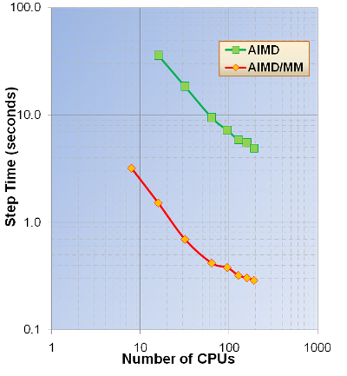
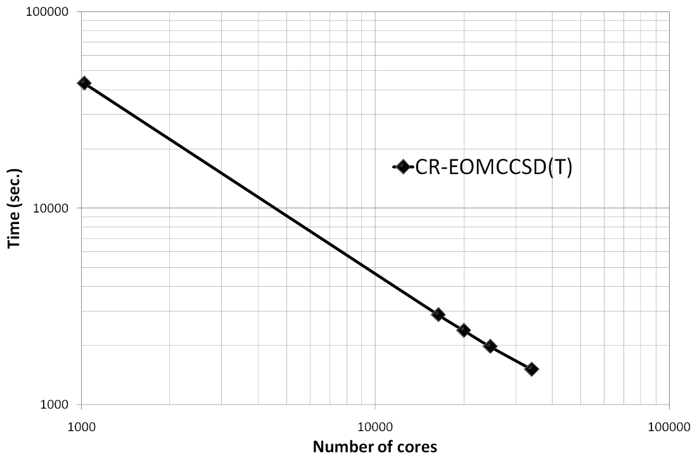
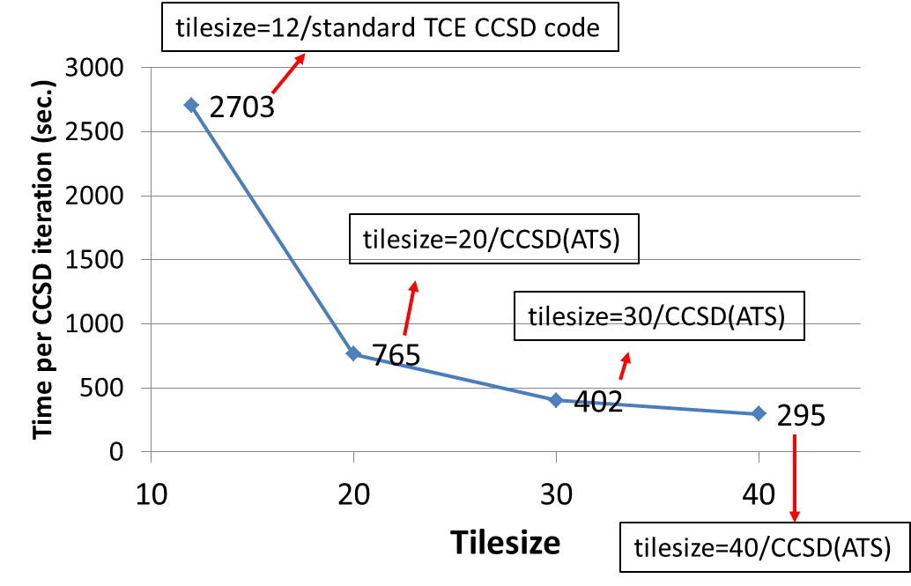
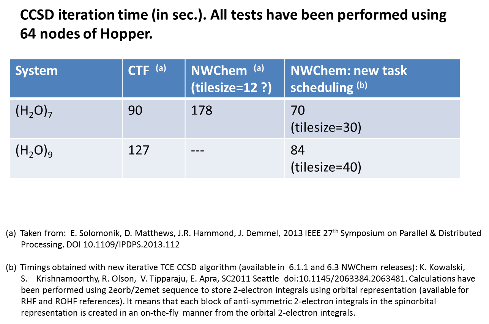

# Benchmarks performed with NWChem

This page contains a suite of benchmarks performed with NWChem. The
benchmarks include a variety of computational chemistry methods on a
variety of high performance computing platforms. The list of benchmarks
available will evolve continuously as new data becomes available. If you
have benchmark information you would like to add for your computing
system, please contact one of the developers.

# Hybrid density functional calculation on the C240 Buckyball

Performance of the Gaussian basis set DFT module in NWChem. This
calculation involved performing a PBE0 calculation (in direct mode) on
the on C240 system with the 6-31G\* basis set (3600 basis
functions) without symmetry. These calculations were performed on the
Cascade supercomputer located at PNNL. The [input
file](Media:input_c240_pbe0.nw "wikilink") is available.

# Parallel performance of *Ab initio* Molecular Dynamics using plane waves

|AIMD Parallel timings for +122O.
These calculations were performed on the Franklin Cray-XT4 computer
system at NERSC. 
AIMD and AIMD/MM Parallel Timings for +64O (unit
cell parameters SC=12.4 Angs. and cutoff energy =100Ry). These
calculations were performed on the Chinook HP computer system at MSCF
EMSL, PNNL. Exact
exchange timings – 80 atom cell of hematite (cutoff energy=100Ry). These
calculations were performed on the Franklin Cray-XT4 computer system at
NERSC.](file:PWEXScaling.png "wikilink") [center|320px|thumb|Exact
exchange timings – 576 atom cell of water (cutoff energy=100Ry). These
calculations were performed on the Hopper Cray-XE6 computer system at
NERSC.](file:water192b.png "wikilink")

# Parallel performance of the CR-EOMCCSD(T) method (triples part)

An example of the scalability of the triples part of the [CR-EOMCCSD(T)
approach](http://dx.doi.org/10.1063/1.3385315) for Green Fluorescent
Protein Chromophore (GFPC) described by cc-pVTZ basis set (648 basis
functions) as obtained from NWChem. Timings were determined from
calculations on the Franklin Cray-XT4 computer system at NERSC. See the
[ input file](Media:input_gfpc.nw "wikilink") for details.

And more recent scalability test of the CR-EOMCCSD(T) formalism (Jaguar
Cray XT5 at ORNL, see K. Kowalski, S. Krishnamoorthy, R.M. Olson, V.
Tipparaju, E. Aprà , SC2011, for details).

# Parallel performance of the multireference coupled cluster (MRCC) methods

In collaboration with Dr. Jiri Pittner's group from Heyrovsky Institute
of Physical Chemistry implementations of two variants of state-specific
MRCC approaches have been developed. During his internship at PNNL Jirka
Brabec, using novel processor-group-based algorithms, implemented
Brillouin-Wigner and Mukherjee MRCC models with singles and doubles. The
scalabililty tests for the Brillouin-Wigner MRCCSD approach have been
performed on Jaguar XT5 system at ORNL for -carotene in 6-31
basis set (472 orbitals, 216 correlated electrons, 20 reference
functions; see J.Brabec, J. Pittner, H.J.J. van Dam, E. Aprà, K.
Kowalski, JCTC 2012, 8(2), pp 487–497). Currently, PNNL postdoctoral
fellow Dr. Kiran Bhaskaran Nair is developing perturbative MRCCSD(T)
approaches, which accounts for the effect of triple excitations.

Scaling of the triples part of the BW-MRCCSD(T) method for
-carotene in 6-31 basis set (JCP 137, 094112 (2012)). The
scalability tests of the BW-MRCCSD(T) implementation of NWChem have been
performed on the Jaguar Cray-XK6 computer system of the National Center
for Computational Sciences at Oak Ridge National Laboratory.

# Timings of CCSD/EOMCCSD for the oligoporphyrin dimer

CCSD/EOMCCSD timings for oligoporphyrin dimer (942 basis functions, 270
correlated electrons, D2h symmetry, excited-state calculations were
performed for state of b1g symmetry, in all test calculation convergence
threshold was relaxed, 1024 cores were used). See the [ input
file](Media:input_p2ta.nw "wikilink") for
details.

`--------------------------------------------------------`  
` Iter          Residuum       Correlation     Cpu    Wall`  
` --------------------------------------------------------`  
`   1   0.7187071521175  -7.9406033677717   640.9   807.7`  
`   ......`  
` MICROCYCLE DIIS UPDATE: 10 5`  
`  11   0.0009737920958  -7.9953441809574   691.1   822.2`  
` --------------------------------------------------------`  
` Iterations converged`  
` CCSD correlation energy / hartree =        -7.995344180957357`  
` CCSD total energy / hartree       =     -2418.570838364838890`  
  
` EOM-CCSD right-hand side iterations`  
` --------------------------------------------------------------`  
`      Residuum       Omega / hartree  Omega / eV    Cpu    Wall`  
` --------------------------------------------------------------`  
`......`  
`Iteration   2 using    6 trial vectors`  
`  0.1584284659595   0.0882389635508    2.40111   865.3  1041.2`  
`Iteration   3 using    7 trial vectors`  
`  0.0575982107592   0.0810948687618    2.20670   918.0  1042.2`

# Performance tests of the GPU implementation of non-iterative part of the CCSD(T) approach

Recent tests of the GPU CCSD(T) implementation performed on Titan Cray
XK7 [1](https://www.olcf.ornl.gov/computing-resources/titan-cray-xk7/)
system at ORNL (C22H14, 378 basis set functions,
C1 symmetry; 98 nodes: 8 cores per node + 1GPU)

**Using 8 CPU cores**

`Using CUDA CCSD(T) code `  
`Using 0 device(s) per node `  
`CCSD[T] correction energy / hartree = -0.150973754992986 `  
`CCSD[T] correlation energy / hartree = -3.067917061062492 `  
`CCSD[T] total energy / hartree = -844.403376796441080 `  
`CCSD(T) correction energy / hartree = -0.147996460406684 `  
`CCSD(T) correlation energy / hartree = -3.064939766476190 `  
`CCSD(T) total energy / hartree = -844.400399501854849 `  
`Cpu & wall time / sec 9229.9 9240.3 `

**Using 7 CPU cores and one GPU**

`Using CUDA CCSD(T) code `  
`Using 1 device(s) per node  `  
`CCSD[T] correction energy / hartree = -0.150973754993019 `  
`CCSD[T] correlation energy / hartree = -3.067917061062597 `  
`CCSD[T] total energy / hartree = -844.403376796441307 `  
`CCSD(T) correction energy / hartree = -0.147996460406693 `  
`CCSD(T) correlation energy / hartree = -3.064939766476270 `  
`CCSD(T) total energy / hartree = -844.400399501854963 `  
`Cpu & wall time / sec 1468.0 1630.7 `

**Using 1 CPU core and one GPU**

`Using CUDA CCSD(T) code`  
`Using 1 device(s) per node`  
`CCSD[T] correction energy / hartree = -0.150973754993069`  
`CCSD[T] correlation energy / hartree = -3.067917061063028`  
`CCSD[T] total energy / hartree =  -844.***************`  
`CCSD(T) correction energy / hartree = -0.147996460406749`  
`CCSD(T) correlation energy / hartree = -3.064939766476708`  
`CCSD(T) total energy / hartree = -844.400399501861216`  
`Cpu & wall time / sec 1410.9 1756.5`

Without GPU 9240.3 sec. With GPU 1630.7 sec.

Next release: GPU implementation of non-iterative part of the MRCCSD(T)
approach (K. Bhaskarsan-Nair, W. Ma, S. Krishnamoorthy, O. Villa, H. van
Dam, E. Aprà, K. Kowalski, J. Chem. Theory Comput. 9, 1949 (2013))

# Performance tests of the Xeon Phi implementation of non-iterative part of the CCSD(T) approach

Recent tests (January 2015) of the Xeon Phi CCSD(T) implementation
performed on EMSL cascade
[2](http://www.emsl.pnl.gov/emslweb/instruments/computing-cascade-atipa-1440-intel-xeon-phi-node-fdr-infiniband-linux-cluster)
system at PNNL

Aprà, E.; Klemm, M.; Kowalski, K., "Efficient Implementation of
Many-Body Quantum Chemical Methods on the Intel® Xeon Phi Coprocessor,"
High Performance Computing, Networking, Storage and Analysis, SC14:
International Conference for , vol., no., pp.674,684, 16-21 Nov. 2014
[3](http://dx.doi.org/10.1109/SC.2014.60)

(Triplet state of
Si4C3N2H12, 706 basis set
functions, C1
symmetry)

# Non-iterative part of the CCSD(T) approach: Comparing Xeon Phi and NVidia K20X performance

Wall time to solution (in seconds) of non-iterative triples part of the
single-reference CCSD(T) approach for the pentacene molecule using Intel
MIC and Nvidia GPU implementations. Tests were performed using 96
compute nodes on the Cascade system at EMSL (Intel® Xeon™ Phi 5110P) and
Titan system at ORNL (NVIDIA Tesla® K20X).

([ input file](Media:pentacene_ccsdt.nw "wikilink"))

|          |                      |             |
| -------- | -------------------- | ----------- |
| Tilesize | Intel Xeon Phi 5110P | Nvidia K20X |
| 18       | 1806.4               | 1824.9      |
| 21       | 1652.2               | 1699.3      |
| 24       | 1453.3               | 1554.4      |
|  |

# Current developments for high accuracy: alternative task schedulers (ATS)

Currently various development efforts are underway for high accuracy
methods that will be available in future releases of NWChem. The
examples below shows the first results of the performance of the triples
part of Reg-CCSD(T) on GPGPUs (left two examples) and of using
alternative task schedules for the iterative CCSD and EOMCCSD.

<File:gpu_scaling_spiro.png>|<small>*Scalability of the triples part of
the Reg-CCSD(T) approach for Spiro cation described by the Sadlej's TZ
basis set (POL1). The calculations were performed using Barracuda
cluster at EMSL.</small> <File:gpu_speedup_uracil.png>|<small>*Speedup
of GPU over CPU of the (T) part of the (T) part of the Reg-CCSD(T)
approach as a function of the tile size for the uracil molecule. The
calculations were performed using Barracuda cluster at EMSL.</small>
<File:ccsd_eomccsd_new.png>|<small>*Comparison of the CCSD/EOMCCSD
iteration times for BacterioChlorophyll (BChl, Mg O6 N4 C 36 H38) for
various tile sizes. Calculations were performed for 3-21G basis set (503
basis functions, C1 symmetry, 240 correlated electrons, 1020
cores).</small> <File:bchl_6_311G_ccsd.png>|<small>*Time per CCSD
iteration for BChl in 6-311G basis set (733 basis functions, C1
symmetry, 240 correlated electrons, 1020 cores) as a function of tile
size.</small> <File:eomccsd_scaling_ic.png>|<small>''Scalability of the
CCSD/EOMCCSD codes for BChl in 6-311G basis set (733 basis functions;
tilesize=40, C1 symmetry, 240 correlated electrons).</small>

Other tests:

The impact of the tilesize on the CCSD(ATS) timings: All tests have been
performed for uracil trimer (6-31G\* basis set; all core electrons
frozen) on Hopper using 25 nodes (600 cores). One can observe almost
10-fold speedup of the CCSD(ATS) code for tilesize=40 compared to
standard TCE CCSD implementation using tilesize=12.

Performance tests for water clusters

Luciferin (aug-cc-pVDZ basis set; RHF reference; frozen core) - time per
CCSD iteration ([ input file](Media:luciferin.nw "wikilink"))

` tilesize = 30 `  
`   256 cores      644 sec.`  
`   512            378 sec.`  
`   664            314 sec.`  
`  1020            278 sec.`  
`  1300            237 sec.`

` tilesize = 40`  
`    128             998 sec.`  
`    256             575 sec.`

Sucrose (6-311G\*\* basis set; RHF reference; frozen core) - time per
CCSD iteration ([ input file](Media:sucrose.nw "wikilink"))

`tilesize = 40`  
`   256 cores   1486 sec. `  
`   512          910 sec.`  
`  1024          608 sec.`

Cytosine-OH (POL1; UHF reference; frozen core) - time per EOMCCSD
iteration ([ input file](Media:cytosine_oh_pol1.nw "wikilink"))

` tilesize = 30`  
` 256 cores    44.5 sec.`

` tilesize = 40 `  
` 128 cores    55.6 sec.`
