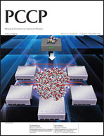

### EMSL Arrows - An Easier Way to Use NWChem

Are you just learning NWChem and would like to have an easy way to
generate input decks, check your output decks against a large database
of calculations, perform simple thermochemistry calculations, calculate
the NMR and IR spectra of modest size molecule, or just try out NWChem
before installing it? EMSL Arrows scientific service can help. [A Web
API to EMSL Arrows is now available for Alpha testing. Click on this
link.](https://arrows.emsl.pnnl.gov/api/) For more information contact
[Eric Bylaska
(eric.bylaska@pnnl.gov).](mailto:eric.bylaska@pnnl.gov?Subject=EMSL%20Arrows%20Question)

[*' EMSL Arrows API*'](https://arrows.emsl.pnnl.gov/api/) 

 Besides using the
Web API you can also use EMSL Arrows by just sending a simple email.
<a href="mailto:arrows@emsl.pnnl.gov?Subject=EMSL%20Arrows%20Calculation%20for%20Wile(y)&amp;body=Just%20send%20this%20email%20to%20arrows@emsl.pnnl.gov%20and%20arrows%20will%20send%20an%20email%20back%20with%20the%20results.%0A%0AHydrolyzing%20Wile%20E%20Coyote's%20favorite%20molecule%0A%0AArrows::%20reaction:%20cid=8376%20+%20hydroxide%20--%3E%20O=N(=O)c1cc(O)c(c(c1)N(=O)=O)C%20+%20nitrite%20:reaction%20::Arrows" class="external text" rel="nofollow">Try it out by clicking here to send an email to arrows@emsl.pnnl.gov.</a>

EMSL arrows is a scientific service that uses NWChem and chemical
computational databases to make materials and chemical modeling
accessible via a broad spectrum of digital communications including
posts to web APIs, social networks, and traditional email. Molecular
modeling software has previously been extremely complex, making it
prohibitive to all but experts in the field, yet even experts can
struggle to perform calculations. This service is designed to be used by
experts and non-experts alike. Experts will be able carry out and keep
track of large numbers of complex calculations with diverse levels of
theories present in their workflows. Additionally, due to a streamlined
and easy-to-use input, non-experts will be able to carry out a wide
variety of molecular modeling calculations previously not accessible to
them.

You do not need to be a molecular modeling expert to use EMSL Arrows. It
is very easy to use. You simply email chemical reactions to
arrows@emsl.pnnl.gov and then an email is sent back to you with
thermodynamic, reaction pathway (kinetic), spectroscopy, and other
results. There are currently 42,000+ calculations in the EMSL Arrows
database and it is growing every day. If an EMSL Arrows request requires
a calculation not already in the database, then it will automatically
start the calculation on a small number of freely available computers
and send back the results when finished. More information can be found
at [Arrows](EMSL_Arrows#%22EMSL). We
would like thank the DOD SERDP program and the DOE OS OBER EMSL project
for their support.

<iframe width="560" height="315" src="//www.youtube.com/embed/6cIwx63qiQM" frameborder="0" allowfullscreen></iframe>

<a href="https://youtu.be/UFZg-_nQZPM" class="external text" rel="nofollow">Tutorial on YouTube</a>
<a href="https://youtu.be/6cIwx63qiQM" class="external text" rel="nofollow">(mobile devices)</a>

### NWChem 6.6 has been released

NWChem team is pleased to announce the 6.6 release. We would like to
express our sincere thanks to all the authors and contributors who made
this release possible. This release includes several new capabilities
and bug fixes. The key features of NWChem 6.6 include:

  - New qmd module
    [AIMD](https://nwchemgit.github.io/Gaussian-Basis-AIMD.html)
    (NVT, NVE) for molecular and finite systems. It can be used with all
    Gaussian basis set ground and excited-state methods in NWChem that
    can provide an energy/gradient (analytic or numerical). It can also
    be combined with COSMO. A qmd_analysis standalone code is also
    provided to analyze the trajectory data.
  - York-Karplus approach in
    [COSMO](https://nwchemgit.github.io/COSMO-Solvation-Model.html)
    (keywords to invoke the Klamt-Schuurmann approach is included in the
    documentation). With the extensive changes that were made in the
    COSMO module, the Klamt-Schuurman approach is not perfectly backward
    compatible with the previous 6.5 release. Some cases show small
    differences in the energies. We are working on a patch for backward
    compatibility.
  - Integration of FEFF6 library into AIMD (FEFF is an automated program
    for ab initio multiple scattering calculations of X-ray Absorption
    Fine Structure (XAFS), X-ray Absorption Near-Edge Structure (XANES)
    and various other spectra for clusters of atoms developed at the
    University of Washington (John Rehr's group)
    <http://feffproject.org/> ).
  - New implementation of the PAW method into PSPW. Simple to use, just
    include PAW potential library in the PSPW simulation.
  - Grimme2, and Grimme3 potentials added to NWPW
  - MGGA-MVS Exchange functional added to [gaussian DFT
    module](https://nwchemgit.github.io/Density-Functional-Theory-for-Molecules#exchange-correlation-functionals)
  - Initial convergence of NWPW wavefunctions now done using finer grids
    in successive stages.
  - Reading and writing of NWPW wavefunctions in ASCII format. To use
    just append .ascii to the NWPW vectors filename
  - Metropolis NVT and NPT added to PSPW
  - Equation parser for defining collective variables in Metadynamics
    and TAMD
  - New NEB solver based on Full Approximation Scheme (FAS) solver.
    Currently only available on Bitbucket
    (https://bitbucket.org/ebylaska/python-neb.git). Integrated version
    will be available soon in the development tree.
  - Parallel in time integrator for use with NWChem. Python programs
    available at
    <ftp://ftp.aip.org/epaps/journ_chem_phys/E-JCPSA6-139-011332/>
  - Trajectories from the NWChem molecular dynamics module can be
    exported in the xyz format
  - Intel Xeon Phi port for
    [MR-CCSD(T)](https://nwchemgit.github.io/TCE.html#ccsdt-and-mrccsdt-implementations-for-intel-mic-architectures)
  - The supported version of the Global Arrays library is now
    [5-4](http://hpc.pnl.gov/globalarrays/release_notes.shtml#5.4b)
  - New ARMCI_NETWORK=MPI-PR (MPI progress ranks). It is the
    recommended option (performance-wise) when no other native ports are
    available.
  - Streamlined installation (automated detection of MPI variables)
  - Improved ScaLapack and ELPA integration. The current ELPA interface
    is compatible with the 2015.05 release.
  - Improved parallelization in DFT [Charge-Density fitting](https://nwchemgit.github.io/Density-Functional-Theory-for-Molecules#specification-of-basis-sets-for-the-dft-module)
    (removed semi-direct option)
  - Improved parallel scalability of
    [Semi-direct MP2](https://nwchemgit.github.io/MP2.html)
  - Improved stability of in-core installation (e.g. `USE_NOIO=y`) of
    [Semi-direct MP2](https://nwchemgit.github.io/MP2.html)
  - Improvements in Xeon Phi offloading for single reference
    [Intel Xeon Phi port for MR-CCSD(T)]
    (https://nwchemgit.github.io/TCE.html#ccsdt-and-mrccsdt-implementations-for-intel-mic-architectures)
  - New LINUX64 architecture available: ppc64le
  - Bug fix for CDFT
  - Bug fix for anisotropic part of the DFT polarizabilities
  - Bug fix in PSPW implementation of Electron Transfer calculation
    (i.e. periodic version of ET module)

### NWChem among 13 science projects selected to run on the 300-petaFLOPS Summit

In preparation for next-generation supercomputer Summit, the Oak Ridge
Leadership Computing Facility (OLCF) selected 13 partnership projects
into its Center for Accelerated Application Readiness (CAAR) program. A
collaborative effort of application development teams and staff from the
OLCF Scientific Computing group, CAAR is focused on redesigning,
porting, and optimizing application codes for Summit’s hybrid CPU–GPU
architecture. Researchers from Pacific Northwest National Laboratory and
IBM Almaden Research Center aim to scale the NWChem application to
utilize GPU accelerators to provide benchmark energies to allow for
accurate parameterization of force fields for glycans as well as develop
and disseminate an open-source database of accurate glycan
conformational energies. New implementations of high-accuracy methods
capable of taking advantage of Summit computational resources will
significantly shift the system-size limit tractable by very accurate yet
expensive methods accounting for the inter-electron correlation effects.
<https://www.olcf.ornl.gov/caar/>

### NWChem Tutorial at NSCCS

Two day workshop (April 21st-22nd 2015) will introduce researchers in
the field of computational chemistry to the NWChem software package.
NWChem aims to provide its users with computational chemistry tools that
can handle (bio)molecules, nanostructures, and solid-state from quantum
to classical, and all combinations thereof.
<https://web.archive.org/web/20150911003831/https://www.nsccs.ac.uk/NWChem2015.php>

### EMSL Named an Intel Parallel Computing Center

Intel has named EMSL, located at Pacific Northwest National Laboratory,
as an Intel Parallel Computing Center. As an Intel PCC, EMSL’s
scientific computing team will work with Intel to modernize the codes of
NWChem to take advantage of technological advancements in computers.
NWChem is one of the Department of Energy’s premier open-source
computational chemistry software suites and has been developed at EMSL.
The modernized codes will be applicable to several science drivers
including studies of aerosol particles, soil chemistry, biosystems,
hormone-cofactor functionality in proteins, ionic liquids in cells,
spectroscopies, new materials and large-scale reaction mechanisms.
<https://web.archive.org/web/20170502154826/http://www.emsl.pnl.gov/emslweb/news/emsl-named-intel%C2%AE-parallel-computing-center>

### NWChem SC2014 paper

 This paper
presents the implementation and performance of the highly accurate
CCSD(T) quantum chemistry method on the Intel Xeon Phi coprocessor
within the context of the NWChem computational chemistry package. The
widespread use of highly correlated methods in electronic structure
calculations is contingent upon the interplay between advances in theory
and the possibility of utilizing the ever-growing computer power of
emerging heterogeneous architectures. We discuss the design decisions of
our implementation as well as the optimizations applied to the compute
kernels and data transfers between host and coprocessor. We show the
feasibility of adopting the Intel Many Integrated Core Architecture and
the Intel Xeon Phi coprocessor for developing efficient computational
chemistry modeling tools. Remarkable scalability is demonstrated by
benchmarks. Our solution scales up to a total of 62560 cores with the
concurrent utilization of Intel Xeon processors and Intel Xeon Phi
coprocessors. New CCSD(T) implementation is available in the 6.5 release
of NWchem
<http://sc14.supercomputing.org/schedule/event_detail-evid=pap217.html>

### NWChem 6.5 has been released

NWChem team is pleased to announce the 6.5 release. We would like to
express our sincere thanks to all the authors and contributors who made
this release possible. This release includes several new powerful
capabilities.

  - Analytical TDDFT gradients. Developers: Niri Govind, Huub van Dam,
    Daniel Silverstein (Jensen Group, Penn State University). D.W.
    Silverstein, N. Govind, H.J.J. van Dam, L. Jensen, “Simulating
    One-Photon Absorption and Resonance Raman Scattering Spectra Using
    Analytical Excited State Energy Gradients within Time-Dependent
    Density Functional Theory,” J. Chem. Theory Comput. 9, 5490 (2013).
    <http://pubs.acs.org/doi/abs/10.1021/ct4007772>
  - Analytical COSMO gradients. Developers: Huub van Dam.
  - Enhanced handling of COSMO parameters. Developers: Marat Valiev.
  - SMD (Solvation Model Based on Density) Model. Developers: Alek
    Marenich (Truhlar/Cramer Group, University of Minnesota), Niri
    Govind
  - VEM (Vertical Excitation or Emission) Model. Developers: Alek
    Marenich (Truhlar/Cramer Group, University of Minnesota), Niri
    Govind
  - Analytical 2nd derivatives for Becke97 style XC functionals.
    Developers: Tobias Risthaus (University of Bonn).
  - Open and closed-shell polarizabilities. Developers: Fredy Aquino
    (Schatz Group, Northwestern University), Jochen Autschbach (SUNY,
    Buffalo). F.W. Aquino, G.C. Schatz, "Time-Dependent Density
    Functional Methods for Raman Spectra in Open-Shell Systems", J.
    Phys. Chem. A, 2014, 118 (2), pp 517–525.
    <http://pubs.acs.org/doi/abs/10.1021/jp411039m>
  - Exchange-hole dipole moment method (XDM). Developers: Alberto Otero
    de la Roza (National Institute for Nanotechnology, NRC), Edoardo
    Apra.
  - Calculation of transition densities for excited-states. Developers:
    Niri Govind.
  - Complete list of exchange-correlation functionals within planewave
    DFT. Developers: Huub van Dam, Eric Bylaska.
  - SCS method for MP2/CCSD. Developers: Massimo Malagoli (Penguin
    Computing).
  - Improved stability of in-core (a.k.a no I/O) MP2. Developers:
    Edoardo Apra.
  - Accurate calculation of Electron Affinities (EA) and Ionization
    Potentials (IP) with equation-of-motion coupled-cluster theory
    (IP/EA-EOMCCSD). Developers: Kiran Bhaskaran Nair (Mark Jarrell,
    Juana Moreno, William Shelton Groups, LSU), Karol Kowalski. Kiran
    Bhaskaran-Nair, K. Kowalski, J. Moreno, M. Jarrell, W.A. Shelton,
    “Equation of motion coupled cluster methods for electron
    attachment and ionization potential in fullerenes C60 and C70,” J.
    Chem. Phys. 141, 074304 (2014).
    <http://dx.doi.org/10.1063/1.4891934>
  - Enabling non-iterative CCSD(T) and CR-EOMCCSD(T) calculations with
    large tiles (new parallel algorithm based on the sliced
    representation of multi-dimensional tensors). Developers: Karol
    Kowalski.
  - new TCE 4-index transformation for RHF/ROHF references. Developers:
    Karol Kowalski.
  - Intel MIC port for the TCE CCSD(T) module. Developers: Edoardo Apra,
    Michael Klemm (Intel), Karol Kowalski.
  - Reducing memory requirements in beta-hyperpolarizability linear
    response CCSD method. Developers: Karol Kowalski
  - Performance optimizaton of spin-adapted CCSD implementation for
    closed-shell systems. Developers: Victor Anisimov (National Center
    for Supercomputing Applications, University of Illinois at
    Urbana-Champaign), Edoardo Apra.

<!-- end list -->

  - Temperature accelerated molecular dynamics (TAMD). Developers: Ying
    Chen (Weare Group, UCSD), Eric Bylaska.
  - Added equation input to TAMD and Metadynamics. This allows the user
    the freedom to define unique collective variables in free energy
    simulations. Developers: Eric Bylaska.
  - Frozen Phonon in BAND. Developers: Eric Bylaska
  - 2d surface geometry optimizations. Developers: Eric Bylaska
  - Interface to FEFF6L. Developers: Eric Bylaska
  - FMM implementation of ion-electron interactions in AIMD/MM.
    Developers: Eric Bylaska
  - Constant temperature and pressure Metropolis Monte-Carlo (beta)
    added to PSPW.
  - Ability to assign different basis sets based on on atom name in
    QM/MM calculations. Developers: Marat Valiev.

<!-- end list -->

  - Complete handling of space groups. Developers: Eric Bylaska.

<!-- end list -->

  - Mingw32 port for Windows 32-bit environments. Developer: Edoardo
    Apra.

### NWChem 6.3 release now available

On May 17, 2013 NWChem version 6.3 was released. 

### NWChem highlighted in DOE Pulse

NWChem's efforts to solve chemistry challenges with high performance
computing were highlighted in [DOE
Pulse](http://www.ornl.gov/info/news/pulse/no373/feature.shtml).

### NWChem 6.1.1 bug fix release now available

On June 26, 2012 NWChem version 6.1.1 was released. This version is
solely a bug fix release with the same functionality as NWChem 6.1. 

### NWChem Schedules Tutorials and Hands-On Training

Centers or sites interested in hosting a workshop or tutorial with or
without hands-on training, please contact nwchemgit@gmail.com

Past tutorial/training sessions:

  - A three-day tutorial and hands-on training at
    [A\*STAR](http://www.acrc.a-star.edu.sg/135/workshops.html) in
    Singapore on October 23-25, 2012
  - A three-day tutorial and hands-on training at the [National
    Supercomputer Center](http://www.vlcc.cn/nwchem2012/) in Beijing on
    October 17-19, 2012
  - A two-day tutorial and hands-on training at [the LONI
    Institute](http://www.institute.loni.org/NWChem2012/) on the
    Louisiana State University (Baton Rouge, LA) campus June 8-9, 2012
  - A two-day tutorial and hands-on training at
    [EPCC](http://www.epcc.ed.ac.uk/training-education/course-registration-form/)
    in Edinburgh, UK on June 13-14, 2011
  - A two-day tutorial and hands-on training at
    [LRZ](http://www.lrz.de/services/compute/courses/#TOC1.220) in
    Garching, Germany on June 9-10, 2011
  - A three-day tutorial and hands-on training at the [National
    Supercomputer Center in
    Beijing](http://english.cnic.cas.cn/ns/es/201012/t20101231_63852.html)
    on December 11-13, 2010
  - A two-day tutorial and hands-on training at
    [NCSA](http://www.ncsa.illinois.edu/Conferences/2010NWChem/) in
    Urbana on December 1-2, 2010
  - A 2-hour tutorial at the Pacific Northwest AVS meeting held at PNNL
    on September 15, 2010

### NWChem 6.1 has been released

On January 27, 2012 NWChem version 6.1 was released. An overview of the
changes, added functionality, and bug fixes in this latest version can
be found.

### PCCP Perspective Published

Developers of NWChem at EMSL were the lead authors on a perspective
article in the highly ranked PCCP journal on utilizing high performance
computing for chemistry and parallel computational chemistry. The
article and cover were published in [Phys. Chem. Chem. Phys. 12, 6896
(2010)](http://dx.doi.org/doi:10.1039/c002859b).

### NWChem released as open-source

On September 30, 2010 NWChem version 6.0 was released. This version
marks a transition of NWChem to an open-source software package. The
software is being released under the
[Educational Community License 2.0](http://opensource.org/licenses/ecl2.php)
(ECL 2.0). 

New functionality, improvements, and bug fixes include:

  - Greatly improved memory management for TCE four-index
    transformation, CCSD(T), CR-EOMCCSD(T), and solver for EOMCCSD
  - Performance and scalability improvments for TCE CCSD(T),
    CR-EOMCCSD(T), and EOMCCSD
  - TCE based static CCSD hyperpolarizabilities
  - New exchange-correlation functionals available in the Gaussian DFT
    module
      - Range-separated functionals: CAM-B3LYP, LC-BLYP, LC-PBE,
        LC-PBE0, BNL. These functionals can also be used to perform
        TDDFT excited-state calculations
      - SSB-D functional
      - Double hybrid functionals (Semi-empirical hybrid DFT combined
        with perturbative MP2)
  - DFT response calculations are now available for order 1 (linear
    response), single frequency, electric field and mixed
    electric-magnetic field perturbations.
  - Spin-orbit now works with direct and distributed data approaches
  - Greatly improved documentation for QM/MM simulations
  - Bug fix for DISP: Empirical long-range vdW contribution
  - Bug fix for Hartree-Fock Exchange contributions in NMR
  - Plane-wave BAND module now has parallelization over k-points, AIMD,
    and Spin-Orbit pseudopotentials
  - Plane-wave modules have improved minimizers for metallic systems and
    metadynamics capabilities
