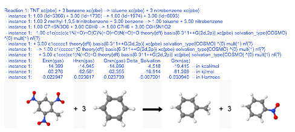

# EMSL Arrows - Evolution of Chemical and Materials Computation

We would like thank the DOD SERDP program and the DOE OS OBER EMSL
project for providing support that helped with the initial development
of EMSL Arrows.

<span style="background: #82BA57; border: solid 1px #a9a9a9; padding: 8px">
[*' EMSL Arrows API*'](https://arrows.emsl.pnnl.gov/api) </span>


<p><iframe width="560" height="315" src="//www.youtube.com/embed/6cIwx63qiQM" frameborder="0" allowfullscreen></iframe>
</p
><p><a href="https://youtu.be/UFZg-_nQZPM" class="external text" rel="nofollow">Tutorial on YouTube</a>
<a href="https://youtu.be/6cIwx63qiQM" class="external text" rel="nofollow">(mobile devices)</a>
</p>
<p>>
<a href="mailto:arrows@emsl.pnnl.gov?Subject=Another%20Wile(y)%20EMSL%20Arrows%20Calculation&amp;body=Just%20send%20this%20email%20to%20arrows@emsl.pnnl.gov%20and%20arrows%20will%20send%20an%20email%20back%20with%20the%20results.%0A%0AHydrolyzing%20Wile%20E%20Coyote's%20favorite%20molecule%20to%20a%20Meisenheimer%20complex%0A%0AArrows::%20reaction:%20cid=8376%20+%20hydroxide%20--%3E%20TNT-1-OH-%20:reaction%20::Arrows" class="external text" rel="nofollow">Click here to try out Arrows by sending it an email</a>
</p>

Are you just learning NWChem and would like to have an easy way to
generate input decks, check your output decks against a large database
of calculations, perform simple thermochemistry calculations, calculate
the NMR and IR spectra of modest size molecule, or just try out NWChem
before installing it? EMSL Arrows scientific service can help.
A Web API to EMSL Arrows is now available for Alpha testing.
Click on this [link](https://arrows.emsl.pnnl.gov/api).  

For more information contact  [Eric Bylaska (eric.bylaska@pnnl.gov)](mailto:eric.bylaska@pnnl.gov?Subject=EMSL%20Arrows%20Question)

<span style="background: #82BA57; border: solid 1px #a9a9a9; padding: 8px">
[*' EMSL Arrows API*'](https://arrows.emsl.pnnl.gov/api) </span>

The difficulty of simulating the thermodynamic and kinetic properties of
new materials is convoluted by the sensitivity of the processes at the
macroscopic scale to the atomic scale; the unusual and unexpected
bonding behaviors of the materials; the complex extreme temperature and
pressure environments likely to be encountered; and the requirements
that simulations be as parameter free as possible and extremely
reliable. The tools of quantum chemistry and statistical mechanics
combined with advanced parallel packages such as NWChem have proved to
be very effective and productive. Not surprisingly, programs that
implement these types of tools make up a large fraction of DOE OS
supercomputer cycles. Despite these hugely successful theoretical
developments, reliable calculations of this type require considerable
computational effort and often the use of codes with difficult input
decks.

The NWChem molecular modeling software implements a robust and diverse
set of molecular theories that can estimate the thermodynamics and
kinetics of molecules and materials. It arguably has the most
capabilities of any molecular modeling code today. The problem with
NWChem and other molecular modeling codes is that:

  - Molecular modeling software is extremely complex, contains millions
    of lines of code, and takes a long time to set up and to learn how
    to use.
  - Even the most basic input for molecular modeling software requires
    the use of other software to generate it.
  - Because of this complexity people unnaturally identify with codes
    and molecular theories, and they are hesitant to learn new codes and
    new molecular simulation techniques.

The goal of this project is to provide EMSL users and DOE scientists and
engineers with an open-source computational chemistry and materials tool
called EMSL Arrows. EMSL Arrows is a software package that combines
NWChem, SQL and NOSQL databases, and email (in the future also social
networks, e.g. Twitter, Tumblr) that simplifies molecular and materials
modeling and makes these modeling capabilities easier to use and more
accessible to many scientists and engineers.

EMSL Arrows is very simple to use. The user just emails chemical
reactions to arrows@emsl.pnnl.gov and then an email is sent back with
thermodynamic, reaction pathway (kinetic), spectroscopy, and other
results.

EMSL Arrows parses the email and then searches the database for the
compounds in the reactions. If a compound isn't there, an NWChem
calculation is setup and submitted to calculate it. Once the calculation
is finished the results are entered into the database and then results
are emailed back. This whole process is completely automated. To enter
different calculation types (e.g. use pspw theory, or pbe0 exchange
correlation functional) the SMILES is appended with keyword{options}
tags. An example email is as follows:
```
To: arrows@emsl.pnnl.gov
  
Subject: Calculate isodesmic reactions  
  
Arrows::   
Reaction: C(Cl)(Cl)(Cl)O + C  --> C(Cl)(Cl)Cl + CO :Reaction  
Reaction: C(Cl)(Cl)(Cl)O + C  --> C(Cl)(Cl)Cl + CO ~ theory{pspw} :Reaction  
Reaction:                        C(Cl)(Cl)(Cl)S + C  --> C(Cl)(Cl)Cl + CS :Reaction  
Reaction:   C(Cl)(Cl)(Cl)S + C  --> C(Cl)(Cl)Cl + CS ~ theory{pm3} :Reaction  
Reaction: TNT + 3 benzene --> toluene + 3 nitrobenzene ~ xc{pbe} :Reaction  
::Arrows
```

The results returned by EMSL Arrows are a combination of text and
graphical output.

<p><a href="Arrowsoutputimage001.png" class="image"></a>
</p><p>

Currently EMSL Arrows is designed to calculate the following for all
NWChem theories:

  - Reaction thermodynamics for molecular systems
  - Reaction paths for molecular systems
  - UV-vis, IR, Raman spectra for molecular systems, phonon 
spectra for
    materials systems
  - NMR spectra for molecular and materials systems
  - EXAFS spectra for molecular and materials systems
  - Energetics, structures, and band structures of crystals using the
    
Crystal Open Database (COD ) numbers
  - A variety of datafiles can be returned including XYZ files, CIF
    
files, NWChem output files

We envision that as Arrows evolves it will be part of future closed
cycles of chemical and materials discovery that requires integrated
computational and experimental tools combined with materials synthesis.

### Try out EMSL Arrows by sending the following simple emails to arrows@emsl.pnnl.gov

<p>Returns b3lyp/6-311++G(2d,2p) results for the cinnamon flavored molecule.  <a href="mailto:arrows@emsl.pnnl.gov?Subject=Big%20Red%20Calculation&amp;body=Just%20send%20this%20email%20to%20arrows@emsl.pnnl.gov%20and%20arrows%20will%20send%20an%20email%20back%20with%20the%20results.%0A%0AArrows::%20%0A%0Amolecule:%20Cinnamaldehyde%20:molecule%20%0A%0A::Arrows" class="external text" rel="nofollow">Click here to run this example.</a>
</p>
```
---------------- mailto: arrows@emsl.pnnl.gov -----------------------  
Arrows::  
  
molecule: Cinnamaldehyde :molecule  
  
::Arrows
```
<p><br />
Using MP2 to calculate the reaction energy of a hydrolysis reaction for <a href="https://s-media-cache-ak0.pinimg.com/736x/03/ca/56/03ca566a8425b37e663bf1bd81ffe61b.jpg" class="external text" rel="nofollow">TNT</a>.
<a href="mailto:arrows@emsl.pnnl.gov?Subject=TNT%20Hydrolysis%20MP2%20Calculation&amp;body=Just%20send%20this%20email%20to%20arrows@emsl.pnnl.gov%20and%20arrows%20will%20send%20an%20email%20back%20with%20the%20results.%0A%0AArrows::%20%0A%0Areaction:%20cid=8376%20+%20hydroxide%20--%3E%20O=N%28=O%29c1cc%28O%29c%28c%28c1%29N%28=O%29=O%29C%20+%20nitrite%20~%20theory%7Bmp2%7D%20:reaction%20%0A%0A::Arrows" class="external text" rel="nofollow">Click here to run this example.</a>
</p>
```
---------------- mailto: arrows@emsl.pnnl.gov -----------------------  
Arrows::  
   
Reaction: cid=8376 + hydroxide --> O=N(=O)c1cc(O)c(c(c1)N(=O)=O)C + nitrite ~ theory{mp2} :Reaction  
  
::Arrows
```
Examples of [isodesmic reaction](Plane-Wave-Density-Functional-Theory#nwpw-tutorial-3-using-isodesmic-reaction-energies-to-estimate-gas-phase-thermodynamics)
<a href="mailto:arrows@emsl.pnnl.gov?Subject=isodesmic%20reactions&amp;body=Just%20send%20this%20email%20to%20arrows@emsl.pnnl.gov%20and%20arrows%20will%20send%20an%20email%20back%20with%20the%20results.%0A%0AArrows::%20%0A%0Areaction:%20TNT%20+%203%20benzene%20--%3E%20toluene%20+%203%20nitrobenzene%20~%20theory%7Bmp2%7D%20:reaction%20%0A%20reaction:%20C%28Cl%29%28Cl%29%28Cl%29O%20+%20C%20--%3E%20C%28Cl%29%28Cl%29Cl%20+%20CO%20:reaction%20%0A%20reaction:%20%20C%28Cl%29%28Cl%29%28Cl%29O%20+%20C%20--%3E%20C%28Cl%29%28Cl%29Cl%20+%20CO%20~%20xc%7Bpbe%7D%20:reaction%20%0A%20reaction:%20%20C%28Cl%29%28Cl%29%28Cl%29O%20+%20C%20--%3E%20C%28Cl%29%28Cl%29Cl%20+%20CO%20~%20theory%7Bpspw%7D%20:reaction%20%0A%0A::Arrows" class="external text" rel="nofollow">Click here to to run this example.</a>
```
---------------- mailto: arrows@emsl.pnnl.gov -----------------------  
Arrows::  
  
Reaction: TNT + 3 benzene --> toluene + 3 nitrobenzene  ~ theory{mp2} :Reaction   
Reaction: C(Cl)(Cl)(Cl)O + C  --> C(Cl)(Cl)Cl + CO :Reaction  
Reaction: C(Cl)(Cl)(Cl)O + C  --> C(Cl)(Cl)Cl + CO ~ xc{pbe} :Reaction  
Reaction: C(Cl)(Cl)(Cl)O + C  --> C(Cl)(Cl)Cl + CO ~ theory{pspw} :Reaction  
  
::Arrows
```
Examples of reaction prediction capabilities in Arrows.
<a href="mailto:arrows@emsl.pnnl.gov?Subject=predict%20reaction%20for%20methane&amp;body=Just%20send%20this%20email%20to%20arrows@emsl.pnnl.gov%20and%20arrows%20will%20send%20an%20email%20back%20with%20the%20results.%0A%0AArrows::%20%0A%0Apredict:%202%20methane%20:predict%20%0A%20%20%0A%0A::Arrows" class="external text" rel="nofollow">Click here to to run this example.</a>

```
---------------- mailto: arrows@emsl.pnnl.gov -----------------------  
Arrows::  
  
Predict: 2 methane   :Predict  
  
::Arrows
```
<a href="mailto:arrows@emsl.pnnl.gov?Subject=predict%20reaction&amp;body=Just%20send%20this%20email%20to%20arrows@emsl.pnnl.gov%20and%20arrows%20will%20send%20an%20email%20back%20with%20the%20results.%0A%0AArrows::%20%0A%0Apredict:%20TNT%20+%20hydroxide%20:predict%20%0A%20%20%0A%0A::Arrows" class="external text" rel="nofollow">Click here to to run this example.</a>

```
---------------- mailto: arrows@emsl.pnnl.gov -----------------------  
Arrows::  
  
Predict: TNT + hydroxide   :Predict  
  
::Arrows
```
Fetch an NWChem output deck from Arrows.
<a href="mailto:arrows@emsl.pnnl.gov?Subject=fetch%20results%20for%20caffeine&amp;body=Just%20send%20this%20email%20to%20arrows@emsl.pnnl.gov%20and%20arrows%20will%20send%20an%20email%20back%20with%20the%20results.%0A%0AArrows::%20%0A%0Anwoutput:%20caffeine%20:nwoutput%20%0A%20%20%0A%0A::Arrows" class="external text" rel="nofollow">Click here to to run this example.</a>
```
---------------- mailto: arrows@emsl.pnnl.gov -----------------------  
Arrows::  
  
nwoutput: caffeine :nwoutput  
  
::Arrows
```

## Try out the following web API links (Now Available for Alpha Testing)

[EMSL Arrows API v1.0](http://arrows.emsl.pnnl.gov/api/)

## Introduction to ESMILES - How to Change Calculation Theories

The combined string, "Molecule\_Input keyword1{option1}
keyword2{option2} keywordN{optionN}", is called an "extended smiles" or
"esmiles" for short. The Molecule\_Input can be specified using a
variety of formats including a SMILES string, common names, iupac, kegg
numbers, cas, pubchem ids, chemspider ids, and InChI strings. The
keyword{option} tags are used to enter different calculation types for a
molecule, e.g. use pspw theory, ccsd(t), or pbe0 exchange correlation
functional.

The following are examples of esmiles strings:

Plane-Wave DFT calculation using LDA and a cutoff energy=30.0 Ry
```
c1ccccc1 theory{pspw} xc{lda} basis{30.0 Ry}
```
MP2 calculation using 6-31G\* basis set
```
CCO theory{mp2} basis{6-31G*}
```
CCSD(T) calculation of ethanol
```
CCO theory{ccsd(t)} basis{6-31G*}
```
Mopac PM3 calculation of caffeine
```
Caffeine theory{pm3}
```
Aperiodic plane-wave DFT calculation of triplet cabon tetrachloride
```
C(Cl)(Cl)(Cl)Cl mult{3} theory{pspw4}  
```
Gas-phase M06-2x/6-31+G\* calculation of benzene
```
benzene theory{dft} xc{m06-2x} solvation_type{none}
```
Equivalent ESMILES for CCSD(T)/6-31G\* calculation of methanol
```
methyl alcohol theory{ccsd(t)} basis{6-31G*}  
kegg=D02309 theory{ccsd(t)} basis{6-31G*}  
cas=67-56-1 theory{ccsd(t)} basis{6-31G*}  
cid=887 theory{ccsd(t)} basis{6-31G*}  
csid=864 theory{ccsd(t)} basis{6-31G*}  
InChI=1S/CH4O/c1-2/h2H,1H3 theory{ccsd(t)} basis{6-31G*}  
```  

The available keywords in and esmiles string are: theory,
theory\_property, theory\_base, basis, basis\_property, basis\_base, xc,
xc\_property, xc\_base, solvation\_type, charge, mult, xyzdata,
geometry\_generation, and calculation\_type.

### ESMILES Options - theory{}, theory\_property{} and theory\_base{}

The default theory used is theory{dft}. The following theories are
available:
```
-       dft        -- NWChem Gaussian DFT  
-       pspw   -- NWChem Plane-Wave DFT (periodic boundary conditions, Γ point)  
-       pspw4 -- NWChem Plane-Wave DFT (aperiodic boundary conditions)  
-       mp2      -- NWChem MP2 program  
-       ccsd(t)  -- NWChem CCSD(T)  
-       pm3      -- Mopac7 PM3  
-       am1      -- Mopac7 AM1  
-       mindo   -- Mopac7 MINDO  
-       mindo3 -- Mopac7 MINDO3
```
The theory\_property{} is an optional keyword used to specify the theory
used in an nmr calculation, and theory\_base{} is an optional keyword
used to specify the theory of the base calculation for an MP2 or CCSD(T)
calculation. By default the theory\_property and theory\_base are
defined to be the same as theory{}.

### ESMILES Options - basis{}, basis\_property{} and basis\_base{}

The default basis used is 6-311++G(2d,2p) for the Gaussian DFT, MP2 and
CCSD(T) programs. For plane-wave DFT the default basis or cutoff energy
is defined to by 50.0 Hartrees or 100.0 Ry.

For Gaussian basis sets any basis set recognized by NWChem can be used,
e.g.
```
CCO basis{6-31G*}
```
Other common basis sets can be used such as cc-pvdz, 6-311G, 3-21G,
6-31+G\*.

For plane-wave basis sets the cutoff energy can changed by just entering
the number in Hartrees or Rydbergs
```
CCO theory{pspw] basis{50.0} 
CCO theory{pspw} basis{100 Ry}  
```
The basis\_property{} is an optional keyword used to specify the basis
set used in an nmr calculation, and basis\_base{} is an optional keyword
used to specify the basis set of the base calculation for an MP2 or
CCSD(T) calculation. By default the basis\_property and basis\_base are
defined to be the same as basis{}.

### ESMILES Options - xc{}, xc\_property{} and xc\_base{}

Only the Gaussian and plane-wave DFT programs utilize the xc{} keyword.
The default exchange correlation functional used is xc{b3lyp}. The
following exchange correlation functions are available with the Gaussian
DFT and plane-wave DFT programs.
```
-       lda       --  local density approximation (LDA) of S.J. Vosko, L. Wilk and M. Nusair, Can. J. Phys. 58, 1200 (1980)  
   
-       pbe      -- The gradient corrected exchange correlation function of J.P. Perdew, K. Burke and M. Ernzerhof,   
                       Phys. Rev. Lett. 77, 3865 (1996); 78 , 1396 (1997)  
   
-       blyp     -- The gradient corrected exchange correlation function A.D. Becke, Phys. Rev. A 88, 3098 (1988) and   
                       C. Lee, W. Yang and R. G. Parr, Phys. Rev. B 37, 785 (1988)  
   
-       b3lyp   -- the hybrid exchange correlation function of A.D. Becke, J. Chem. Phys. 98, 5648 (1993)    
                       and C. Lee, W. Yang and R. G. Parr, Phys. Rev. B 37, 785 (1988)  
   
-       pbe0     -- the hybrid exchange correlation function of C.Adamo and V.Barone, J. Chem. Phys. 110, 6158 (1999)  
   
-       m06-2x -- the hybrid meta exchange correlation function of Y. Zhao, D. G. Truhlar, J. Chem. Phys. 125, 194101 (2006).   
                        Only available in Gaussian DFT program
```

The `xc_property{}` is an optional keyword used to specify the exchange
correlation potential used in an nmr calculation, and `xc_base{}` is an
optional keyword used to specify the exchange correlation potential of
the base calculation for an MP2 or CCSD(T) calculation. By default the
`xc_property` and `xc_base` are defined to be the same as `xc{}`.  

### ESMILES Options - solvation_type{}

The default solvation type is solvation\_type{COSMO}. The following
solvation types are available with the Gaussian DFT, MP2 and CCSD(T)
programs.
```
-       COSMO            -- The COSMO solvation model of Klampt and Shuurman (solvent=water)

-       COSMO-SMD           -- The extended Minnesota COSMO solvation model of Cramer et al. (solvent=water)

-       COSMO-SMD:solvent   -- where the solvent keyword is from Table of SMD solvent names below

-       None                 -- Gas-phase calculation, no solvation model included in the calculations
```

 The available  SMD `solvent` keywords are given  below:  


| Keyword     | Name                            |
| ----------- | ------------------------------- |
| h2o         | water (default)                 |
| water       | water (default)                 |
| acetacid    | acetic acid                     |
| acetone     | acetone                         |
| acetntrl    | acetonitrile                    |
| acetphen    | acetophenone                    |
| aniline     | aniline                         |
| anisole     | anisole                         |
| benzaldh    | benzaldehyde                    |
| benzene     | benzene                         |
| benzntrl    | benzonitrile                    |
| benzylcl    | benzyl chloride                 |
| brisobut    | 1-bromo-2-methylpropane         |
| brbenzen    | bromobenzene                    |
| brethane    | bromoethane                     |
| bromform    | bromoform                       |
| broctane    | 1-bromooctane                   |
| brpentan    | 1-bromopentane                  |
| brpropa2    | 2-bromopropane                  |
| brpropan    | 1-bromopropane                  |
| butanal     | butanal                         |
| butacid     | butanoic acid                   |
| butanol     | 1-butanol                       |
| butanol2    | 2-butanol                       |
| butanone    | butanone                        |
| butantrl    | butanonitrile                   |
| butile      | butyl acetate                   |
| nba         | butylamine                      |
| nbutbenz    | n-butylbenzene                  |
| sbutbenz    | sec-butylbenzene                |
| tbutbenz    | tert-butylbenzene               |
| cs2         | carbon disulfide                |
| carbntet    | carbon tetrachloride            |
| clbenzen    | chlorobenzene                   |
| secbutcl    | sec-butyl chloride              |
| chcl3       | chloroform                      |
| clhexane    | 1-chlorohexane                  |
| clpentan    | 1-chloropentane                 |
| clpropan    | 1-chloropropane                 |
| ocltolue    | o-chlorotoluene                 |
| m-cresol    | m-cresol                        |
| o-cresol    | o-cresol                        |
| cychexan    | cyclohexane                     |
| cychexon    | cyclohexanone                   |
| cycpentn    | cyclopentane                    |
| cycpntol    | cyclopentanol                   |
| cycpnton    | cyclopentanone                  |
| declncis    | cis-decalin                     |
| declntra    | trans-decalin                   |
| declnmix    | decalin (cis/trans mixture)     |
| decane      | n-decane                        |
| decanol     | 1-decanol                       |
| edb12       | 1,2-dibromoethane               |
| dibrmetn    | dibromomethane                  |
| butyleth    | dibutyl ether                   |
| odiclbnz    | o-dichlorobenzene               |
| edc12       | 1,2-dichloroethane              |
| c12dce      | cis-dichloroethylene            |
| t12dce      | trans-dichloroethylene          |
| dcm         | dichloromethane                 |
| ether       | diethyl ether                   |
| et2s        | diethyl sulfide                 |
| dietamin    | diethylamine                    |
| mi          | diiodomethane                   |
| dipe        | diisopropyl ether               |
| dmds        | dimethyl disulfide              |
| dmso        | dimethyl sulfoxide              |
| dma         | N,N-dimethylacetamide           |
| cisdmchx    | cis-1,2-dimethylcyclohexane     |
| dmf         | N,N-dimethylformamide           |
| dmepen24    | 2,4-dimethylpentane             |
| dmepyr24    | 2,4-dimethylpyridine            |
| dmepyr26    | 2,6-dimethylpyridine            |
| dioxane     | 1,4-dioxane                     |
| phoph       | diphenyl ether                  |
| dproamin    | dipropylamine                   |
| dodecan     | n-dodecane                      |
| meg         | 1,2-ethanediol                  |
| etsh        | ethanethiol                     |
| ethanol     | ethanol                         |
| etoac       | ethyl acetate                   |
| etome       | ethyl formate                   |
| eb          | ethylbenzene                    |
| phenetol    | ethyl phenyl ether              |
| c6h5f       | fluorobenzene                   |
| foctane     | 1-fluorooctane                  |
| formamid    | formamide                       |
| formacid    | formic acid                     |
| heptane     | n-heptane                       |
| heptanol    | 1-heptanol                      |
| heptnon2    | 2-heptanone                     |
| heptnon4    | 4-heptanone                     |
| hexadecn    | n-hexadecane                    |
| hexane      | n-hexane                        |
| hexnacid    | hexanoic acid                   |
| hexanol     | 1-hexanol                       |
| hexanon2    | 2-hexanone                      |
| hexene      | 1-hexene                        |
| hexyne      | 1-hexyne                        |
| c6h5i       | iodobenzene                     |
| iobutane    | 1-iodobutane                    |
| c2h5i       | iodoethane                      |
| iohexdec    | 1-iodohexadecane                |
| ch3i        | iodomethane                     |
| iopentan    | 1-iodopentane                   |
| iopropan    | 1-iodopropane                   |
| cumene      | isopropylbenzene                |
| p-cymene    | p-isopropyltoluene              |
| mesityln    | mesitylene                      |
| methanol    | methanol                        |
| egme        | 2-methoxyethanol                |
| meacetat    | methyl acetate                  |
| mebnzate    | methyl benzoate                 |
| mebutate    | methyl butanoate                |
| meformat    | methyl formate                  |
| mibk        | 4-methyl-2-pentanone            |
| mepropyl    | methyl propanoate               |
| isobutol    | 2-methyl-1-propanol             |
| terbutol    | 2-methyl-2-propanol             |
| nmeaniln    | N-methylaniline                 |
| mecychex    | methylcyclohexane               |
| nmfmixtr    | N-methylformamide (E/Z mixture) |
| isohexan    | 2-methylpentane                 |
| mepyrid2    | 2-methylpyridine                |
| mepyrid3    | 3-methylpyridine                |
| mepyrid4    | 4-methylpyridine                |
| c6h5no2     | nitrobenzene                    |
| c2h5no2     | nitroethane                     |
| ch3no2      | nitromethane                    |
| ntrprop1    | 1-nitropropane                  |
| ntrprop2    | 2-nitropropane                  |
| ontrtolu    | o-nitrotoluene                  |
| nonane      | n-nonane                        |
| nonanol     | 1-nonanol                       |
| nonanone    | 5-nonanone                      |
| octane      | n-octane                        |
| octanol     | 1-octanol                       |
| octanon2    | 2-octanone                      |
| pentdecn    | n-pentadecane                   |
| pentanal    | pentanal                        |
| npentane    | n-pentane                       |
| pentacid    | pentanoic acid                  |
| pentanol    | 1-pentanol                      |
| pentnon2    | 2-pentanone                     |
| pentnon3    | 3-pentanone                     |
| pentene     | 1-pentene                       |
| e2penten    | E-2-pentene                     |
| pentacet    | pentyl acetate                  |
| pentamin    | pentylamine                     |
| pfb         | perfluorobenzene                |
| benzalcl    | phenylmethanol                  |
| propanal    | propanal                        |
| propacid    | propanoic acid                  |
| propanol    | 1-propanol                      |
| propnol2    | 2-propanol                      |
| propntrl    | propanonitrile                  |
| propenol    | 2-propen-1-ol                   |
| propacet    | propyl acetate                  |
| propamin    | propylamine                     |
| pyridine    | pyridine                        |
| c2cl4       | tetrachloroethene               |
| thf         | tetrahydrofuran                 |
| sulfolan    | tetrahydrothiophene-S,S-dioxide |
| tetralin    | tetralin                        |
| thiophen    | thiophene                       |
| phsh        | thiophenol                      |
| toluene     | toluene                         |
| tbp         | tributyl phosphate              |
| tca111      | 1,1,1-trichloroethane           |
| tca112      | 1,1,2-trichloroethane           |
| tce         | trichloroethene                 |
| et3n        | triethylamine                   |
| tfe222      | 2,2,2-trifluoroethanol          |
| tmben124    | 1,2,4-trimethylbenzene          |
| isoctane    | 2,2,4-trimethylpentane          |
| undecane    | n-undecane                      |
| m-xylene    | m-xylene                        |
| o-xylene    | o-xylene                        |
| p-xylene    | p-xylene                        |
| xylenemx    | xylene (mixture)                |
    
  
When a solvent is specified by name, the descriptors for the solvent are
based on the Minnesota Solvent Descriptor Database:

Winget, P.; Dolney, D. M.; Giesen, D. J.; Cramer, C. J.; Truhlar, D. G.
Minnesota Solvent Descriptor Database. University of Minnesota:
Minneapolis, MN, 2010. <http://comp.chem.umn.edu/solvation/mnsddb.pdf>

## ESMILES Reactions - How to Calculate Reaction Energies


The basic input is a chemical reaction where the molecules are specified
using smiles strings or esmiles strings (vida infra), e.g.
```
   C(Cl)(Cl)(Cl)O + C --> C(Cl)(Cl)Cl + CO
```
Note that the reaction: :reaction keywords have only one ":", whereas
the Arrows keywords use two colons.

The results contain both gas phase and solution phase reaction energies.
The default level of theory used in these calculations is
b3lyp/6-311++G(2d,2p) and the default solvation model is COSMO. The
returned email will contain the following output.
```
Reaction 1: C(Cl)(Cl)(Cl)O + C --> C(Cl)(Cl)Cl + CO    
- instance 1: 1.00 (Id=6833) + 1.00 (Id=11824) --> 1.00 (Id=6832) + 1.00 (Id=11215)    
- instance 1: 1.00 trichloromethanol + 1.00 methane --> 1.00 chloroform + 1.00 methanol    
- instance 1: 1.00 C1Cl3H1O1 + 1.00 C1H4 --> 1.00 C1Cl3H1 + 1.00 C1H4O1    
- instance 1:   1.00 OC(Cl)(Cl)Cl theory{dft} basis{6-311++G(2d,2p)} xc{b3lyp} solvation_type{COSMO} ^{0} mult{1} nf{?}    
- instance 1: + 1.00 C theory{dft} basis{6-311++G(2d,2p)} xc{b3lyp} solvation_type{COSMO} ^{0} mult{1} nf{0}    
- instance 1:   --> 1.00 C(Cl)(Cl)Cl theory{dft} basis{6-311++G(2d,2p)} xc{b3lyp} solvation_type{COSMO} ^{0} mult{1} nf{?}    
- instance 1:     + 1.00 CO theory{dft} basis{6-311++G(2d,2p)} xc{b3lyp} solvation_type{COSMO} ^{0} mult{1} nf{0}    
- instance 1:        Erxn(gas)       Hrxn(gas)       Grxn(gas) Delta_Solvation        Grxn(aq)    
- instance 1:            8.035           9.580           8.809          -1.991           6.818  -- in kcal/mol    
- instance 1:           33.618          40.084          36.857          -8.332          28.525  -- in kj/mol    
- instance 1:         0.012804        0.015267        0.014038       -0.003173        0.010865  -- in Hartrees
```
The reaction output for the chemical reaction contains the gas phase
reaction energy, gas-phase reaction enthalpy, gas-phase reaction free
energy, change in solvation energy, and the solution phase reaction free
energy. The energy values are given in kcal/mol, kj/mol, and Hartrees..
Besides the energies the output also provides several rows of
information about the calculation:
```
-       first row: the reaction input parsed  
-       second row: the arrows ids used for the compounds in the reaction  
-       third row: the iupac names of the compounds if available.  If not available the systems will default to using smiles   
                        strings  
-       fourth- rows: the chemical reaction is written using the esmiles notation.  
```
The esmiles notation contains all the information about the calculations
of the compounds. In this example, theory used was dft, basis was
6-311++G(2d,2p), the exchange correlation, the solvation type was cosmo.
The charge and multiplicity of the molecules are also given. The value
in the nf{} tag contains the number of imaginary frequencies in the
vibrational calculation for the molecule.

A variety of other inputs to describe the chemical structure besides
smiles can be used, including common names, iupac, kegg numbers, cas,
pubchem ids, chemspider ids, and InChI strings. The common names, iupac
and InChI strings are entered as replacements to the smiles strings, and
the kegg, cas, pubchem, and csid inputs are entered as kegg=value,
cas=value, cid=value, csid=value where value is the id. The chemical
structure input types can be mixed and matched in the reaction input.
The following reaction inputs are all equivalent.
```
  
trichloromethanol + methane --> chloroform + methyl alcohol
trichloromethanol + C --> chloroform + kegg=D02309
trichloromethanol + C --> chloroform + cas=67-56-1
trichloromethanol + C --> chloroform + cid=887
trichloromethanol + C --> chloroform + csid=864
trichloromethanol + C --> chloroform + InChI=1S/CH4O/c1-2/h2H,1H3
  
```

To calculate atomization energies the following input can be used.
```
 C(Cl)(Cl)(Cl)O  --> [C]  mult{3} + 3 [Cl] mult{2} + [O] mult{3}
```


## MAP Function for Adding Options to Reactions

To calculate a reaction energy using non-default options the following
format could be used, e.g.
```
Arrows::  
  
reaction:   
trichloromethanol theory{pspw} xc{lda} + methane theory{pspw} xc{lda}   
--> chloroform theory{pspw} xc{lda} + methyl alcohol theory{pspw} xc{lda}   
:reaction  
  
::Arrows
```
in the body of an Arrows email, or just the following single line input
in the Web API entry box
```
 trichloromethanol theory{pspw} xc{lda} + methane theory{pspw} xc{lda}   
 --> chloroform theory{pspw} xc{lda} + methyl alcohol theory{pspw} xc{lda}
```
Entering ESMILES in this way for reactions is tedius and prone to typos.
To simplify this type of input a map function has been added to the
reaction input, where the format for the mapping function is to append
the reaction with the tilde, "\~", symbol followed by the esmiles
options.
```
trichloromethanol + methane --> chloroform + methyl alcohol ~ theory{pspw} xc{lda}
```
The map function essentially appends every compound in the reaction by
the esmiles options string.This is preferred way to use the map
function. However, an alternative format for entering the map function
has also been added to the reaction: :reaction block. The format of the
block is reaction\[esmiles options\]: reaction :reaction.
```
Arrows::  
  
reaction[theory{pspw} xc{lda}]:   
trichloromethanol + methane --> chloroform + methyl alcohol    
:reaction  
  
::Arrows
```

## How to Define the Chemical Structure with XYZ Input

The xyzinput: :xyzinput block is used to enter a chemical structure
using xyz coordinates. The label: :label subblock is used to label the
xyz structure so that it can be referenced in reaction: :reaction,
molecule: :molecule, and nmr: :nmr blocks. The xyz geometry is entered
inside the xyzdata: :xyzdata block. The coordinates are assumed to be in
Angstroms. The xyz geometry can either contain the number of atoms at
the start of the input, e.g.
```
Arrows::  
 
xyzinput:  
label: amolecule :label  
   xyzdata:  
20  
 
C   0.810772 1.260891 0.224768  
C   -0.445319 0.626551 0.148559  
C   -0.550132 -0.747571 -0.024182  
C   0.598317 -1.510887 -0.051277  
C   1.856720 -0.927387 0.081993  
C   1.951003 0.440481 0.208335  
H   2.736961 -1.550133 0.062422  
H   2.912395 0.927722 0.273890  
O   1.062201 2.575051 0.296009  
C   0.213380 3.557631 -0.323370  
H   -1.520657 -1.209783 -0.105115  
N   -1.712300 1.341956 0.351481  
N   0.485785 -2.966232 -0.210786  
O   -0.636770 -3.441145 -0.327238  
O   1.526277 -3.613525 -0.218259  
O   -2.671572 1.004073 -0.327713  
O   -1.733900 2.198527 1.228109  
H   0.882435 4.349335 -0.647148  
H   -0.510291 3.940088 0.389177  
H   -0.297779 3.136834 -1.188838  
  :xyzdata  
:xyzinput  
 
molecule: label=amolecule xc{m06-2x} :molecule  
 
::Arrows  

r it can be left out, e.g.

Arrows::  
 
xyzinput:  
label: amolecule :label  
   xyzdata:  
C   0.810772 1.260891 0.224768  
C   -0.445319 0.626551 0.148559  
C   -0.550132 -0.747571 -0.024182  
C   0.598317 -1.510887 -0.051277  
C   1.856720 -0.927387 0.081993  
C   1.951003 0.440481 0.208335  
H   2.736961 -1.550133 0.062422  
H   2.912395 0.927722 0.273890  
O   1.062201 2.575051 0.296009  
C   0.213380 3.557631 -0.323370  
H   -1.520657 -1.209783 -0.105115  
N   -1.712300 1.341956 0.351481  
N   0.485785 -2.966232 -0.210786  
O   -0.636770 -3.441145 -0.327238  
O   1.526277 -3.613525 -0.218259  
O   -2.671572 1.004073 -0.327713  
O   -1.733900 2.198527 1.228109  
H   0.882435 4.349335 -0.647148  
H   -0.510291 3.940088 0.389177  
H   -0.297779 3.136834 -1.188838  
  :xyzdata  
:xyzinput  
  
molecule: label=amolecule xc{m06-2x} :molecule
  
::Arrows
```
## How to Calculate NMR Spectra

The nmr: :nmr block is used to energy an NMR calculation
```
Arrows:: 
nmr: c1ccccc1 basis{6-31G*} solvation_type{None} :nmr
::Arrows
```
For single line input the esmiles is preceded by the words "nmr for",
e.g.
```
nmr for c1ccccc1 basis{6-31G*} solvation_type{None}
```
## How to Generate a Table of Reactions

The reactionenumerate: :reactionenumerate block is used to generate a
table of reactions in CSV format, which can be copy and pasted into
spreadsheets.
```
Arrows::  
 
reactionenumerate:  
  energytype: grxn(aq) kcal/mol :energytype  
  tablereactions:  
     reaction: TNT + hydroxide --> TNT-2-OH + nitrite :reaction  
     reaction: DNAN + hydroxide --> DNAN-2-OH + nitrite :reaction  
  :tablereactions  
  tablemethods:  
      method: xc{pbe} :method  
      method: xc{b3lyp} :method  
      method: xc{m06-2x} :method  
  :tablemethods  
:reactionenumerate  
  
::Arrows
```
## How to Fetch NWChem Output

The NWChem output can be fetched using the nwoutput: :nwoutput and
printnwout: :printnwout blocks. The input for the nwoutput: :nwoutput
block is an ESMILES strings, e.g.
```
Arrows::
nwoutput: TNT theory{pspw} :nwoutput
::Arrows
```
For single line input the esmiles is preceded by the words "nwoutput
for", e.g.
```
nwoutput for aspirin theory{pspw}
```
The input for the printnwout: :printnwout block is an Arrows id, e.g.
```
Arrows::  
printnwout: 13212 :printnwout
::Arrows
```
## Generate NWChem Input

The Web API can be used to generate an NWChem input deck. For single
line input the esmiles is preceded by the words "input deck for", e.g.
```
input deck for aspirin
```
## How to Fetch XYZ Geometry

An XYZ geometry can be fetched using the xyzfile: :xyzfile and printxyz:
:printxyz blocks. The input for the xyzfile: :xyzfile block is an
ESMILES strings, e.g.
```
Arrows::  
xyzfile: TNT theory{pspw} :xyzfile
::Arrows
```
The input for the printxyz: :printxyz block is an Arrows id, e.g.
```
Arrows::  
printxyz: 13212 :printxyz
::Arrows
```
For single line input the esmiles is preceded by the words "xyz for",
e.g.
```
xyz for TNT theory{pspw}
```
