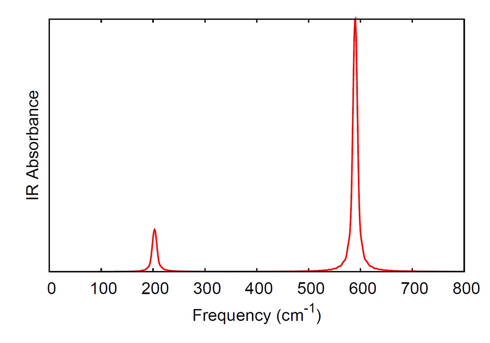
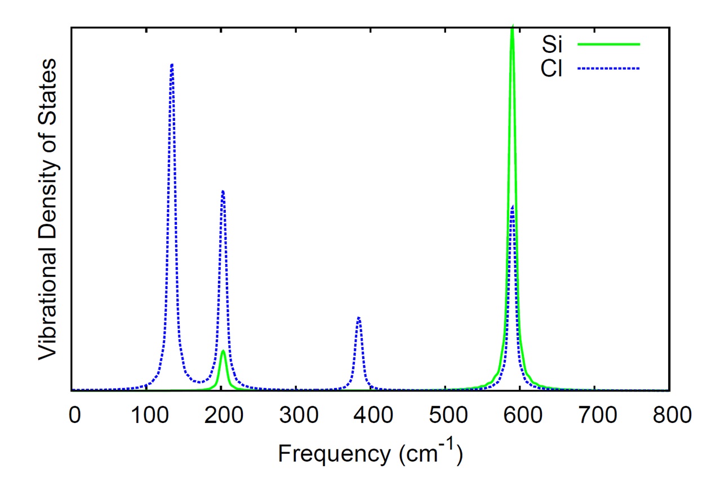

[TOC]
# Gaussian Basis AIMD

## Overview

This module performs adiabatic ab initio molecular dynamics on finite
systems. The nuclei are integrated using the velocity-Verlet algorithm,
and the electronic potential can be provided by any of the Gaussian
basis set based methods in NWChem, e.g. DFT, TDDFT, TCE, MP2, SCF,
MCSCF, etc. If analytic gradients are not available for the selected
level of theory, numerical gradients will automatically be used. Initial
velocities are randomly selected from the Maxwell-Boltzmann distribution
at the specified temperature, unless a restart file (`.qmdrst`) is
present. If a restart file is present, the trajectory information will
be read from that file and the trajectory will resume from that point.

For computational details and a case study using the module, please
refer to the following paper: S. A. Fischer, T. W. Ueltschi, P. Z.
El-Khoury, A. L. Mifflin, W. P. Hess, H.F. Wang, C. J. Cramer, N. Govind
"Infrared and Raman Spectroscopy from Ab Initio Molecular Dynamics and
Static Normal Mode Analysis: The CH Region of DMSO as a Case Study" J.
Phys. Chem. B, 120 (8), pp 1429–1436 (2016); [DOI:10.1021/acs.jpcb.5b03323](https://dx.doi.org/10.1021/acs.jpcb.5b03323).

```
QMD
  [dt_nucl <double default 10.0>]  
  [nstep_nucl <integer default 1000>]  
  [targ_temp <double default 298.15>]  
  [thermostat <string default none> <thermostat parameters>]  
  [rand_seed <integer default new one generated for each run>]  
  [com_step <integer default 100>]  
  [print_xyz <integer default 1>]  
  [linear]   
  [property <integer default 1>] 
  [tddft <integer default 1>]
  [namd ]
END
```

The module is called as:

```
task <level of theory> qmd
```

where <level of theory> is any Gaussian basis set method in NWChem

## QMD Keywords

### DT_NUCL: Nuclear time step

This specifies the nuclear time step in atomic units (1 a.u. = 0.02419
fs).
Default: 10.0 a.u.

### NSTEP_NUCL: Simulation steps

This specifies the number of steps to take in the nuclear dynamics.  
Default: 1000

### TARG_TEMP: Temperature of the system

This specifies the temperature to use with the thermostat. Also it is
used in generating initial velocities from the Maxwell-Boltzmann
distribution.  
Default: 298.15 K

### THERMOSTAT: Thermostat for controling temperature of the simulation

This specifies the thermostat to use for regulating the temperature of
the nuclei. Possible options are:

- **none**

   No thermostat is used, i.e. an NVE ensemble is simulated. Default  

- **svr** `<double default 1000.0>`

   Stochastic velocity rescaling thermostat of Bussi, Donadio, and Parrinello,
 J. Chem. Phys. 126, 014101 (2007)  
   Number sets the relaxation parameter of the thermostat  

- **langevin** `<double default 0.1>`

   Langevin dynamics, implementation according to Bussi and Parrinello Phys. Rev. E 75, 056707 (2007)  
   Number sets the value of the friction  

- **berendsen** `<double default 1000.0>`  

   Berendsen thermostat, number sets the relaxation parameter of the thermostat  

- **rescale**

   Velocity rescaling, i.e. isokinetic ensemble  

### RAND_SEED: Seed for the random number generator

This specifies the seed for initializing the random number generator. If
not given, a unique random seed will be generated. Even without a
thermostat, this will influence the initial
velocities.

### COM_STEP: How often center-of-mass translations and rotations are removed

This specifies that center-of-mass translations and rotations will be
removed every `com_step` steps. Default 10 COM translations and rotations
are removed on startup (either randomized initial velocities or those
read from the restart file).

### PRINT_XYZ: How often to print trajectory information to xyz file

This specifies how often the trajectory information (coordinates, velocities,
total energy, step number, dipole (if available)) is written to the xyz file. The
units for the coordinates and velocities in the xyz file are Angstrom
and Angstrom/fs, respectively.  
For example, `print_xyz 5` will write the xyz trajectory file every 5 steps.  
Default: 1 

### LINEAR: Flag for linear molecules

If present, the code assumes the molecule is linear.

### PROPERTY: How often to calculate molecular properties as part of the MD simulation

If present, the code will look for the property block and calculate the requested properties.  
For example, `property 5` will calculate properties on the current geometry every 5 steps.  
Default: 0 (e.g properties are not computed)  

### TDDFT: How often to peform TDDFT calculation as part of the MD simulation  

If present, the code will look for the tddft block and calculate the absorption spectrum.  
For example, `tddft 5` will perform tddft calculations on the current geometry every 5 steps.  
Default: 0 (e.g tddft is not run)

## Sample input files

### Ground state Molecular Dynamics

The following is a sample input for a ground state MD simulation. The
simulation is 200 steps long with a 10 a.u. time step, using the
stochastic velocity rescaling thermostat with a relaxation parameter of
100 a.u. and a target temperature of 200 K. Center-of-mass rotations and
translations will be removed every 10 steps and trajectory information
will be output to the xyz file every 5 steps.

```
start qmd_dft_h2o_svr  
echo  
print low  
geometry noautosym noautoz  
  O   0.00000000    -0.01681748     0.11334792  
  H   0.00000000     0.81325914    -0.34310308  
  H   0.00000000    -0.67863597    -0.56441201  
end  
basis  
  * library 6-31G*  
end  
dft  
  xc pbe0  
end  
qmd  
  nstep_nucl  200  
  dt_nucl     10.0  
  targ_temp   200.0  
  com_step    10  
  thermostat  svr 100.0  
  print_xyz   5  
end  
task dft qmd
```
  
### Excited state Molecular Dynamics
  
The following is a sample input for an excited state MD simulation on
the first excited state. The simulation is 200 steps long with a 10 a.u.
time step, run in the microcanonical ensemble. Center-of-mass rotations
and translations will be removed every 10 steps and trajectory
information will be output to the xyz file every 5 steps.

```
start qmd_tddft_h2o_svr  
echo  
print low  
geometry noautosym noautoz  
  O   0.00000000    -0.01681748     0.11334792  
  H   0.00000000     0.81325914    -0.34310308  
  H   0.00000000    -0.67863597    -0.56441201  
end  
basis  
  * library 6-31G*  
end  
dft  
  xc pbe0  
end  
tddft  
  nroots 5  
  notriplet  
  target 1  
  civecs  
  grad  
    root 1  
  end  
end  
qmd  
  nstep_nucl  200  
  dt_nucl     10.0  
  com_step    10  
  thermostat  none  
  print_xyz   5  
end  
task tddft qmd
```

### Property calculation in a Molecular Dynamics simulation

Thefollowing is a sample input for an MD simulation that compute
polarizability by means of the
[SOS method](Properties.md#polarizability-computed-with-the-sum-over-orbitals-method)
at each time step.

```
start qmd_prop_h2o_svr  
echo  
print low  
geometry noautosym noautoz  
  O   0.00000000    -0.01681748     0.11334792  
  H   0.00000000     0.81325914    -0.34310308  
  H   0.00000000    -0.67863597    -0.56441201  
end  
basis  
  * library 6-31G*  
end  
dft  
  xc pbe0  
end  
 
qmd  
  nstep_nucl  200  
  dt_nucl     10.0  
  com_step    10  
  thermostat  none  
  print_xyz   5
  property 1
end  

property
 polfromsos
end
task tddft qmd
```

Additional sample inputs can be found in $NWCHEM\_TOP/QA/tests/qmd\_\*
(e.g. [https://github.com/nwchemgit/nwchem/tree/master/QA/tests/qmd_dft_h2o_berendsen_props](https://github.com/nwchemgit/nwchem/tree/master/QA/tests/qmd_dft_h2o_berendsen_props))

## Processing the output of a QMD run

The xyz file produced by the QMD module contains the velocities (given
in Angstrom/fs), in addition to the coordinates (given in Angstrom). The
comment lines also contain the time step, total energy (atomic units),
and dipole moment (atomic units). In the directory [$NWCHEM_TOP/contrib/qmd_tools](https://github.com/nwchemgit/nwchem/tree/master/contrib/qmd_tools), the code [qmd_analysis.f90](https://github.com/nwchemgit/nwchem/blob/master/contrib/qmd_tools/qmd_analysis.f90) will used the xyz trajectory as input to calculate the IR spectrum and
vibrational density of states from Fourier transforms of the dipole and
atomic momenta autocorrelation functions, respectively. The code needs
to be linked to a LAPACK library when compiled; the Makefile in the
directory will compile the code with the LAPACK routines included with
the NWChem source.

Here we compute the IR spectrum and the element-wise breakdown of the
  vibrational density of states for silicon tetrachloride (SiCl<sub>4</sub>). The
following input file was used.

```
start SiCl4  
echo  
print low  
geometry noautosym noautoz  
  Si              -0.00007905     0.00044148     0.00000001  
  Cl               0.71289590     1.00767685     1.74385011  
  Cl              -2.13658008    -0.00149375    -0.00000001  
  Cl               0.71086735    -2.01430142    -0.00000001  
  Cl               0.71289588     1.00767684    -1.74385011  
end  
basis  
  * library 6-31G  
end  
dft  
  xc hfexch 1.0  
end  
qmd  
  nstep_nucl  20000  
  dt_nucl     10.0  
  targ_temp   20.0  
  com_step    10  
  rand_seed   12345  
  thermostat  none  
end  
task dft qmd
```

The IR spectrum and vibrational density of states were generated from
the [qmd_analysis code](qmd_tools.tar.gz) with the following
command.

```
./qmd_analysis -xyz SiCl4.xyz -steps 15000 -skip 5000 -ts 10.0 -temp 20.0 -smax 800 -width 10.0
```

where we have skipped the first 5000 steps from the simulation and only
used the data from the last 15000 steps to compute the spectra. The time
step is given as 10 a.u. since that was the time step in the simulation
and we output the trajectory information every step. The temperature was
set to 20 K (for analysis, this is only used in the calculation of the
quantum correction factor for the autocorrelation function of the dipole
moment). The option smax sets the maximum of the spectral window that is
output to 800 wave numbers. The width option sets the full-width at
half-maximum of the peaks in the resulting spectra.

The computed IR spectrum and vibrational density of states are shown
here.




### NAMD: Non-adiabatic Excited Stated Molecular Dynamics

For  details of the NAMD implementation, please
refer to the following paper:  
H. Song, S. A. Fischer, Y. Zhang, C. J. Cramer, S. Mukamel, N. Govind and S. Tretiak,
"First Principles Nonadiabatic Excited-State Molecular Dynamics in NWChem",
Journal of Chemical Theory and Computation  16 (10), pp. 6418-6427 (2020);
[DOI:10.1021/acs.jctc.0c00295](https://dx.doi.org/10.1021/acs.jctc.0c00295).

```
[namd]
  [init_state <integer default 2>]
  [nstates <integer default 2>]
  [dt_elec <double default 0.01>]
  [deco <logical default .false.]
  [tdks <integer default 1>]
[end]  
```

In the `namd` sub-block within the `qmd` block, please note:

- The number of roots requested in the tddft block must be at least nstates-1.
- The nuclear time step (dt_nucl) must be an integer multiple of the electronic time step (`mod(dt_nucl,dt_elec)=0`).

#### DECO: Decoherence flag

The `deco` flag applies the EDC electronic decoherence correction described in the paper:  
G. Granucci and M. Persico,
"Critical appraisal of the fewest switches algorithm for surface hopping", J. Chem. Phys. 126, 134114 (2007);
[DOI:10.1063/1.2715585](https://dx.doi.org/10.1063/1.2715585).
The default value is `.false.`, i.e. no decoherence correction is applied.

#### DT_ELEC: Electronic dynamics time step

The keyword `dt_elec` sets the electronic time step in atomic units.

#### N_STATES: Number of states

The keyword `nstates` sets the number of electronic states to include in the calculation, i.e.
the number of states for use with Eq. 5 of the 2020 Song paper.

#### INIT_STATE: Initial state

The keyword `init_state` sets the initial electronic state to be occupied;
the numbering for this keyword and the output that reports the currently
occupied state runs from 0 (ground state) to `nstates-1`.
So if you want to start a calculation in the first excited state, you would set
`init_state` to 1.

#### TDKS: Time-Dependent Kohn-Sham

The keyword `tdks` will use Time-Dependent Kohn-Sham instead of the default [Tamm-Dancoff](Excited-State-Calculations.md#cis-and-rpa-the-tamm-dancoff-approximation) approximation.  
The keyword requires the keyword [`odft`](Density-Functional-Theory-for-Molecules.md#odft-and-mult-open-shell-systems)
in the `dft` input block to work.  
It can have two values:

- `1` (default) selects the alpha spin channel
- `2`  selects the beta spin channel

#### NAMD Input Example

Example input for  fewest-switches surface-hopping (FSSH) approach.

```
geometry noautosym nocenter
O 0.0000  0.0000  0.1197
H 0.0000  0.7615 -0.4790
H 0.0000 -0.7615 -0.4790
end
basis
* library 6-31G*
end

dft
  xc b3lyp
end

tddft
  nroots 10
  notriplet
  cis
  civecs
  grad
    root 1
  end
end

qmd
  nstep_nucl 50
  dt_nucl 0.5
  targ_temp 300.0
  thermostat svr 500
  namd 
    nstates 5
    init_state 3
    dt_elec 0.1
    deco .true.
  end
end
task tddft qmd
```
