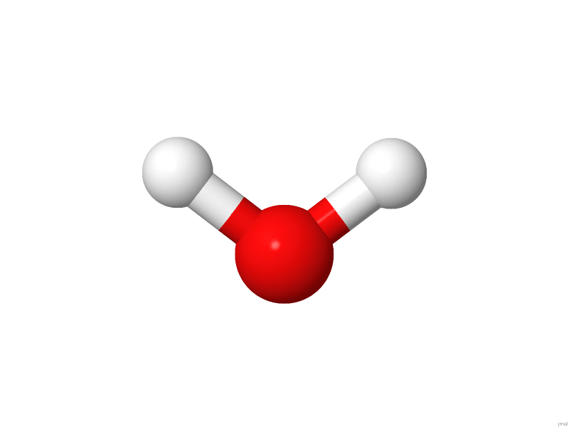
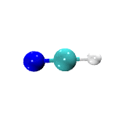

# Nudged Elastic Band (NEB) method

The NEB module is an implementation of the nudged elastic band (NEB)
method of Jonsson et al., and it is one of two drivers in NWChem that
can be used to perform minimum energy path optimizations. NEB can be
used at all levels of theory, including SCF, HF, DFT, PSPW, BAND, MP2,
RIMP2, CCSD, TCE.

Input to the NEB modules is contained with the NEB block

` NEB`  
`  ...`  
` END`

To run a NEB calculation the following the following task directives is
used

`TASK `<theory>` NEB`  
`TASK `<theory>` NEB ignore`

where <theory> is SCF, HF, DFT, PSPW, BAND, MP2, CCSD, TCE, etc.. The
Task directive with the ignore option is recommended, otherwise NWChem
will crash if the path is not optimized in the allowed maximum number of
iterations.

Optional input for this module is specified within the compound
directive,

` NEB`  
`    NBEADS <integer nbeads default 5>`  
`    KBEADS <float kbeads default 0.1>`  
`    MAXITER <integer maxiter default 5>`  
  
`    STEPSIZE <integer stepsize default 1.0>`  
`    NHIST <integer nhist default 5>`  
`    ALGORITHM <integer algorithm default 0>`  
  
`    [loose | default | tight]`  
`    GMAX <float gmax default 0.00045>`  
`    GRMS <float grms default 0.00030>`  
`    XMAX <float xmax default 0.00018>`  
`    XMRS <float xmrs default 0.00012>`  
` `  
`    [IMPOSE]`  
`    [HASMIDDLE]`  
`    [XYZ_PATH `<string xyzfilename>`]`  
`    [RESET]`  
`    [PRINT_SHIFT <integer print_shift default 0>]`  
` END`

The following list describes the input for the NEB block

  - <nbeads> - number of beads (or images) used to represent the path
  - <kbeads> - value for the NEB spring constant
  - <maxiter> - maximum number of NEB path optimizations to be performed
  - <stepsize> - value for the stepsize used in the optimization.
    Typically less than 1.
  - <nhist> - number of histories to use for quasi-Newton optimization
    (algorithm =0)
  - LOOSE|DEFAULT|TIGHT - options specifying thresholds for convergence
  - <gmax> - value for the maximum gradient used to determine
    convergence
  - <grms> - value for the root mean square gradient used to determine
    convergence
  - <xmax> - value for the maximum cartesian step used to determine
    convergence
  - <xrmx> - value for the root mean square cartesian step used to
    determine convergence
  - <algorithm> - 0: quasi-Newton Fixed Point optimization, 1: dampled
    Verlet optimization, 2: refining conjugate gradient optimization
  - IMPOSE - if specified causes the initial geometries used to specify
    the path to be aligned with one another
  - HASMIDDLE - if specified causes the initial path to use the the
    "midgeom" geometry to be used as the midpoint, i.e. the initial path
    is defined as a linear morphing from "geometry" --\> "midgeom" --\>
    "endgeom"
  - XYZ\_PATH - if specified the initial path is defined from the
    sequence of geometries contained in <xyzfilename>
  - RESET - if specified causes the NEB optimization and path to be
    started from scratch
  - <print_shift> - setting the PRINT\_SHIFT directive causes the path
    energies and geometries to be outputed every <print_shift> steps.
    The current path energies are appended to the file
    jobname.neb\_epath and the current geometries are appended to the
    file jobname.nebpath\_"current iteration".xyz.

## Setting up initial path

There are three different ways to define the initial path for NEB
optimization.

  - Linear interpolation between two geometries

The geometries in the path are defined
by

where the starting geometry () is entered in the
geometry block labeled "geometry", e.g.

`geometry nocenter noautosym noautoz`  
`O  0.00000000    -0.02293938     0.00000000`  
`H  0.00000000     0.55046969     0.75406534`  
`H  0.00000000     0.55046969    -0.75406534`  
`end`

and the last geometry in the path () in
entered in the geometry block label "endgeom", e.g.

`geometry endgeom nocenter noautosym noautoz`  
`O  0.00000000     0.02293938     0.00000000`  
`H  0.00000000    -0.55046969     0.75406534`  
`H  0.00000000    -0.55046969    -0.75406534`  
`end`

  - Linear interpolation between three geometries

The geometries for this path are defined
by

and

where the starting (), middle
() and last ()
geometries are entered in the geometry blocks "geometry", "midgeom" and
"endgeom" respectively, e.g.

`geometry nocenter noautosym noautoz`  
`O  0.00000000    -0.02293938     0.00000000`  
`H  0.00000000     0.55046969     0.75406534`  
`H  0.00000000     0.55046969    -0.75406534`  
`end`

`geometry midgeom nocenter noautosym noautoz`  
`O  0.00000000     0.00000000     0.00000000`  
`H  0.00000000     0.00000000     1.00000000`  
`H  0.00000000     0.00000000    -1.00000000`  
`end`

`geometry endgeom nocenter noautosym noautoz`  
`O  0.00000000     0.02293938     0.00000000`  
`H  0.00000000    -0.55046969     0.75406534`  
`H  0.00000000    -0.55046969    -0.75406534`  
`end`

  - Using xyz\_path to explicitly input a path of geometries

The "xyz\_path" option can also be used to define the initial path.

`...`  
`NEB`  
`   ...`  
`  XYZ_PATH path.xyz`  
`END`  
`...`

where path.xyz contains a list of geometries in xyz format, e.g.

`--------------- path.xyz ------------------`  
`                   3`  
`energy=  -17.107207699285738     `  
`O           0.000000   -0.022939    0.000000`  
`H           0.000000    0.550469    0.754065`  
`H           0.000000    0.550469   -0.754065`  
`                   3`  
`energy=  -17.094903833074170     `  
`O          -0.000003   -0.110080   -0.000000`  
`H          -0.000000    0.273180    0.847029`  
`H          -0.000000    0.273180   -0.847029`  
`                   3`  
`energy=  -17.063823686395292     `  
`O          -0.000000   -0.000080   -0.000000`  
`H           0.000000   -0.000002    0.941236`  
`H           0.000000   -0.000002   -0.941236`  
`                   3`  
`energy=  -17.094944036147005     `  
`O          -0.000000    0.110472   -0.000000`  
`H          -0.000000   -0.273172    0.846957`  
`H          -0.000000   -0.273172   -0.846957`  
`                   3`  
`energy=  -17.107208157343706     `  
`O           0.000000    0.022939    0.000000`  
`H           0.000000   -0.550469    0.754065`  
`H           0.000000   -0.550469   -0.754065`  
`--------------- path.xyz ------------------`

## Convergence criteria

The defaults may be used, or the directives LOOSE, DEFAULT, or TIGHT
specified to use standard sets of values, or the individual criteria
adjusted. All criteria are in atomic units. GMAX and GRMS control the
maximum and root mean square gradient in the coordinates. XMAX and XRMS
control the maximum and root mean square of the Cartesian step.

`                LOOSE    DEFAULT    TIGHT`  
`       GMAX   0.0045d0   0.00045   0.000015   `  
`       GRMS   0.0030d0   0.00030   0.00001`  
`       XMAX   0.0054d0   0.00180   0.00006`  
`       XRMS   0.0036d0   0.00120   0.00004`

## NEB Tutorial 1: H2O Inversion

(input:[Media:h2o-neb.nw](Media:h2o-neb.nw "wikilink"),
output:[Media:h2o-neb.nwout](Media:h2o-neb.nwout "wikilink"), datafiles:
[Media:h2o-neb.neb\_epath.dat](Media:h2o-neb.neb_epath.dat "wikilink")
[Media:h2o-neb.neb\_final\_epath.dat](Media:h2o-neb.neb_final_epath.dat "wikilink")
)

(xyzfiles: [Media:
h2o-neb.nebpath\_000001.xyz](Media:_h2o-neb.nebpath_000001.xyz "wikilink")
[Media:
h2o-neb.nebpath\_000005.xyz](Media:_h2o-neb.nebpath_000005.xyz "wikilink")
[Media:
h2o-neb.nebpath\_000010.xyz](Media:_h2o-neb.nebpath_000010.xyz "wikilink")
[Media:
h2o-neb.nebpath\_000020.xyz](Media:_h2o-neb.nebpath_000020.xyz "wikilink")
[Media:
h2o-neb.nebpath\_final.xyz](Media:_h2o-neb.nebpath_final.xyz "wikilink")
)

[400px](file:h2o-neb.png "wikilink")

`Title "H2O inversion calculation"`  
`echo`  
`start h2o-neb`  
  
`memory 1600 mb`  
  
`permanent_dir ./perm2`  
`scratch_dir      ./perm2`  
  
`geometry nocenter noautosym noautoz`  
`O  0.00000000    -0.02293938     0.00000000`  
`H  0.00000000     0.55046969     0.75406534`  
`H  0.00000000     0.55046969    -0.75406534`  
`end`  
  
`geometry endgeom nocenter noautosym noautoz`  
`O  0.00000000     0.02293938     0.00000000`  
`H  0.00000000    -0.55046969     0.75406534`  
`H  0.00000000    -0.55046969    -0.75406534`  
`end`  
  
`#### Gaussian DFT ####`  
`basis`  
`* library 3-21G`  
`end`  
  
`dft`  
`  xc b3lyp`  
`  maxiter 5001`  
`  cgmin`  
`end`  
  
`neb`  
`  nbeads 10`  
`  kbeads 1.0`  
`  maxiter 10`  
`  stepsize 0.10`  
`  print_shift 1`  
`end`  
`task dft neb ignore`

`neb`  
`  # increase the number of images`  
`  nbeads 20`  
`  kbeads 1.0`  
`  stepsize 1.0`  
`  maxiter 30`  
`  loose`  
`end`  
`task dft neb ignore`

After each optimization step the path energies are outputed as follows

`neb: Path Energy #                    9`  
`neb:                     1  -75.970000166349976     `  
`neb:                     2  -75.973958450556779     `  
`neb:                     3  -75.973964391052448     `  
`neb:                     4  -75.973965560274110     `  
`neb:                     5  -75.973961077512683     `  
`neb:                     6  -75.973087554095144     `  
`neb:                     7  -75.965847261117744     `  
`neb:                     8  -75.950292780255126     `  
`neb:                     9  -75.932932759963109     `  
`neb:                    10  -75.921912278179292     `  
`neb:                    11  -75.921834552460439     `  
`neb:                    12  -75.932680002200939     `  
`neb:                    13  -75.949868818688529     `  
`neb:                    14  -75.965372754426866     `  
`neb:                    15  -75.972788885848303     `  
`neb:                    16  -75.973958649400714     `  
`neb:                    17  -75.973965255113598     `  
`neb:                    18  -75.973964962774133     `  
`neb:                    19  -75.973959526041568     `  
`neb:                    20  -75.970000163960066     `

Another way to keep track of the optimization process is to run the
following grep command on the output
file.

`[WE24397:NWChem/NEB/Example2] bylaska% grep @ h2o-neb.nwout`  
`@neb  `  
`@neb NEB Method`  
`@neb algorithm      =         0`  
`@neb maxiter        =        10`  
`@neb nbeads         =        10`  
`@neb nhist          =         5`  
`@neb natoms         =         3`  
`@neb stepsize       = 0.100E+01`  
`@neb trust          = 0.100E+00`  
`@neb kbeads         = 0.100E+00`  
`@neb Gmax tolerance = 0.450E-03`  
`@neb Grms tolerance = 0.300E-03`  
`@neb Xmax tolerance = 0.180E-03`  
`@neb Xrms tolerance = 0.120E-03`  
`@neb  `  
`@neb Step    Intrinsic E    Mid-Point E      Minimum E      Maximum E   Gmax     Grms     Xrms     Xmax   Walltime`  
`@neb ---- -------------- -------------- -------------- -------------- -------- -------- -------- -------- --------`  
`@neb    1     -75.951572     -75.921109     -75.970632     -75.921109  0.55875  0.01606  0.14221  1.54029    454.9`  
`@neb    2     -75.953755     -75.923180     -75.972590     -75.923177  0.38930  0.01116  0.01588  0.45644    624.4`  
`@neb    3     -75.956726     -75.924391     -75.972861     -75.924387  0.25587  0.00961  0.03673  0.83118    805.2`  
`@neb    4     -75.957861     -75.924279     -75.973059     -75.924275  0.23572  0.00894  0.01793  0.24399    971.8`  
`@neb    5     -75.959613     -75.925045     -75.973869     -75.925036  0.10257  0.00464  0.03197  0.20350   1152.8`  
`@neb    6     -75.959964     -75.925503     -75.973957     -75.925486  0.04762  0.00196  0.00905  0.10433   1316.4`  
`@neb    7     -75.960068     -75.925822     -75.973956     -75.925791  0.03897  0.00141  0.00308  0.04432   1519.9`  
`@neb    8     -75.960091     -75.925914     -75.973959     -75.925877  0.03707  0.00127  0.00070  0.01691   2055.8`  
`@neb    9     -75.960129     -75.926078     -75.973962     -75.926028  0.03353  0.00108  0.00127  0.03707   2297.2`  
`@neb   10     -75.960142     -75.926142     -75.973963     -75.926085  0.03199  0.00101  0.00054  0.00420   2756.6`  
`@neb   NEB calculation not converged`  
`@neb  `  
`@neb NEB Method`  
`@neb algorithm      =         0`  
`@neb maxiter        =        30`  
`@neb nbeads         =        20`  
`@neb nhist          =         5`  
`@neb natoms         =         3`  
`@neb stepsize       = 0.100E+01`  
`@neb trust          = 0.100E+00`  
`@neb kbeads         = 0.100E+01`  
`@neb Gmax tolerance = 0.450E-02`  
`@neb Grms tolerance = 0.300E-02`  
`@neb Xmax tolerance = 0.540E-02`  
`@neb Xrms tolerance = 0.360E-02`  
`@neb  `  
`@neb Step    Intrinsic E    Mid-Point E      Minimum E      Maximum E   Gmax     Grms     Xrms     Xmax   Walltime`  
`@neb ---- -------------- -------------- -------------- -------------- -------- -------- -------- -------- --------`  
`@neb    1     -75.960225     -75.921704     -75.973965     -75.921669  0.24799  0.00398  0.00272  0.08741   3966.5`  
`@neb    2     -75.960339     -75.921782     -75.973965     -75.921745  0.24794  0.00328  0.00199  0.12148   5023.2`  
`@neb    3     -75.960424     -75.921742     -75.973965     -75.921701  0.19390  0.00286  0.00164  0.08342   5741.4`  
`@neb    4     -75.960494     -75.921849     -75.973965     -75.921804  0.19681  0.00266  0.00143  0.09030   6079.7`  
`@neb    5     -75.960646     -75.921874     -75.973965     -75.921820  0.17459  0.00240  0.00241  0.22047   6751.5`  
`@neb    6     -75.960674     -75.921856     -75.973965     -75.921797  0.14246  0.00165  0.00060  0.00256   7572.3`  
`@neb    7     -75.960724     -75.921884     -75.973966     -75.921817  0.13004  0.00153  0.00082  0.05401   7893.3`  
`@neb    8     -75.960747     -75.921892     -75.973966     -75.921822  0.12809  0.00149  0.00038  0.00237   8631.2`  
`@neb    9     -75.960792     -75.921912     -75.973966     -75.921835  0.12267  0.00142  0.00075  0.05081   9222.0`  
`@neb   10     -75.960813     -75.921923     -75.973966     -75.921841  0.11902  0.00138  0.00035  0.00212  10163.2`  
`@neb   11     -75.960834     -75.921934     -75.973966     -75.921846  0.11569  0.00135  0.00035  0.00203  10478.3`  
`@neb   12     -75.961060     -75.922060     -75.973966     -75.921889  0.07709  0.00104  0.00365  0.30944  10863.8`  
`@neb   13     -75.961255     -75.922186     -75.973966     -75.921919  0.04600  0.00087  0.00309  0.19999  11357.0`  
`@neb   14     -75.961405     -75.922286     -75.973966     -75.921927  0.03549  0.00079  0.00244  0.03857  11860.0`  
`@neb  NEB calculation converged`

# Zero Temperature String Method

The STRING module is an implementation of the zero temperature string
method of vanden Eijden et al., and it is one of two drivers in NWChem
that can be used to perform minimum energy path optimizations. STRING
can be used at all levels of theory, including SCF, HF, DFT, PSPW, BAND,
MP2, RIMP2, CCSD, TCE.

Input to the STRING module is contained with the STRING block

` STRING`  
`  ...`  
` END`

To run a STRING calculation the following the following task directives
is used

`TASK `<theory>` STRING`  
`TASK `<theory>` STRING ignore`

where <theory> is SCF, HF, DFT, PSPW, BAND, MP2, CCSD, TCE, etc.. The
Task directive with the ignore option is recommended, otherwise NWChem
will crash if the path is not optimized in the allowed maximum number of
iterations.

Optional input for this module is specified within the compound
directive,

` STRING`  
`    NBEADS <integer nbeads default 5>`  
`    MAXITER <integer maxiter default 5>`  
  
`    STEPSIZE <integer stepsize default 1.0>`  
`    NHIST <integer nhist default 5>`  
`    INTERPOL <integer algorithm default 1>`  
  
`    FREEZE1 <logical freeze1 default .false.>`  
`    FREEZEN <logical freezen default .false.>`  
  
`    TOL <float tol default 0.00045>`  
` `  
`    [IMPOSE]`  
`    [HASMIDDLE]`  
`    [XYZ_PATH `<string xyzfilename>`]`  
`    [RESET]`  
`    PRINT_SHIFT <integer print_shift default 0>`  
` END`

The following list describes the input for the NEB block

  - <nbeads> - number of beads (or images) used to represent the path
  - <maxiter> - maximum number of NEB path optimizations to be performed
  - <stepsize> - value for the stepsize used in the optimization.
    Typically less than 1.
  - <nhist> - number of histories to use for quasi-Newton optimization
    (algorithm =0)
  - <tol> - value for the maximum gradient used to determine convergence
  - <freeze1> - .true.: first bead of simulation frozen, .false.:first
    bead of simulation not frozen.
  - <freezen> - .true.:last bead of simulation frozen, .false.:last bead
    of simulation not frozen
  - <interpol> - 1: linear, 2: spline, 3: Akima spline
  - IMPOSE - if specified causes the initial geometries used to specify
    the path to be aligned with one another
  - HASMIDDLE - if specified causes the initial path to use the the
    "midgeom" geometry to be used as the midpoint, i.e. the initial path
    is defined as a linear morphing from "geometry" --\> "midgeom" --\>
    "endgeom"
  - XYZ\_PATH - if specified the initial path is defined from the
    sequence of geometries contained in <xyzfilename>
  - RESET - if specified causes the NEB optimization and path to be
    started from scratch
  - <print_shift> - setting the PRINT\_SHIFT directive causes the path
    energies and geometries to be outputed every <print_shift> steps.
    The current path energies are appended to the file
    jobname.neb\_epath and the current geometries are appended to the
    file jobname.nebpath\_"current iteration".xyz.

## Setting up the initial path

There are three different ways to define the initial path for NEB
optimization.

  - Linear interpolation between two geometries

The geometries in the path are defined
by

where the starting geometry () is entered in the
geometry block labeled "geometry", e.g.

`geometry nocenter noautosym noautoz`  
`O  0.00000000    -0.02293938     0.00000000`  
`H  0.00000000     0.55046969     0.75406534`  
`H  0.00000000     0.55046969    -0.75406534`  
`end`

and the last geometry in the path () in
entered in the geometry block label "endgeom", e.g.

`geometry endgeom nocenter noautosym noautoz`  
`O  0.00000000     0.02293938     0.00000000`  
`H  0.00000000    -0.55046969     0.75406534`  
`H  0.00000000    -0.55046969    -0.75406534`  
`end`

  - Linear interpolation between three geometries

The geometries for this path are defined
by

and

where the starting (), middle
() and last ()
geometries are entered in the geometry blocks "geometry", "midgeom" and
"endgeom" respectively, e.g.

`geometry nocenter noautosym noautoz`  
`O  0.00000000    -0.02293938     0.00000000`  
`H  0.00000000     0.55046969     0.75406534`  
`H  0.00000000     0.55046969    -0.75406534`  
`end`

`geometry midgeom nocenter noautosym noautoz`  
`O  0.00000000     0.00000000     0.00000000`  
`H  0.00000000     0.00000000     1.00000000`  
`H  0.00000000     0.00000000    -1.00000000`  
`end`

`geometry endgeom nocenter noautosym noautoz`  
`O  0.00000000     0.02293938     0.00000000`  
`H  0.00000000    -0.55046969     0.75406534`  
`H  0.00000000    -0.55046969    -0.75406534`  
`end`

  - Using xyz\_path to explicitly input a path of geometries

The "xyz\_path" option can also be used to define the initial path, e.g.

`...`  
`STRING`  
`   ...`  
`  XYZ_PATH path.xyz`  
`END`  
`...`

## String Tutorial 1:HCN --\> HNC path optimization

(input:[Media:HCN-string1.nw](Media:HCN-string1.nw "wikilink"),
output:[Media:HCN-string1.nwout](Media:HCN-string1.nwout "wikilink"),
datafiles:
[Media:HCN-string1.string\_epath.dat](Media:HCN-string1.string_epath.dat "wikilink")
[Media:HCN-string1.string\_final\_epath.dat](Media:HCN-string1.string_final_epath.dat "wikilink")
)

(xyzfiles: [Media:
HCN-string1.stringpath\_000001.xyz](Media:_HCN-string1.stringpath_000001.xyz "wikilink")
[Media:
HCN-string1.stringpath\_000005.xyz](Media:_HCN-string1.stringpath_000005.xyz "wikilink")
[Media:
HCN-string1.stringpath\_000010.xyz](Media:_HCN-string1.stringpath_000010.xyz "wikilink")
[Media:
HCN-string1.stringpath\_000020.xyz](Media:_HCN-string1.stringpath_000020.xyz "wikilink")
[Media:
HCN-string1.stringpath\_000030.xyz](Media:_HCN-string1.stringpath_000030.xyz "wikilink")
[Media:
HCN-string1.stringpath\_final.xyz](Media:_HCN-string1.stringpath_final.xyz "wikilink")
)

[400px](file:hcn-hnc-dft.png "wikilink")

In this example, the path energy for the reaction HCN --\> HNC is
calculated.

`#  `  
`# The initial path has the Carbon moving through the Nitrogen.`  
`# So for this simulation to work that atom avoidance code needs to work.`  
`# Because the initial path is so stiff the wavefunction optimizer needs to requires`  
`# lots of iterations during the early stages of the path optimization.`  
`#`  
`#`  
`Title "HCN --> HNC Zero-Temperature String Simulation"`  
`echo`  
`start hcn-hnc-dft`  
  
`permanent_dir ./perm`  
`scratch_dir ./perm`  
` `  
`geometry noautoz noautosym`  
`C         0.00000000     0.00000000    -0.49484657`  
`N         0.00000000     0.00000000     0.64616359`  
`H         0.00000000     0.00000000    -1.56151539`  
`end`  
  
`geometry endgeom  noautoz noautosym`  
`C         0.00000000     0.00000000     0.73225318 `  
`N         0.00000000     0.00000000    -0.42552059`  
`H         0.00000000     0.00000000    -1.42351006`  
`end`  
  
`#### Gaussian DFT ####`  
`basis`  
`* library 3-21G`  
`end`  
  
`dft`  
`  xc b3lyp`  
`  maxiter 501`  
`end`  
  
`string`  
`  nhist 10`  
`  nbeads 10`  
`  maxiter 10`  
`  stepsize 0.10`  
`  print_shift 1`  
  
`  # don't allow the end points of the path to move`  
`  freeze1 .true.`  
`  freezeN .true.`  
`end`  
`task dft string ignore`

`string`  
`  # increase the number of images`  
`  nbeads 20`  
`  maxiter 20`  
  
`  # allow the end points of the path to move`  
`  freeze1 .false.`  
`  freezeN .false.`  
`end`  
`task dft string ignore`

After each optimization step the path energies are outputed as follows

` string: Path Energy #                    2`  
` string:                     1  -92.906682492969779`  
` string:                     2  -92.743446565848473`  
` string:                     3  -92.751945829987775`  
` string:                     4  -92.756507971834026`  
` string:                     5  -92.726984154346979`  
` string:                     6  -92.701651474021503`  
` string:                     7  -92.672613497521183`  
` string:                     8  -92.825096796032099`  
` string:                     9  -92.716422030970662`  
` string:                    10  -92.881713271394148`

Another way to keep track of the optimization process is to run the
following grep command on the output
file.

`[WE24397:NWChem/NEB/Example2] bylaska% grep @ HCN-dft.out`  
`@zts`  
`@zts String method.`  
`@zts Temperature          =   0.00000`  
`@zts Covergence Tolerance =   0.00010`  
`@zts Step Size            =   0.10000`  
`@zts Maximum Time Steps   =        10`  
`@zts Number of replicas   =        10`  
`@zts Number of histories  =        10`  
`@zts String Interpolator  =         1`  
`@zts First Replica        = frozen`  
`@zts Last Replica         = frozen`  
`@zts`  
`@zts  Step     xrms     xmax        E start       E middle          E end          E max      E average`  
`@zts     1 0.460700 2.602234    -92.9066825    -83.4767173    -92.8817133    -83.4767173    -91.6169775`  
`@zts     2 0.862226 5.405612    -92.9066825    -92.3028437    -92.8817133    -92.3028437    -92.6631831`  
`@zts     3 0.105285 0.530157    -92.9066825    -92.3289676    -92.8817133    -92.3289676    -92.6702949`  
`@zts     4 0.134687 0.740991    -92.9066825    -92.3512584    -92.8817133    -92.3512584    -92.6821949`  
`@zts     5 0.117113 0.916210    -92.9066825    -92.3767826    -92.8817133    -92.3767826    -92.6899234`  
`@zts     6 0.124464 0.844439    -92.9066825    -92.4195957    -92.8817133    -92.4195957    -92.7045117`  
`@zts     7 0.092105 0.731434    -92.9066825    -92.4510785    -92.8817133    -92.4510785    -92.7156403`  
`@zts     8 0.049227 0.330651    -92.9066825    -92.4690983    -92.8817133    -92.4690983    -92.7288274`  
`@zts     9 0.032819 0.177356    -92.9066825    -92.4827444    -92.8817133    -92.4827444    -92.7344806`  
`@zts    10 0.076249 0.444246    -92.9066825    -92.4930430    -92.8817133    -92.4930430    -92.7381477`  
`@zts The string calculation failed to converge`  
`@zts Bead number    1  Potential Energy =     -92.906682487840`  
`@zts Bead number    2  Potential Energy =     -92.850640135623`  
`@zts Bead number    3  Potential Energy =     -92.819370566454`  
`@zts Bead number    4  Potential Energy =     -92.680821335407`  
`@zts Bead number    5  Potential Energy =     -92.505231918657`  
`@zts Bead number    6  Potential Energy =     -92.493042984646`  
`@zts Bead number    7  Potential Energy =     -92.637367419044`  
`@zts Bead number    8  Potential Energy =     -92.775376312982`  
`@zts Bead number    9  Potential Energy =     -92.831230727986`  
`@zts Bead number   10  Potential Energy =     -92.881713271394`  
`@zts`  
`@zts String method.`  
`@zts Temperature          =   0.00000`  
`@zts Covergence Tolerance =   0.00010`  
`@zts Step Size            =   0.10000`  
`@zts Maximum Time Steps   =        20`  
`@zts Number of replicas   =        20`  
`@zts Number of histories  =        10`  
`@zts String Interpolator  =         1`  
`@zts First Replica        = moves`  
`@zts Last Replica         = moves`  
`@zts`  
`@zts  Step     xrms     xmax        E start       E middle          E end          E max      E average`  
`@zts     1 1.039809 5.039486    -92.9071472    -92.4998400    -92.8820628    -92.4998400    -92.7500136`  
`@zts     2 0.192562 0.999019    -92.9073958    -92.5259828    -92.8821500    -92.5259828    -92.7624061`  
`@zts     3 0.244943 1.236459    -92.9075306    -92.5735140    -92.8821223    -92.5735140    -92.7816692`  
`@zts     4 0.207031 1.093667    -92.9075888    -92.6229190    -92.8821177    -92.6154678    -92.7979112`  
`@zts     5 0.056648 0.293829    -92.9075975    -92.6672565    -92.8821033    -92.6507897    -92.8101666`  
`@zts     6 0.078950 0.555245    -92.9076044    -92.7245122    -92.8822536    -92.7014407    -92.8241914`  
`@zts     7 0.065564 0.521110    -92.9076101    -92.7539982    -92.8822915    -92.7376310    -92.8326007`  
`@zts     8 0.050188 0.319477    -92.9076113    -92.7695725    -92.8824219    -92.7612604    -92.8378464`  
`@zts     9 0.055301 0.322130    -92.9076168    -92.7754581    -92.8825732    -92.7740099    -92.8408900`  
`@zts    10 0.038769 0.195102    -92.9076177    -92.7775695    -92.8826652    -92.7775695    -92.8425440`  
`@zts    11 0.064900 0.273480    -92.9076215    -92.7800330    -92.8827175    -92.7800330    -92.8443574`  
`@zts    12 0.062593 0.266337    -92.9076224    -92.7823972    -92.8826993    -92.7823972    -92.8458976`  
`@zts    13 0.205437 0.948190    -92.9076243    -92.7842034    -92.8826408    -92.7842034    -92.8469810`  
`@zts    14 0.015025 0.068924    -92.9076247    -92.7844362    -92.8826536    -92.7844362    -92.8472227`  
`@zts    15 0.129208 0.602636    -92.9076254    -92.7849856    -92.8826676    -92.7849856    -92.8477169`  
`@zts    16 0.013479 0.056561    -92.9076260    -92.7855201    -92.8826783    -92.7855201    -92.8481626`  
`@zts    17 0.472858 2.220715    -92.9076271    -92.7878088    -92.8826913    -92.7878088    -92.8497919`  
`@zts    18 0.162617 0.766201    -92.9076273    -92.7879912    -92.8826934    -92.7879912    -92.8499197`  
`@zts    19 0.013204 0.060562    -92.9076276    -92.7885097    -92.8826994    -92.7885097    -92.8502675`  
`@zts    20 0.718205 3.423813    -92.9076278    -92.7905066    -92.8827009    -92.7895258    -92.8514863`  
`@zts The string calculation failed to converge`  
`@zts Bead number    1  Potential Energy =     -92.907627751439`  
`@zts Bead number    2  Potential Energy =     -92.905047596626`  
`@zts Bead number    3  Potential Energy =     -92.897944354806`  
`@zts Bead number    4  Potential Energy =     -92.887494117302`  
`@zts Bead number    5  Potential Energy =     -92.874059841858`  
`@zts Bead number    6  Potential Energy =     -92.857382758537`  
`@zts Bead number    7  Potential Energy =     -92.837207959079`  
`@zts Bead number    8  Potential Energy =     -92.815902497386`  
`@zts Bead number    9  Potential Energy =     -92.798474907121`  
`@zts Bead number   10  Potential Energy =     -92.789525765222`  
`@zts Bead number   11  Potential Energy =     -92.790506632257`  
`@zts Bead number   12  Potential Energy =     -92.799861168980`  
`@zts Bead number   13  Potential Energy =     -92.814252430183`  
`@zts Bead number   14  Potential Energy =     -92.830704548760`  
`@zts Bead number   15  Potential Energy =     -92.847248091296`  
`@zts Bead number   16  Potential Energy =     -92.861557132126`  
`@zts Bead number   17  Potential Energy =     -92.871838446832`  
`@zts Bead number   18  Potential Energy =     -92.878543965696`  
`@zts Bead number   19  Potential Energy =     -92.881844751735`  
`@zts Bead number   20  Potential Energy =     -92.882700859222`

A plotting program (e.g. gnuplot, xmgrace) can be used to look at final
path as well as the the convergence of the path
i.e.,

`[WE24397:NEB/Example2/perm] bylaska% gnuplot`  
  
`   G N U P L O T`  
`   Version 4.6 patchlevel 0    last modified 2012-03-04 `  
`   Build System: Darwin x86_64`  
  
`   Copyright (C) 1986-1993, 1998, 2004, 2007-2012`  
`   Thomas Williams, Colin Kelley and many others`  
  
`   gnuplot home:     `<http://www.gnuplot.info>  
`   faq, bugs, etc:   type "help FAQ"`  
`   immediate help:   type "help"  (plot window: hit 'h')`  
  
`Terminal type set to 'aqua'`  
`gnuplot> set xlabel "Reaction Coordinate"`  
`gnuplot> set ylabel "Energy (kcal/mol)"`  
`gnuplot> set yrange [0:100]`  
`gnuplot> set grid`  
`gnuplot> set style data linespoints`  
`gnuplot> plot "hcn-hnc-dft.string_epath" using 1:($2+92.908)*27.2116*23.06,"hcn-hnc-dft.string_final_epath" using 1:($2+92.908)*27.2116*23.06`  
`gnuplot> `

[400px](file:hcn-hnc-dft0.png "wikilink")

## String Tutorial 2:

`Title "2SiO4H4 --> H3O3Si-O-SiO3H3 + H2O"`  
`echo`  
`start sio4h4-dimer`  
  
`memory 1800 mb`  
  
`permanent_dir ./perm`  
`scratch_dir   ./perm`  
` `  
`geometry noautoz noautosym`  
`Si        -3.90592       -0.11789        0.03791 `  
`O         -2.32450       -0.24327       -0.05259`  
`O         -4.45956       -1.13247        1.13159`  
`O         -4.53584       -0.45118       -1.38472`  
`O         -4.28179        1.37363        0.44838`  
`Si         1.27960        0.06912        0.14555`  
`O          2.85122        0.23514        0.32761`  
`O          0.54278        0.38513        1.52092`  
`O          0.94484       -1.42248       -0.29913`  
`O          0.75605        1.07390       -0.97272`  
`H         -1.66762       -0.74425       -0.29362`  
`H         -4.05734        2.06481        0.90983`  
`H         -4.30983       -1.85807        1.57116`  
`H         -4.43621       -0.88060       -2.12508`  
`H          3.59374       -0.16315        0.50572`  
`H          0.36896        0.10990        2.31839`  
`H          0.53993       -2.15495       -0.09488`  
`H          0.43207        1.85525       -1.13531`  
`end`  
  
`geometry endgeom  noautoz noautosym`  
`Si        -3.07373        0.18232       -0.24945`  
`O         -1.50797        0.23823       -0.53062`  
`O         -3.36758       -0.93058        0.85023`  
`O         -3.83958       -0.20093       -1.59101`  
`O         -3.57993        1.59735        0.27471`  
`Si        -0.05186        0.25441        0.11277`  
`O          0.94679       -0.58168       -0.80206`  
`O         -0.10091       -0.40972        1.55838`  
`O          1.41035       -3.75872        1.22931`  
`O          0.47135        1.75206        0.24209`  
`H          1.03624       -4.62405        0.92620`  
`H         -3.81554        2.06192        0.96069`  
`H         -3.97094       -1.38510        1.26383`  
`H         -4.39754       -0.73964       -1.96563`  
`H          1.45990       -0.57144       -1.49361`  
`H         -0.44444       -0.37536        2.34765`  
`H          2.15751       -4.00850        1.82933`  
`H          0.77180        2.44229       -0.17616`  
`end`  
  
`nwpw`  
`  simulation_cell`  
`     SC 18.0`  
`  end`  
`  cutoff 30.0`  
`  lmbfgs`  
`end`  
  
`string`  
`  nhist 10`  
`  nbeads 10`  
`  maxiter 10`  
`  stepsize 0.10`  
`  print_shift 1`  
  
`  # don't allow the end points of the path to move`  
`  freeze1 .true.`  
`  freezeN .true.`  
`end`  
`task pspw string ignore`

`string`  
`  # increase the number of images`  
`  nbeads 20`  
`  maxiter 20`  
  
`  # allow the end points of the path to move`  
`  freeze1 .false.`  
`  freezeN .false.`  
`end`  
`task pspw string ignore`

## String Tutorial 3: Combining NEB and String path optimizations
