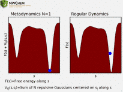

##### Contents  

* [1 Pseudopotential plane-wave density functional theory (NWPW)](#pseudopotential-plane-wave-density-functional-theory-nwpw "wikilink")
   - [1.1 PSPW Tasks - Gamma Point Calculations](#pspw-tasks---gamma-point-calculations "wikilink")
      - [1.1.1 PAW Potentials](#paw-potentials "wikilink") 
         - [1.1.1.1 PAW Implementation Notes](#paw-implementation-notes "wikilink")
      - [1.1.2 Exchange-Correlation Potentials](#exchange-correlation-potentials "wikilink")
         - [1.1.2.1 DFT + U Corrections](#dft--u-corrections "wikilink")
         - [1.1.2.2 Langreth style vdw and vdw2 van der Wall functionals](#langreth-style-vdw-and-vdw-van-der-wall-functionals "wikilink")
         - [1.1.2.3 Grimme Dispersion Corrections](#grimme-dispersion-corrections "wikilink")
         - [1.1.2.4 Using Exchange-Correlation Potentials Available in the DFT Module](#using-exchange-correlation-potentials-available-in-the-dft-module "wikilink")
         - [1.1.2.4 Exact Exchange](#exact-exchange "wikilink")
         - [1.1.2.5 Self-Interaction Corrections](#self-interaction-corrections "wikilink")
      - [1.1.3 Wannier](#wannier "wikilink")
      - [1.1.4 Mulliken Analysis](#mulliken-analysis "wikilink")
      - [1.1.5 Density of States](#density-of-states "wikilink")
      - [1.1.6 Projected Density of States](#projected-density-of-states "wikilink")
      - [1.1.7 Point Charge Analysis](#point-charge-analysis "wikilink")
      - [1.1.8 PSPW_DPLOT - Generate Gaussian Cube Files](#pspw_dplot---generate-gaussian-cube-files "wikilink")
   - [1.2 Band Tasks - Multiple k-point Calculations](#band-tasks---multiple-k-point-calculations "wikilink")
      - [1.2.1 Brillouin Zone](#brillouin-zone "wikilink")
         - [1.2.1.1 Band Structure Paths](#band-structure-paths "wikilink")
         - [1.2.1.2 Special Points of Different Space Groups (Conventional Cells)](#special-points-of-different-space-groups-conventional-cells "wikilink")
      - [1.2.2 Screened Exchange](#screened-exchange "wikilink")
      - [1.2.3 Density of States and Projected Density of States](#density-of-states-and-projected-density-of-states "wikilink")
      - [1.2.4 Two-Component Wavefunctions (Spin-Orbit ZORA)](#two-component-wavefunctions-spin-orbit-zora "wikilink")
      - [1.2.5 BAND_DPLOT - Generate Gaussian Cube Files](#band_dplot---generate-gaussian-cube-files "wikilink")
   - [1.3 Car-Parrinello](#car-parrinello "wikilink")
      - [1.3.1 Adding Geometry Constraints to a Car-Parrinello Simulation](#adding-geometry-constraints-to-a-car-parrinello-simulation "wikilink")
      - [1.3.2 Car-Parrinello Output Datafiles](#car-parrinello-output-datafiles "wikilink")
         - [1.3.2.1 XYZ motion file](#xyz-motion-file "wikilink")
         - [1.3.2.2 ION_MOTION motion file](#ion_motion-motion-file "wikilink")
         - [1.3.2.3 EMOTION motion file](#emotion-motion-file "wikilink")
         - [1.3.2.4 HMOTION motion file](#hmotion-motion-file "wikilink")
         - [1.3.2.5 EIGMOTION motion file](#eigmotion-motion-file "wikilink")
         - [1.3.2.6 OMOTION motion file](#omotion-motion-file "wikilink")
   - [1.4 Born-Oppenheimer Molecular Dynamics](#born-oppenheimer-molecular-dynamics "wikilink")
   - [1.5 Metropolis Monte-Carlo](#metropolis-monte-carlo  "wikilink")
   - [1.6 Free Energy Simulations](#free-energy-simulations "wikilink")
      - [1.6.1 MetaDynamics](#metaDynamics "wikilink")
         - [1.6.1.1 Input](#Input "wikilink")
      - [1.6.2 TAMD - Temperature Accelerated Molecular Dynamics](#tamd---temperature-accelerated-molecular-dynamics "wikilink")
         - [1.6.2.1 Input](#input "wikilink")
      - [1.6.3 Collective Variables](#collective-variables "wikilink")
         - [1.6.3.1 Bond Distance Collective Variable](#bond-distance-collective-variable "wikilink")
         - [1.6.3.2 Angle Collective Variable](#angle-collective-variable "wikilink")
         - [1.6.3.3 Coordination Collective Variable](#coordination-collective-variable "wikilink")
         - [1.6.3.4 N-Plane Collective Variable](#n-plane-collective-variable "wikilink")
         - [1.6.3.5 User defined Collective Variable](#user-defined-collective-variable "wikilink")
   - [1.7 Extended X-Ray Absorption Fine Structure (EXAFS) - Integration with FEFF6L](#extended-x-ray-absorption-fine-structure-exafs---integration-with-feff6l "wikilink")
   - [1.8 Frozen Phonon Calculations](#frozen-phonon-calculations "wikilink")
   - [1.9 Steepest Descent](#steepest-descent "wikilink")
   - [1.10 Simulation Cell](#simulation-cell "wikilink")
   - [1.11 Unit Cell Optimization](#unit-cell-optimization "wikilink")
   - [1.12 SMEAR - Fractional Occupation of the Molecular Orbitals](#smear---fractional-occupation-of-the-molecular-orbitals "wikilink")
   - [1.13 Spin Penalty Functions](#spin-penalty-functions "wikilink")
   - [1.14 AIMD/MM (QM/MM)](#aimdmm-qmmm "wikilink")
   - [1.15 PSP_GENERATOR](#psp_generator "wikilink")
      - [1.15.1 ATOMIC_FILLING Block](#atomic_filling-block  "wikilink")
      - [1.15.2 CUTOFF](#cutoff  "wikilink")
      - [1.15.3 SEMICORE_RADIUS](#semicore_radius  "wikilink")
   - [1.16 PAW Tasks - Legacy Implementation](#paw_tasks---legacy-implementation  "wikilink")
   - [1.17 Pseudopotential and PAW basis Libraries](#pseudopotential-and-paw-basis-libraries  "wikilink")
   - [1.18 NWPW RTDB Entries and Miscellaneous DataFiles](#nwpw-rtdb-entries-and-miscellaneous-datafiles  "wikilink")
      - [1.18.1 Ion Positions](#ion-positions  "wikilink")
      - [1.18.2 Ion Velocities](#ion-velocities  "wikilink")
      - [1.18.3 Wavefunction Datafile](#wavefunction-datafile  "wikilink")
      - [1.18.4 Velocity Wavefunction Datafile](#velocity-wavefunction-datafile  "wikilink")
      - [1.18.5 Formatted Pseudopotential Datafile](#formatted-pseudopotential-datafile  "wikilink")
      - [1.18.6 One-Dimensional Pseudopotential Datafile](#one-dimensional-pseudopotential-datafile  "wikilink")
   - [1.19 Car-Parrinello Scheme for Ab Initio Molecular Dynamics](#car-parrinello-scheme-for-ab-initio-molecular-dynamics  "wikilink")
      - [1.19.1 Verlet Algorithm for Integration](#verlet-algorithm-for-integration  "wikilink")
      - [1.19.2 Constant Temperature Simulations: Nose-Hoover Thermostats](#constant-temperature-simulations-nose-hoover-thermostats  "wikilink")
   - [1.20 NWPW Tutorial 1: S2 dimer examples with PSPW](#nwpw-tutorial-1-s-dimer-examples-with-pspw "wikilink")
      - [1.20.1 Total energy of S2 dimer with LDA approximation](#total-energy-of-s2-dimer-with-lda-approximation  "wikilink")
      - [1.20.2 Structural optimization of S2 dimer with LDA approximation](#structural-optimization-of-s2-dimer-with-lda-approximation  "wikilink")
      - [1.20.3 Frequency calculation of S2 dimer with LDA approximation](#frequency-calculation-of-s2-dimer-with-lda-approximation  "wikilink")
      - [1.20.4 Ab initio molecular dynamics simulation (Car-Parrinello) of S2 dimer using the LDA approximation](#ab-initio-molecular-dynamics-simulation-car-parrinello-of-s2-dimer-using-the-lda-approximation  "wikilink")
      - [1.20.5 Ab initio molecular dynamics simulation (Born-Oppenheimer) of S2 dimer using the LDA approximation](#ab-initio-molecular-dynamics-simulation-born-oppenheimer-of-s2-dimer-using-the-lda-approximation  "wikilink")
   - [1.21 NWPW Tutorial 2: Using PSPW Car-Parrinello Simulated Annealing Simulations to Optimize Structures](#nwpw-tutorial-2:-using-pspw-car-parrinello-simulated-annealing-simulations-to-optimize-structures  "wikilink")
      - [1.21.1 Simulated Annealing Using Constant Energy Simulation](#simulated-annealing-using-constant-energy-simulation  "wikilink")
      - [1.21.2 Simulated Annealing Using Constant Temperature Simulation](#simulated-annealing-using-constant-temperature-simulation  "wikilink")
   - [1.22 NWPW Tutorial 3: using isodesmic reaction energies to estimate gas-phase thermodynamics](#nwpw-tutorial-3-using-isodesmic-reaction-energies-to-estimate-gas-phase-thermodynamics "wikilink")
   - [1.23 NWPW Tutorial 4: AIMD/MM simulation of CCl4 + 64 H2O](#nwpw-tutorial-4:-aimdmm-simulation-of-ccl4-+-64-h2o  "wikilink")
   - [1.24 NWPW Tutorial 5: Optimizing the Unit Cell and Geometry of Diamond](#nwpw-tutorial-5:-optimizing-the-unit-cell-and-geometry-of-diamond  "wikilink")
      - [1.24.1 Optimizing the Unit Cell and Geometry for an 8 Atom Supercell of Diamond with PSPW](#optimizing-the-unit-cell-and-geometry-for-an-8-atom-supercell-of-diamond-with-pspw  "wikilink")
      - [1.24.2 Optimizing the Unit Cell for an 8 Atom Supercell of Diamond with BAND](#optimizing-the-unit-cell-for-an-8-atom-supercell-of-diamond-with-band  "wikilink")
      - [1.24.3 Using BAND to Optimize the Unit Cell for a 2 Atom Primitive Cell of Diamond](#using-band-to-optimize-the-unit-cell-for-a-2-atom-primitive-cell-of-diamond  "wikilink")
      - [1.24.4 Using BAND to Calculate the Band Structures of Diamond](#using-band-to-calculate-the-band-structures-of-diamond  "wikilink")
      - [1.24.5 Using BAND to Calculate the Density of States of Diamond](#using-band-to-calculate-the-density-of-states-of-diamond  "wikilink")
      - [1.24.6 Calculate the Phonon Spectrum of Diamond](#calculate-the-phonon-spectrum-of-diamond  "wikilink")
   - [1.25 NWPW Tutorial 6: optimizing the unit cell of nickel with fractional occupation](#nwpw-tutorial-6:-optimizing-the-unit-cell-of-nickel-with-fractional-occupation  "wikilink")
   - [1.26 NWPW Tutorial 7: Optimizing the unit cells with symmetry: Diamond with Fd-3m symmetry and Brucite with P-3m1 symmetry](#nwpw-tutorial-7:-optimizing-the-unit-cells-with-symmetry:-diamond-with-fd-3m-symmetry-and-brucite-with-p-3m1-symmetry  "wikilink")
   - [1.27 NWPW Tutorial 8: NVT Metropolis Monte-Carlo Simulations](#nwpw-tutorial-8:-nvt-metropolis-monte-carlo-simulations  "wikilink")
   - [1.28 NWPW Tutorial 9: NPT Metropolis Monte-Carlo Simulations](#nwpw-tutorial-9:-npt-metropolis-monte-carlo-simulations  "wikilink")
   - [1.29 NWPW Tutorial 9: Free Energy Simulations](#nwpw-tutorial-9:-free-energy-simulations  "wikilink")
   - [1.30 PAW Tutorial](#paw-tutorial  "wikilink")
      - [1.30.1 Optimizing a water molecule](#optimizing-a-water-molecule  "wikilink")
      - [1.30.2 Optimizing a unit cell and geometry for Silicon-Carbide](#optimizing-a-unit-cell-and-geometry-for-silicon-carbide  "wikilink")
      - [1.30.3 Running a Car-Parrinello Simulation](#running-a-car-parrinello-simulation "wikilink")
   - [1.31 NWPW Capabilities and Limitations](#nwpw-capabilities-and-limitations  "wikilink")
   - [1.32 Development Blog](#development-blog  "wikilink")
   - [1.33 Questions and Difficulties](#questions-and-difficulties "wikilink")


# Pseudopotential plane-wave density functional theory (NWPW)

The NWChem plane-wave (NWPW) module uses pseudopotentials and plane-wave
basis sets to perform Density Functional Theory calculations (simple
introduction [pw-lecture.pdf](pw-lecture.pdf)).
This module complements the capabilities of the more traditional
Gaussian function based approaches by having an accuracy at least as
good for many applications, yet is still fast enough to treat systems
containing hundreds of atoms. Another significant advantage is its
ability to simulate dynamics on a ground state potential surface
directly at run-time using the Car-Parrinello algorithm. This method's
efficiency and accuracy make it a desirable first principles method of
simulation in the study of complex molecular, liquid, and solid state
systems. Applications for this first principles method include the
calculation of free energies, search for global minima, explicit
simulation of solvated molecules, and simulations of complex vibrational
modes that cannot be described within the harmonic approximation.

The NWPW module is a collection of three modules.

  - PSPW - (PSeudopotential Plane-Wave) A gamma point code for
    calculating molecules, liquids, crystals, and surfaces.
  - Band - A band structure code for calculating crystals and surfaces
    with small band gaps (e.g. semi-conductors and metals).
  - PAW - a (gamma point) projector augmented plane-wave code for
    calculating molecules, crystals, and surfaces
    (<span style="color: red;"> *This module will be deprecated in the
    future releases since PAW potentials have been added to PSPW*
    </span>)

The PSPW, Band, and PAW modules can be used to compute the energy and
optimize the geometry. Both the PSPW and Band modules can also be used
to find saddle points, and compute numerical second derivatives. In
addition the PSPW module can also be used to perform Car-Parrinello
molecular dynamics. Section [PSPW Tasks](#PSPW_Tasks "wikilink")
describes the tasks contained within the PSPW module, section [Band
Tasks](#Band_Tasks "wikilink") describes the tasks contained within the
Band module, section [PAW Tasks](#PAW_Tasks "wikilink") describes the
tasks contained within the PAW module, and section [Pseudopotential and
PAW basis
Libraries](#Pseudopotential_and_PAW_basis_Libraries "wikilink")
describes the pseudopotential library included with NWChem. The
datafiles used by the PSPW module are described in section [NWPW RTDB
Entries and DataFiles](#nwpw-rtdb-entries-and-dataFiles "wikilink").
Car-Parrinello output data files are described in section
[Car-Parrinello Output
Datafiles](#PSPW_Car-Parrinello_Output_Datafiles "wikilink"), and the
minimization and Car-Parrinello algorithms are described in section
[Car-Parrinello Scheme for Ab Initio Molecular
Dynamics](#car-parrinello-scheme-for-ab-initio-molecular-dynamics "wikilink").
Examples of how to setup and run a PSPW geometry optimization, a
Car-Parrinello simulation, a band structure minimization, and a PAW
geometry optimization are presented at the end. Finally in section [NWPW
Capabilities and
Limitations](#nwpw-capabilities-and-limitations "wikilink") the
capabilities and limitations of the NWPW module are discussed.  

<span style="color: red;"> *As of NWChem 6.6 to use PAW potentials the
user is recommended to use the implementation contained in the PSPW
module (see Sections ). PAW potentials are also being integrated into
the BAND module. Unfortunately, the porting to BAND was not completed
for the NWChem 6.6 release.* </span>

If you are a first time user of this module it is recommended that you
skip the next five sections and proceed directly to the tutorials.

## PSPW Tasks - Gamma Point Calculations

All input to the PSPW Tasks is contained within the compound PSPW block,
```
PSPW 
  ...
END
```
To perform an actual calculation a TASK PSPW directive is used (Section
[Task](Top-level#Task "wikilink")).

`TASK PSPW`

In addition to the directives listed in
[Task](Top-level#Task "wikilink"), i.e. 
```
TASK PSPW energy 
TASK PSPW gradient 
TASK PSPW optimize 
TASK PSPW saddle 
TASK PSPW freqencies
TASK PSPW vib 
```
there are additional directives that are specific to the
PSPW module, which are:
```
TASK PSPW [Car-Parrinello             ||   
           Born-Oppenheimer           ||
           Metropolis                 ||
           pspw_et                    ||
           noit_energy                ||
           stress                     ||
           pspw_dplot                 ||  
           wannier                    ||
           expand_cell                || 
           exafs                      ||
           ionize                     ||
           lcao                       ||
           rdf                        ||
           aimd_properties            ||
           translate                  ||
           psp_generator              || 
           steepest_descent           ||  
           psp_formatter              || 
           wavefunction_initializer   ||  
           v_wavefunction_initializer ||  
           wavefunction_expander       ]
```
Once a user has specified a geometry, the PSPW module can be invoked
with no input directives (defaults invoked throughout). However, the
user will probably always specify the simulation cell used in the
computation, since the default simulation cell is not well suited for
most systems. There are sub-directives which allow for customized
application; those currently provided as options for the PSPW module
are:
```
NWPW   
  SIMULATION_CELL            ... (see section `[`Simulation Cell`](#Simulation_Cell "wikilink")`) END   
  CELL_NAME <string cell_name default 'cell_default'> `  
  VECTORS [[input (<string input_wavefunctions default file_prefix.movecs>) || 
           [output(<string output_wavefunctions default file_prefix.movecs>)]] 
  XC (Vosko      || LDA          || PBE96         || revPBE       || PBEsol          ||   
      LDA-SIC    || LDA-SIC/2    || LDA-0.4SIC    || LDA-SIC/4    || LDA-0.2SIC    || 
      PBE96-SIC  || PBE96-SIC/2  || PBE96-0.4SIC  || PBE96-SIC/4  || PBE96-0.2SIC  || 
      revPBE-SIC || revPBE-SIC/2 || revPBE-0.4SIC || revPBE-SIC/4 || revPBE-0.2SIC || 
      PBE96-Grimme2  || PBE96-Grimme3  || PBE96-Grimme4  || BLYP-Grimme2   || BLYP-Grimme3    || BLYP-Grimme4 || 
      revPBE-Grimme2 || revPBE-Grimme3 || revPBE-Grimme4 || PBEsol-Grimme2 || PBEsol-Grimme3 || PBEsol-Grimme4 || 
      PBE0-Grimme2    || PBE0-Grimme3    || PBE0-Grimme4   || B3LYP-Grimme2  || B3LYP-Grimme3  || B3LYP-Grimme4 ||
      revPBE0-Grimme2 || revPBE0-Grimme3 || revPBE0-Grimme4 ||
      PBE0       || revPBE0      || HSE  || HF || default Vosko) 
  XC new ...(see section `[`Using Exchange-Correlation Potentials Available in the DFT Module`](#Using_Exchange-Correlation_Potentials_Available_in_the_DFT_Module "wikilink")`) 
  DFT||ODFT||RESTRICTED||UNRESTRICTED `  
  MULT <integer mult default 1>   
  CG 
  LMBFGS   
  SCF [Anderson|| simple || Broyden]  
      [CG || RMM-DIIS] 
      [density || potential]
      [ALPHA real alpha default 0.25]
      [Kerker real ekerk nodefault] 
      [ITERATIONS integer inner_iterations default 5]  
      [OUTER_ITERATIONS integer outer_iterations default 0]
  LOOP <integer inner_iteration outer_iteration default 10 100>  
  TOLERANCES <real tole tolc default 1.0e-7 1.0e-7> 
  FAKE_MASS <real fake_mass default 400000.0> 
  TIME_STEP <real time_step default 5.8> 
  EWALD_NCUT <integer ncut default 1> 
  EWALD_RCUT <real rcut default (see input description)>  
  CUTOFF  <real cutoff> 
  ENERGY_CUTOFF <real ecut default (see input description)> 
  WAVEFUNCTION_CUTOFF <real wcut default (see input description)>  
  ALLOW_TRANSLATION 
  TRANSLATION (ON || OFF)
  ROTATION (ON || OFF) 
  MULLIKEN [OFF]
  EFIELD `  

  BO_STEPS <integer bo_inner_iteration bo_outer_iteration default 10 100> 
  MC_STEPS <integer mc_inner_iteration mc_outer_iteration default 10 100>
  BO_TIME_STEP  <real bo_time_step default 5.0> 
  BO_ALGORITHM [verlet|| velocity-verlet || leap-frog]
  BO_FAKE_MASS <real bo_fake_mass default 500.0> 

  MAPPING <integer mapping default 1>  
  NP_DIMENSIONS <integer npi npj default -1 -1>`  
  CAR-PARRINELLO             ... (see section `[`Car-Parrinello`](#Car-Parrinello "wikilink")`) END 
  STEEPEST_DESCENT           ... (see section `[`Steepest Descent`](#STEEPEST_DESCENT "wikilink")`) END
  DPLOT                      ... (see section `[`DPLOT`](#DPLOT "wikilink")`) END 
  WANNIER                    ... (see section `[`Wannier`](#Wannier "wikilink")`) END 
  PSP_GENERATOR              ... (see section `[`PSP Generator`](#PSP_GENERATOR "wikilink")`)) END   
  
  WAVEFUNCTION_INITIALIZER   ... (see section `[`Wavefunction Initializer`](NWPW_RETIRED#WAVEFUNCTION_INITIALIZER "wikilink")` - retired) END  
  V_WAVEFUNCTION_INITIATIZER ... (see section `[`Wavefunction Velocity Initializer` (NWPW_RETIRED#V_WAVEFUNCTION_INITIALIZER "wikilink")` - retired) END  
  WAVEFUNCTION_EXPANDER      ... (see section `[`Wavefunction Expander`](NWPW_RETIRED#WAVEFUNCTION_EXPANDER "wikilink")` - retired) END  
  INPUT_WAVEFUNCTION_FILENAME <string input_wavefunctions default file_prefix.movecs> `  
 OUTPUT_WAVEFUNCTION_FILENAME <string output_wavefunctions default file_prefix.movecs> `  
END
```
The following list describes the keywords contained in the PSPW input
block.

  - <cell_name> - name of the simulation\_cell named <cell_name>. See
    section [Simulation Cell](#Simulation_Cell "wikilink").
  - <input_wavefunctions> - name of the file containing one-electron
    orbitals
  - <output_wavefunctions> - name of the file that will contain the
    one-electron orbitals at the end of the run.
  - <fake_mass> - value for the electronic fake mass (
).
    This parameter is not presently used in a conjugate gradient
    simulation.
  - <time_step> - value for the time step (). This parameter
    is not presently used in a conjugate gradient simulation.
  - <inner_iteration> - number of iterations between the printing out of
    energies and tolerances
  - <outer_iteration> - number of outer iterations
  - <tole> - value for the energy tolerance.
  - <tolc> - value for the one-electron orbital tolerance.
  - <cutoff> - value for the cutoff energy used to define the
    wavefunction. In addition using the CUTOFF keyword automatically
    sets the cutoff energy for the density to be twice the wavefunction
    cutoff.
  - <ecut> - value for the cutoff energy used to define the density.
    Default is set to be the maximum value that will fit within the
    simulation\_cell <cell_name>.
  - <wcut> - value for the cutoff energy used to define the one-electron
    orbitals. Default is set to be the maximum value that will fit
    within the simulation\_cell <cell_name>.
  - <ncut> - value for the number of unit cells to sum over (in each
    direction) for the real space part of the Ewald summation. Note
    Ewald summation is only used if the simulation\_cell is periodic.
  - <rcut> - value for the cutoff radius used in the Ewald summation.
    Note Ewald summation is only used if the simulation\_cell is
    periodic.

`Default set to be `"`.`

  - (Vosko || PBE96 || revPBE || ...) - Choose between Vosko et al's LDA
    parameterization or the orginal and revised Perdew, Burke, and
    Ernzerhof GGA functional. In addition, several hybrid options.
  - MULT - optional keyword which if specified allows the user to define
    the spin multiplicity of the system
  - MULLIKEN - optional keyword which if specified causes a Mulliken
    analysis to be performed at the end of the simulation.
  - EFIELD - optional keyword which if specified causes an atomic
    electric field analysis to be performed at the end of the
    simulation.
  - ALLOW\_TRANSLATION - By default the the center of mass forces are
    projected out of the computed forces. This optional keyword if
    specified allows the center of mass forces to not be zero.
  - TRANSLATION - By default the the center of mass forces are projected
    out of the computed forces. TRANSLATION ON allows the center of mass
    forces to not be zero.
  - ROTATION - By default the overall rotation is not projected out of
    the computed forces. ROTATION OFF projects out the overal rotation
    of the molecule.
  - CG - optional keyword which sets the minimizer to 1
  - LMBFGS - optional keyword which sets the minimizer to 2
  - SCF - optional keyword which sets the minimizer to be a band by band
    minimizer. Several options are available for setting the density or
    potential mixing, and the type of Kohn-Sham minimizer.
  - <mapping> - for a value of 1 slab FFT is used, for a value of 2 a
    2d-hilbert FFT is used.

A variety of prototype minimizers can be used to minimize the energy. To
use these other optimizers the following SET directive needs to be
specified:
```
set nwpw:mimimizer 1 # Default - Grassman conjugate gradient minimizer is used to minimize the energy. 
set nwpw:mimimizer 2 # Grassman LMBFGS minimimzer is used to minimize the energy.
set nwpw:minimizer 4 # Stiefel conjugate gradient minimizer is used to minimize the energy. 
set nwpw:minimizer 5 # Band-by-band (potential) minimizer is used to minimize the energy.
set nwpw:minimizer 6 # Projected Grassman LMBFGS minimizer is used to minimize the energy.
set nwpw:minimizer 7 # Stiefel LMBFGS minimizer is used to minimize the energy.
set nwpw:minimizer 8 # Band-by-band (density) minimizer is used to minimize the energy.
```
Limited testing suggests that the Grassman LMBFGS minimizer is about
twice as fast as the conjugate gradient minimizer. However, there are
several known cases where this optimizer fails, so it is currently not a
default option, and should be used with caution.

In addition the following SET directives can be
specified:
```
set nwpw:lcao_skip .false. # Initial wavefunctions generated using an LCAO guess.  
set nwpw:lcao_skip .true. # Default - Initial wavefunctions generated using a random plane-wave guess.
set nwpw:lcao_print .false. # Default - Output not produced during the generation of the LCAO guess.   
set nwpw:lcao_print .true. # Output produced during the generation of the LCAO guess.
set nwpw:lcao_iterations 2 #specifies the number of LCAO iterations.
```
### PAW Potentials

The PSPW code can now handle PAW potentials. To use them the
pseudopotentials input block is used to redirect the code to use the paw
potentials located in the default paw potential library
($NWCHEM\_TOP/src/nwpw/libraryp/paw\_default). For example, to redirect
the code to use PAW potentials for carbon and hydrogen, the following
input would be used.
```
nwpw 
    pseudopotentials 
      C library paw_default 
      H library paw_default 
    end  
end
```
Most of the capabilities of PSPW will work with PAW potentials including
geometry optimization, Car-Parrinello ab initio molecular dynamics,
Born-Oppenheimer ab initio molecular dynamics, Metropolis Monte-Carlo,
and AIMD/MM. Unfortunately, some of the functionality is missing at this
point in time such as Mulliken analysis, and analytic stresses. However
these small number of missing capabilities should become available over
the next couple of months in the development tree of NWChem.

Even though analytic stresses are not currently available with PAW
potentials unit cell optimization can still be carried out using
numerical stresses. The following SET directives can be used to tell the
code to calculate stresses
numerically.
```
set includestress  .true.              #this option tells driver to optimize the unit cell 
set includelattice .true.              #this option tells driver to optimize cell using a,b,c,alpha,beta,gamma 
set nwpw:frozen_lattice:thresh 999.0   #large number guarentees the lattice gridding does not adjust during optimization
set nwpw:cif_filename  pspw_corundum
set nwpw:stress_numerical .true. 
set nwpw:lstress_numerical .true.
```
#### PAW Implementation Notes

The main idea in the PAW method(Blochl 1994) is to project out the
high-frequency components of the wavefunction in the atomic sphere
region. Effectively this splits the original wavefunction into two
parts:


The first part  is smooth and can be
represented using a plane wave basis set of practical size. The second
term is localized with the atomic spheres and is represented on radial
grids centered on the atoms
as

<center>


</center>

where the coefficients are given by

<center>


</center>

This decomposition can be expressed using an invertible linear
transformation, , is defined which relates the stiff one-electron
wavefunctions  to a set of smooth one-electron wavefunctions


<center>


</center>

<center>


</center>

which can be represented by fairly small plane-wave basis. The
transformation  is defined using a local PAW basis, which consists
of atomic orbitals, , 
smooth atomic
orbitals,  which coincide with
the atomic orbitals outside a defined atomic sphere, and projector
functions, . Where I is the atomic index and
α is the orbital index. The projector functions are constructed such
that they are localized within the defined atomic sphere and in addition
are orthonormal to the atomic orbitals. Blöchl defined the invertible
linear transformations
by

<center>


</center>

<center>


</center>

<center>


</center>

The main effect of the PAW transformation is that the fast variations of
the valence wave function in the atomic sphere region are projected out
using local basis set, thereby producing a smoothly varying wavefunction
that may be expanded in a plane wave basis set of a manageable size.

The expression for the total energy in PAW method can be separated into
the following 15 terms.


The first five terms are essentially the same as for a standard
pseudopotential plane-wave program, minus the non-local pseudopotential,
where

<center>


</center>

<center>


</center>

<center>


</center>

<center>


</center>

<center>


</center>

The local potential in the  term is the Fourier
transform
of

<center>


</center>

It turns out that for many atoms  needs to be fairly small.
This results in  being stiff. However, since
in the integral above this function is multiplied by a smooth density
 the expansion of 
only needs to be the same as the smooth density. The auxiliary
pseudoptential  is defined to
be localized within the atomic sphere and is introduced to remove ghost
states due to local basis set incompleteness.

The next four terms are atomic based and they essentially take into
account the difference between the true valence wavefunctions and the
pseudowavefunctions.

<center>


</center>

<center>


</center>

<center>


</center>

<center>


</center>

The next three terms are the terms containing the compensation charge
densities.

<center>


</center>

<center>


</center>

<center>


</center>

In the first two formulas the first terms are computed using plane-waves
and the second terms are computed using Gaussian two center integrals.
The smooth local potential in the  term is the Fourier
transform
of

<center>


</center>

The stiff and smooth compensation charge densities in the above formula
are

<center>


</center>

<center>


</center>

where

<center>


</center>

The decay parameter  is defined the same as above, and
 is defined to be smooth enough in order that ρ̃\_cmp (r) and  can readily be expanded in
terms of plane-waves.

The final three terms are the energies that contain the core
densities

<center>


</center>

<center>


</center>

<center>


</center>

The matrix elements contained in the above formula
are

<center>


</center>

<center>


</center>

<center>


</center>

<center>


</center>

<center>


</center>

<center>


</center>

<center>


</center>

<center>


</center>

### Exchange-Correlation Potentials

#### DFT + U Corrections

TO DO
```
nwpw 
  uterm d 0.13634 0.0036749 1 
end
```

#### Langreth style vdw and vdw van der Wall functionals

These potenials that are used to augment standard exchange-correlation potentials area calculated from a double integral over a nonlocal interaction kernel,
,


that is evaluated using the fast Fourier transformation method of Roman-Perez and Soler.

G. Roman-Perez and J. M. Soler, Phys. Rev. Lett. 103, 096102 (2009).

Langreth vdw and vdw2 van der Wall functionals are currently available for the BEEF, PBE96,
revPBE, PBEsol, BLYP, PBE0, revPBE0, HSE, and B3LYP exchange-correlation
functionals. To use them the following keywords BEEF-vdw, BEEF-vdw2, PBE96-vdw,
PBE96-vdw2, BLYP-vdw, BLYP-vdw2,
revPBE-vdw, revPBE-vdw, PBEsol-vdw PBEsol-vdw2, PBE0-vdw, PBE0-vdw2,
revPBE0-vdw, revPBE0-vdw2, HSE-vdw, HSE-vdw2, B3LYP-vdw, and B3LYP-vdw2
 can be used in the XC input directive, e.g.
```
nwpw
   xc beef-vdw  
end
```
```
nwpw
   xc beef-vdw2  
end
```
the vdw and vdw2 functionals are defined in  
 
(vdw) Dion M, Rydberg H, Schröder E, Langreth DC, Lundqvist BI. Van der Waals density functional for general geometries. Physical review letters. 2004 Jun 16;92(24):246401.

(vdw2) K. Lee, E. D. Murray, L. Kong, B. I. Lundqvist, and D. C. Langreth, Phys. Rev. B 82, 081101 (2010).


#### Grimme Dispersion Corrections
Grimme dispersion corrections are currently available for the PBE96,
revPBE, PBEsol, BLYP, PBE0, revPBE0, HSE, and B3LYP exchange-correlation
functionals. To use them the following keywords PBE96-Grimme2,
PBE96-Grimme3, PBE96-Grimme4, BLYP-Grimme2, BLYP-Grimme3, BLYP-Grimme4,
revPBE-Grimme2, revPBE-Grimme3, revPBE-Grimme4, PBEsol-Grimme2,
PBEsol-Grimme3, PBEsol-Grimme4, PBE0-Grimme2, PBE0-Grimme3,
PBE0-Grimme4, revPBE0-Grimme2, revPBE0-Grimme3, revPBE0-Grimme4,
HSE-Grimme2, HSE-Grimme3, HSE-Grimme4, B3LYP-Grimme2, B3LYP-Grimme3, and
B3LYP-Grimme4 can be used in the XC input directive, e.g.
```
nwpw
   xc pbe96-grimme2  
end
```
In these functionals Grimme2, Grimme3 and Grimme4 are defined in the
following papers by S. Grimme.

Grimme2 - Commonly known as DFT-D2, S. Grimme, J. Comput. Chem., 27
(2006), 1787-1799.

Grimme3 - Commonly known as DFT-D3, S. Grimme, J. Antony, S. Ehrlich and
H. Krieg A consistent and accurate ab initio parameterization of density
functional dispersion correction (DFT-D) for the 94 elements H-Pu, J.
Chem. Phys, 132 (2010), 154104

Grimme4 - Commonly known as DFT-D3 with BJ damping. This correction
augments the Grimme3 correction by including BJ-damping, S. Grimme, J.
Antony, S. Ehrlich and H. Krieg A consistent and accurate ab initio
parameterization of density functional dispersion correction (DFT-D) for
the 94 elements H-Pu, J. Chem. Phys, 132 (2010), 154104. S. Grimme, S.
Ehrlich and L. Goerigk, J. Comput. Chem, 32 (2011), 1456-1465. This
correction augments the Grimme3 correction by including BJ-damping.

If these functionals are used in a publication please include in your
citations the references to Grimme's work.

#### Using Exchange-Correlation Potentials Available in the DFT Module

(<span style="color: red;">*Warning - To use this capability in NWChem
6.6 the user must explicitly include the nwxc module in the
NWCHEM\_MODULES list when compiling. Unfortunately, there was too much
uncertainty in how the nwxc computed higher-order derivatives used by
some of the functionality in nwdft module to include it in a release for
all the functionality in NWChem. We are planning to have a debug release
in winter 2016 to take fix this problem. This capability is still
included by default in NWChem 6.5*</span>)

The user has the option of using many of the exchange-correlation
potentials available in DFT Module (see Section [XC and DECOMP --
Exchange-Correlation
Potentials](Density_Functional_Theory_for_Molecules#XC_and_DECOMP_--_Exchange-Correlation_Potentials "wikilink")).
```
  XC [[acm] [b3lyp] [beckehandh] [pbe0] [bhlyp]\
      [becke97]  [becke97-1] [becke97-2] [becke97-3] [becke98] [hcth] [hcth120] [hcth147] \ 
      [hcth407] [becke97gga1] [hcth407p] \
      [optx] [hcthp14] [mpw91] [mpw1k] [xft97] [cft97] [ft97] [op] [bop] [pbeop]\
      [HFexch <real prefactor default 1.0>] \
      [becke88 [nonlocal] <real prefactor default 1.0>] \
      [xperdew91 [nonlocal] <real prefactor default 1.0>] \
      [xpbe96 [nonlocal] <real prefactor default 1.0>] \
      [gill96 [nonlocal] <real prefactor default 1.0>] \
      [lyp <real prefactor default 1.0>] \
      [perdew81 <real prefactor default 1.0>] \
      [perdew86 [nonlocal] <real prefactor default 1.0>] \
      [perdew91 [nonlocal] <real prefactor default 1.0>] \
      [cpbe96 [nonlocal] <real prefactor default 1.0>] \
      [pw91lda <real prefactor default 1.0>] \
      [slater <real prefactor default 1.0>] \
      [vwn_1 <real prefactor default 1.0>] \
      [vwn_2 <real prefactor default 1.0>] \
      [vwn_3 <real prefactor default 1.0>] \
      [vwn_4 <real prefactor default 1.0>] \
      [vwn_5 <real prefactor default 1.0>] \
      [vwn_1_rpa <real prefactor default 1.0>]]
```
These functional can be invoked by prepending the "new" directive before
the exchange correlation potetntials in the input directive, XC new
slater vwn\_5.

That is, this statement in the input file
```
nwpw 
 XC new slater vwn_5  
end  
task pspw energy
```
Using this input the user has ability to include only the local or
nonlocal contributions of a given functional. The user can also specify
a multiplicative prefactor (the variable <prefactor> in the input) for
the local/nonlocal component or total (for more details see Section [XC
and DECOMP -- Exchange-Correlation
Potentials](Density_Functional_Theory_for_Molecules#XC_and_DECOMP_--_Exchange-Correlation_Potentials "wikilink")).
An example of this might be,

`  XC new becke88 nonlocal 0.72`

The user should be aware that the Becke88 local component is simply the
Slater exchange and should be input as such.

Any combination of the supported exchange functional options can be
used. For example the popular Gaussian B3 exchange could be specified
as:

`  XC new slater 0.8 becke88 nonlocal 0.72 HFexch 0.2`

Any combination of the supported correlation functional options can be
used. For example B3LYP could be specified
as:

`XC new vwn_1_rpa 0.19 lyp 0.81 HFexch 0.20  slater 0.80 becke88 nonlocal 0.72`

and X3LYP as:
```
xc new vwn_1_rpa 0.129 lyp 0.871 hfexch 0.218 slater 0.782 \ 
becke88 nonlocal 0.542  xperdew91 nonlocal 0.167
```
#### Exact Exchange

#### Self-Interaction Corrections

The SET directive is used to specify the molecular orbitals contribute
to the self-interaction-correction (SIC) term.

`set pspw:SIC_orbitals `<integer list_of_molecular_orbital_numbers>

This defines only the molecular orbitals in the list as SIC active. All
other molecular orbitals will not contribute to the SIC term. For
example the following directive specifies that the molecular orbitals
numbered 1,5,6,7,8, and 15 are SIC active.

`set pspw:SIC_orbitals 1 5:8 15`

or equivalently

`set pspw:SIC_orbitals 1 5 6 7 8 15`

The following directive turns on self-consistent SIC.
```
set pspw:SIC_relax .false. # Default - Perturbative SIC calculation  
set pspw:SIC_relax .true. # Self-consistent SIC calculation
```
Two types of solvers can be used and they are specified using the
following SET directive
```
set pspw:SIC_solver_type 1 # Default - cutoff coulomb kernel 
set pspw:SIC_solver_type 2 # Free-space boundary condition kernel
```
The parameters for the cutoff coulomb kernel are defined by the
following SET directives:
```
set pspw:SIC_screening_radius <real rcut>  
set pspw:SIC_screening_power <real rpower>
```
### Wannier

The pspw wannier task is generate maximally localized (Wannier)
molecular orbitals. The algorithm proposed by Silvestrelli et al is use
to generate the Wannier orbitals.

Input to the Wannier task is contained within the Wannier sub-block.
```
NWPW  
...  
 Wannier  
   ...   
 END 
... 
END
```
To run a Wannier calculation the following directive is used:

`TASK PSPW Wannier`

Listed below is the format of a Wannier
sub-block.
```
NWPW  
...   
 Wannier   
  OLD_WAVEFUNCTION_FILENAME <string input_wavefunctions default input_movecs>  
  NEW_WAVEFUNCTION_FILENAME <string output_wavefunctions default input_movecs> 
 END`  
...  
END
```
The following list describes the input for the Wannier sub-block.

  - <input_wavefunctions> - name of pspw wavefunction file.
  - <output_wavefunctions> - name of pspw wavefunction file that will
    contain the Wannier orbitals.

### Mulliken Analysis

### Density of States

The "dos" option is used to turn on a density of states analysis. This
option can be specified without additional parameters, i.e.
```
nwpw 
  dos  
end
```
in which case default values are used, or it can be specified with
additional parameters, e.g.
```
nwpw
   dos 0.002 700 -0.80000 0.8000 
end
```
The parameters are
```
nwpw  
 dos  [<alpha> <npoints> <emin> <emax>] 
end
```
where

  - <alpha> - value for the broadening the eigenvalues, default
    0.05/27.2116 au
  - <npoints> - number of plotting points in dos files, default 500
  - <emin> - minimum energy in dos plots, default min(eigenvalues)-0.1
    au
  - <emax> - maximimum energy in dos plots, default max(eigenvalues)+0.1
    au

The units for dos parameters are in atomic units. Note that if virtual
states are specified in the pspw calculation then the virtual density of
states will also be generated in addition to the filled density of
states.

The following files are generated and written to the permanent\_dir for
restricted calculations

  - file\_prefix.smear\_dos\_both - total density of states
  - file\_prefix.smear\_fdos\_both - density of states of filled states
  - file\_prefix.smear\_vdos\_both - density of states of virtual states

For unrestricted calculations

  - file\_prefix.smear\_dos\_alpha - total density of states for up
    electrons
  - file\_prefix.smear\_dos\_beta - total density of states for down
    electrons
  - file\_prefix.smear\_fdos\_alpha - density of states for filled up
    electrons
  - file\_prefix.smear\_fdos\_beta - density of states for filled down
    electrons
  - file\_prefix.smear\_vdos\_alpha - density of states for virtual up
    electrons
  - file\_prefix.smear\_vdos\_beta - density of states for virtual down
    electrons

The nwpw:dos:actlist variable is used to specify the atoms used to
determine weights for dos generation. If the variable is not set then
all the atoms are used, e.g.

`set nwpw:dos:actlist 1 2 3 4`

### Projected Density of States

For projected density of states the "Mulliken" keyword needs to be set,
e.g.
```
nwpw 
  Mulliken  
  dos
end
```
The following additional files are generated and written to the
permanent\_dir for restricted calculations

  - file\_prefix.mulliken\_dos\_both\_s - total s projected density of
    restricted states
  - file\_prefix.mulliken\_fdos\_both\_s - s projected density of states
    of filled restricted states
  - file\_prefix.mulliken\_vdos\_both\_s - s projected density of states
    of virtual restricted states
  - file\_prefix.mulliken\_dos\_both\_p - total p projected density of
    states
  - file\_prefix.mulliken\_fdos\_both\_p - p projected density of states
    of filled states
  - file\_prefix.mulliken\_vdos\_both\_p - p projected density of states
    of virtual states

...

  - file\_prefix.mulliken\_dos\_both\_all - total of projected density
    of filled and virtual restricted states
  - file\_prefix.mulliken\_fdos\_both\_all - total of projected density
    of filled restricted states
  - file\_prefix.mulliken\_vdos\_both\_all - total of projected density
    of states of virtual restricted states

Similarly for unrestricted calculations

  - file\_prefix.mulliken\_dos\_alpha\_s - total s projected density of
    up states
  - file\_prefix.mulliken\_fdos\_alpha\_s - s projected density of
    states of filled up states
  - file\_prefix.mulliken\_vdos\_alpha\_s - s projected density of
    states of virtual up states
  - file\_prefix.mulliken\_dos\_alpha\_p - total p projected density of
    up states
  - file\_prefix.mulliken\_fdos\_alpha\_p - p projected density of
    states of filled up states
  - file\_prefix.mulliken\_vdos\_alpha\_p - p projected density of
    states of virtual up states

...

  - file\_prefix.mulliken\_dos\_alpha\_all - total of projected density
    of filled up states
  - file\_prefix.mulliken\_fdos\_alpha\_all - total of projected density
    of filled up states
  - file\_prefix.mulliken\_vdos\_alpha\_all - total of projected density
    of states of virtual up states

...

  - file\_prefix.mulliken\_dos\_beta\_s - total s projected density of
    down states
  - file\_prefix.mulliken\_fdos\_beta\_s - s projected density of states
    of filled down states
  - file\_prefix.mulliken\_vdos\_beta\_s - s projected density of states
    of virtual down states
  - file\_prefix.mulliken\_dos\_beta\_p - total p projected density of
    down states
  - file\_prefix.mulliken\_fdos\_beta\_p - p projected density of states
    of filled down states
  - file\_prefix.mulliken\_vdos\_beta\_p - p projected density of states
    of virtual down states

...

  - file\_prefix.mulliken\_dos\_beta\_all - total of projected density
    of filled down states
  - file\_prefix.mulliken\_fdos\_beta\_all - total of projected density
    of filled down states
  - file\_prefix.mulliken\_vdos\_beta\_all - total of projected density
    of states of virtual down states

### Point Charge Analysis

The MULLIKEN option can be used to generate derived atomic point charges
from a plane-wave density. This analysis is based on a strategy
suggested in the work of P.E. Blochl, J. Chem. Phys. vol. 103, page 7422
(1995). In this strategy the low-frequency components a plane-wave
density are fit to a linear combination of atom centered Gaussian
functions.

The following SET directives are used to define the
fitting.
```
set nwpw_APC:Gc <real Gc_cutoff> # specifies the maximum frequency component of the density to be used in the fitting in units of au.  
set nwpw_APC:nga `<integer number_gauss>` # specifies the the number of Gaussian functions per atom.
set nwpw_APC:gamma `<real gamma_list>` # specifies the decay lengths of each atom centered Gaussian. 
```
We suggest using the following parameters.
```
set nwpw_APC:Gc 2.5
set nwpw_APC:nga 3 
set nwpw_APC:gamma 0.6 0.9 1.35  
```
### PSPW_DPLOT - Generate Gaussian Cube Files

The pspw dplot task is used to generate plots of various types of
electron densities (or orbitals) of a molecule. The electron density is
calculated on the specified set of grid points from a PSPW calculation.
The output file generated is in the Gaussian Cube format. Input to the
DPLOT task is contained within the DPLOT sub-block.
```
NWPW 
...  
 DPLOT   
   ...   
 END  
... 
END
```
To run a DPLOT calculation the following directive is used:

`TASK PSPW PSPW_DPLOT`

Listed below is the format of a DPLOT
sub-block.
```
NWPW  
...   
 DPLOT  
   VECTORS <string input_wavefunctions default input_movecs>  
   DENSITY [total||diff||alpha||beta||laplacian||potential default total]   
           <string density_name no default>  
   ELF [restricted|alpha|beta] <string elf_name no default>`   
   ORBITAL <integer orbital_number no default> <string orbital_name no default>  
   [LIMITXYZ [units <string Units default au>]   
   <real X_From> <real X_To> <integer No_Of_Spacings_X>   
   <real Y_From> <real Y_To> <integer No_Of_Spacings_Y>  
   <real Z_From> <real Z_To> <integer No_Of_Spacings_Z>]  
   NCELL <integer nx default 0> <integer ny default 0> <integer nz default 0>
   POSITION_TOLERANCE <real rtol default 0.001>
 END  
...  
END
```
The following list describes the input for the DPLOT sub-block.

`VECTORS <string input_wavefunctions default input_movecs>` 

This sub-directive specifies the name of the molecular orbital file. If
the second file is optionally given the density is computed as the
difference between the corresponding electron densities. The vector
files have to
match.
```
DENSITY [total||difference||alpha||beta||laplacian||potential default total] 
        <string density_name no default>
```
This sub-directive specifies, what kind of density is to be plotted. The
known names for total, difference, alpha, beta, laplacian, and
potential.

`ELF [restricted|alpha|beta] <string elf_name no default>`

This sub-directive specifies that an electron localization function
(ELF) is to be
plotted.

`ORBITAL <integer orbital_number no default> <string orbital_name no default>`

This sub-directive specifies the molecular orbital number that is to be
plotted.
```
LIMITXYZ [units <string Units default angstroms>]  
<real X_From> <real X_To> <integer No_Of_Spacings_X>  
<real Y_From> <real Y_To> <integer No_Of_Spacings_Y>  
<real Z_From> <real Z_To> <integer No_Of_Spacings_Z>
```
By default the grid spacing and the limits of the cell to be plotted are
defined by the input wavefunctions. Alternatively the user can use the
LIMITXYZ sub-directive to specify other limits. The grid is generated
using No\_Of\_Spacings + 1 points along each direction. The known names
for Units are angstroms, au and bohr.

## Band Tasks - Multiple k-point Calculations

All input to the Band Tasks is contained within the compound NWPW block,
```
NWPW   
 ...  
END
```
To perform an actual calculation a Task Band directive is used (Section
[Task](Top-level#TASK "wikilink")).

`Task Band`

Once a user has specified a geometry, the Band module can be invoked
with no input directives (defaults invoked throughout). There are
sub-directives which allow for customized application; those currently
provided as options for the Band module
are:
```
NWPW   
 CELL_NAME <string cell_name default cell_default> 
 ZONE_NAME <string zone_name default zone_default>  
 INPUT_WAVEFUNCTION_FILENAME <string input_wavefunctions default input_movecs>  
 OUTPUT_WAVEFUNCTION_FILENAME <string output_wavefunctions default input_movecs>  
 FAKE_MASS <real fake_mass default 400000.0>   
 TIME_STEP <real time_step default 5.8>   
 LOOP <integer inner_iteration outer_iteration default 10 100>   
 TOLERANCES <real tole tolc default 1.0e-7 1.0e-7> 
 CUTOFF <real cutoff>  
 ENERGY_CUTOFF <real ecut default (see input description)> 
 WAVEFUNCTION_CUTOFF <real wcut default (see input description)>  
 EWALD_NCUT <integer ncut default 1>] 
 EWALD_RCUT <real rcut default (see input description)> 

 XC (Vosko      || LDA          || PBE96         || revPBE       || PBEsol          ||  `  
                || HSE  || default Vosko)                                                                `  
  #Note that HSE is the only hybrid functional implemented in BAND

 DFT||ODFT||RESTRICTED||UNRESTRICTED   
 MULT <integer mult default 1>   
 CG  
 LMBFGS  
 SCF [Anderson|| simple || Broyden]  
 [CG || RMM-DIIS] [density || potential]  
 [ALPHA real alpha default 0.25]  
 [ITERATIONS integer inner_iterations default 5]  
 [OUTER_ITERATIONS integer outer_iterations default 0]

 SIMULATION_CELL  [units <string units default bohrs>]
   ... (see input description)   
 END 
 BRILLOUIN_ZONE 
   ... (see input description) 
 END 
 MONKHORST-PACK <real n1 n2 n3 default 1 1 1>
 BAND_DPLOT 
   ... (see input description)  
 END`  
 MAPPING <integer mapping default 1>  
 SMEAR <sigma default 0.001> 
 [TEMPERATURE `<temperature>`] 
 [FERMI || GAUSSIAN default FERMI] 
 [ORBITALS <integer orbitals default 4>] 
END 
```
The following list describes these keywords.

  - <cell_name> - name of the simulation\_cell named <cell_name>. See
    [\#Simulation Cell](#Simulation_Cell "wikilink").
  - <input_wavefunctions> - name of the file containing one-electron
    orbitals
  - <output_wavefunctions> - name that will point to file containing the
    one-electron orbitals at the end of the run.
  - <fake_mass> - value for the electronic fake mass (). This
    parameter is not presently used in a conjugate gradient simulation
  - <time_step> - value for the time step (). This parameter
    is not presently used in a conjugate gradient simulation.
  - <inner_iteration> - number of iterations between the printing out of
    energies and tolerances
  - <outer_iteration> - number of outer iterations
  - <tole> - value for the energy tolerance.
  - <tolc> - value for the one-electron orbital tolerance.
  - <cutoff> - value for the cutoff energy used to define the
    wavefunction. In addition using the CUTOFF keyword automatically
    sets the cutoff energy for the density to be twice the wavefunction
    cutoff.
  - <ecut> - value for the cutoff energy used to define the density.
    Default is set to be the maximum value that will fit within the
    simulation\_cell <cell_name>.
  - <wcut> - value for the cutoff energy used to define the one-electron
    orbitals. Default is set to be the maximum value that will fix
    within the simulation\_cell <cell_name>.
  - <ncut> - value for the number of unit cells to sum over (in each
    direction) for the real space part of the Ewald summation. Note
    Ewald summation is only used if the simulation\_cell is periodic.
  - <rcut> - value for the cutoff radius used in the Ewald summation.
    Note Ewald summation is only used if the simulation\_cell is
    periodic.

` Default set to be ``.`

  - (Vosko || PBE96 || revPBE) - Choose between Vosko et al's LDA
    parameterization or the orginal and revised Perdew, Burke, and
    Ernzerhof GGA functional.
  - SIMULATION\_CELL (see section -sec:pspw\_cell-)
  - BRILLOUIN\_ZONE (see section -sec:band\_brillouin\_zone-)
  - MONKHORST-PACK - Alternatively, the MONKHORST-PACK keyword can be
    used to enter a MONKHORST-PACK sampling of the Brillouin zone.
  - <smear> - value for smearing broadending
  - <temperature> - same as smear but in units of K.
  - CG - optional keyword which sets the minimizer to 1
  - LMBFGS - optional keyword which sets the minimizer to 2
  - SCF - optional keyword which sets the minimizer to be a band by band
    minimizer. Several options are available for setting the density or
    potential mixing, and the type of Kohn-Sham minimizer.

### Brillouin Zone

To supply the special points of the Brillouin zone, the user defines a
brillouin\_zone sub-block within the NWPW block. Listed below is the
format of a brillouin\_zone
sub-block.
```
NWPW  
...   
 BRILLOUIN_ZONE 
   ZONE_NAME <string name default zone_default> 
   (KVECTOR <real k1 k2 k3 no default> <real weight default (see input description)>   
    ...)   
 END  
...  
END
```
The user enters the special points and weights of the Brillouin zone.
The following list describes the input in detail.

  - <name> - user-supplied name for the simulation block.
  - <k1 k2 k3> - user-supplied values for a special point in the
    Brillouin zone.
  - \<weight\<\> - user-supplied weight. Default is to set the weight so
    that the sum of all the weights for the entered special points adds
    up to unity.

#### Band Structure Paths

SC: gamma, m, r, x

FCC: gamma, k, l, u, w, x

BCC: gamma, h, n, p

Rhombohedral: not currently implemented

Hexagonal: gamma, a, h, k, l, m

Simple Tetragonal: gamma, a, m, r, x, z

Simple Orthorhombic: gamma, r, s, t, u, x, y, z

Body-Centered Tetragonal: gamma, m, n, p, x

#### Special Points of Different Space Groups (Conventional Cells)

(1) P1

(2) P-1

(3)

### Screened Exchange

### Density of States and Projected Density of States

The "dos" option is used to calculate density of states using broadening
of the eigenvalues . This option can be specified without additional
parameters, i.e.
```
nwpw  
  dos
end
```
in which case default values are used, or it can be specified with
additional parameters, e.g.
```
nwpw  
   dos 0.002 700 -0.80000 0.8000
end
```
The parameters are
```
nwpw 
 dos  [<alpha> <npoints> <emin> <emax>]
end
```
where

  - <alpha> - value for the broadening the eigenvalues, default
    0.05/27.2116 au
  - <npoints> - number of plotting points in dos files, default 500
  - <emin> - minimum energy in dos plots, default min(eigenvalues)-0.1
    au
  - <emax> - maximimum energy in dos plots, default max(eigenvalues)+0.1
    au

The units for dos parameters are in atomic units. Note that if virtual
states are specified in the pspw calculation then the virtual density of
states will also be generated in addition to the filled density of
states.

The following files are generated and written to the permanent\_dir for
restricted calculations

  - file\_prefix.smear\_dos\_both - total density of states
  - file\_prefix.smear\_fdos\_both - density of states of filled states
  - file\_prefix.smear\_vdos\_both - density of states of virtual states

For unrestricted calculations

  - file\_prefix.smear\_dos\_alpha - total density of states for up
    electrons
  - file\_prefix.smear\_dos\_beta - total density of states for down
    electrons
  - file\_prefix.smear\_fdos\_alpha - density of states for filled up
    electrons
  - file\_prefix.smear\_fdos\_beta - density of states for filled down
    electrons
  - file\_prefix.smear\_vdos\_alpha - density of states for virtual up
    electrons
  - file\_prefix.smear\_vdos\_beta - density of states for virtual down
    electrons

The nwpw:dos:actlist variable is used to specify the atoms used to
determine weights for dos generation. If the variable is not set then
all the atoms are used, e.g.

`set nwpw:dos:actlist 1 2 3 4`

For projected density of states the "Mulliken" keyword needs to be set,
e.g.
```
nwpw
  Mulliken
  dos 
end
```
The following additional files are generated and written to the
permanent\_dir for restricted calculations

  - file\_prefix.mulliken\_dos\_both\_s - total s projected density of
    restricted states
  - file\_prefix.mulliken\_fdos\_both\_s - s projected density of states
    of filled restricted states
  - file\_prefix.mulliken\_vdos\_both\_s - s projected density of states
    of virtual restricted states
  - file\_prefix.mulliken\_dos\_both\_p - total p projected density of
    states
  - file\_prefix.mulliken\_fdos\_both\_p - p projected density of states
    of filled states
  - file\_prefix.mulliken\_vdos\_both\_p - p projected density of states
    of virtual states

...

  - file\_prefix.mulliken\_dos\_both\_all - total of projected density
    of filled and virtual restricted states
  - file\_prefix.mulliken\_fdos\_both\_all - total of projected density
    of filled restricted states
  - file\_prefix.mulliken\_vdos\_both\_all - total of projected density
    of states of virtual restricted states

Similarly for unrestricted calculations

  - file\_prefix.mulliken\_dos\_alpha\_s - total s projected density of
    up states
  - file\_prefix.mulliken\_fdos\_alpha\_s - s projected density of
    states of filled up states
  - file\_prefix.mulliken\_vdos\_alpha\_s - s projected density of
    states of virtual up states
  - file\_prefix.mulliken\_dos\_alpha\_p - total p projected density of
    up states
  - file\_prefix.mulliken\_fdos\_alpha\_p - p projected density of
    states of filled up states
  - file\_prefix.mulliken\_vdos\_alpha\_p - p projected density of
    states of virtual up states

...

  - file\_prefix.mulliken\_dos\_alpha\_all - total of projected density
    of filled up states
  - file\_prefix.mulliken\_fdos\_alpha\_all - total of projected density
    of filled up states
  - file\_prefix.mulliken\_vdos\_alpha\_all - total of projected density
    of states of virtual up states

...

  - file\_prefix.mulliken\_dos\_beta\_s - total s projected density of
    down states
  - file\_prefix.mulliken\_fdos\_beta\_s - s projected density of states
    of filled down states
  - file\_prefix.mulliken\_vdos\_beta\_s - s projected density of states
    of virtual down states
  - file\_prefix.mulliken\_dos\_beta\_p - total p projected density of
    down states
  - file\_prefix.mulliken\_fdos\_beta\_p - p projected density of states
    of filled down states
  - file\_prefix.mulliken\_vdos\_beta\_p - p projected density of states
    of virtual down states

...

  - file\_prefix.mulliken\_dos\_beta\_all - total of projected density
    of filled down states
  - file\_prefix.mulliken\_fdos\_beta\_all - total of projected density
    of filled down states
  - file\_prefix.mulliken\_vdos\_beta\_all - total of projected density
    of states of virtual down states


### Two-Component Wavefunctions (Spin-Orbit ZORA)

### BAND\_DPLOT - Generate Gaussian Cube Files

The BAND BAND\_DPLOT task is used to generate plots of various types of
electron densities (or orbitals) of a crystal. The electron density is
calculated on the specified set of grid points from a Band calculation.
The output file generated is in the Gaussian Cube format. Input to the
BAND\_DPLOT task is contained within the BAND\_DPLOT sub-block.
```
NWPW   
...  
 BAND_DPLOT 
   ... 
 END 
...
END
```
To run a BAND\_DPLOT calculation the following directive is used:

`TASK BAND BAND_DPLOT`

Listed below is the format of a BAND\_DPLOT
sub-block.
```
NWPW
... 
 BAND_DPLOT 
   VECTORS `<string input_wavefunctions default input_movecs>
   DENSITY [total||difference||alpha||beta||laplacian||potential default total] <string density_name no default>
   ELF [restricted|alpha|beta] <string elf_name no default>  
   ORBITAL (density || real || complex default density)  
           <integer orbital_number no default> 
           <integer brillion_number default 1> 
           <string orbital_name no default>  
   [LIMITXYZ [units <string Units default angstroms>]   
    <real X_From> <real X_To> <integer No_Of_Spacings_X>  
    <real Y_From> <real Y_To> <integer No_Of_Spacings_Y>  
    <real Z_From> <real Z_To> <integer No_Of_Spacings_Z>] 
 END
...
END
```
The following list describes the input for the BAND\_DPLOT sub-block.

`VECTORS <string input_wavefunctions default input_movecs>`

This sub-directive specifies the name of the molecular orbital file. If
the second file is optionally given the density is computed as the
difference between the corresponding electron densities. The vector
files have to
match.

`DENSITY [total||difference||alpha||beta||laplacian||potential default total] `<string density_name no default>`

This sub-directive specifies, what kind of density is to be plotted. The
known names for total, difference, alpha, beta, laplacian, and
potential.

`ELF [restricted|alpha|beta] `<string elf_name no default>`

This sub-directive specifies that an electron localization function
(ELF) is to be
plotted.
```
ORBITAL (density || real || complex default density) <integer orbital_number no default><integer brillion_number default 1> <string orbital_name no default>
```
This sub-directive specifies the molecular orbital number that is to be
plotted.
```
LIMITXYZ [units `<string Units default angstroms>] 
<real X_From>` `<real X_To>` `<integer No_Of_Spacings_X>  
<real Y_From>` `<real Y_To>` `<integer No_Of_Spacings_Y>  
<real Z_From>` `<real Z_To>` `<integer No_Of_Spacings_Z>
```
By default the grid spacing and the limits of the cell to be plotted are
defined by the input wavefunctions. Alternatively the user can use the
LIMITXYZ sub-directive to specify other limits. The grid is generated
using No\_Of\_Spacings + 1 points along each direction. The known names
for Units are angstroms, au and bohr.

## Car-Parrinello

The Car-Parrinello task is used to perform ab initio molecular dynamics
using the scheme developed by Car and Parrinello. In this unified ab
initio molecular dynamics scheme the motion of the ion cores is coupled
to a fictitious motion for the Kohn-Sham orbitals of density functional
theory. Constant energy or constant temperature simulations can be
performed. A detailed description of this method is described in section
[Car-Parrinello Scheme for Ab Initio Molecular
Dynamics](#Car-Parrinello_Scheme_for_Ab_Initio_Molecular_Dynamics "wikilink").

Input to the Car-Parrinello simulation is contained within the
Car-Parrinello sub-block.
```
NWPW 
... 
 Car-Parrinello  
   ...  
 END  
...
END
```
To run a Car-Parrinello calculation the following directives are used:
```
TASK PSPW Car-Parrinello   
 TASK BAND Car-Parrinello`  
 TASK PAW Car-Parrinello
```
The Car-Parrinello sub-block contains a great deal of input, including
pointers to data, as well as parameter input. Listed below is the format
of a Car-Parrinello
sub-block.
```
NWPW  
...   
 Car-Parrinello   
   CELL_NAME <string cell_name default 'cell_default'>
   INPUT_WAVEFUNCTION_FILENAME <string input_wavefunctions default file_prefix.movecs>  
   OUTPUT_WAVEFUNCTION_FILENAME <string output_wavefunctions default file_prefix.movecs>   
   INPUT_V_WAVEFUNCTION_FILENAME <string input_v_wavefunctions default file_prefix.vmovecs> 
   OUTPUT_V_WAVEFUNCTION_FILENAME <string output_v_wavefunctions default file_prefix.vmovecs>  
   FAKE_MASS <real fake_mass default default 1000.0>
   TIME_STEP <real time_step default 5.0>  
   LOOP <integer inner_iteration outer_iteration default 10 1> 
   SCALING <real scale_c scale_r default 1.0 1.0> `  
   ENERGY_CUTOFF <real ecut default (see input description)>   
   WAVEFUNCTION_CUTOFF <real wcut default (see input description)>   
   EWALD_NCUT <integer ncut default 1>   
   EWALD_RCUT <real rcut default (see input description)> `  
    XC (Vosko      || LDA          || PBE96         || revPBE       || HF            ||    
        LDA-SIC    || LDA-SIC/2    || LDA-0.4SIC    || LDA-SIC/4    || LDA-0.2SIC    ||   
        PBE96-SIC  || PBE96-SIC/2  || PBE96-0.4SIC  || PBE96-SIC/4  || PBE96-0.2SIC  ||   
        revPBE-SIC || revPBE-SIC/2 || revPBE-0.4SIC || revPBE-SIC/4 || revPBE-0.2SIC ||   
        PBE0       || revPBE0      || default Vosko) 
   [Nose-Hoover <real Period_electron real Temperature_electron 
                 real Period_ion      real Temperature_ion     
                 integer Chainlength_electron integer Chainlength_ion default 100.0 298.15 100.0 298.15 1 1>]   
   [TEMPERATURE <real Temperature_ion      real Period_ion 
                 real Temperature_electron real Period_electron  
                 integer Chainlength_ion integer Chainlength_electron default 298.15 1200 298.15 1200.0 1 1>]   
   [SA_decay <real sa_scale_c sa_scale_r default 1.0 1.0>] 
   XYZ_FILENAME <string xyz_filename default file_prefix.xyz> 
   ION_MOTION_FILENAME <string ion_motion_filename default file_prefix.ion_motion
   EMOTION_FILENAME <string emotion_filename default file_prefix.emotion> 
   HMOTION_FILENAME `<string hmotion_filename nodefault>
   OMOTION_FILENAME `<string omotion_filename nodefault>
   EIGMOTION_FILENAME `<string eigmotion_filename nodefault>  
 END  
...  
END
```
The following list describes the input for the Car-Parrinello sub-block.

  - <cell_name> - name of the the simulation\_cell named <cell_name>.
    See section [Simulation Cell](#Simulation_Cell "wikilink").
  - <input_wavefunctions> - name of the file containing one-electron
    orbitals
  - <output_wavefunctions> - name of the file that will contain the
    one-electron orbitals at the end of the run.
  - <input_v_wavefunctions> - name of the file containing one-electron
    orbital velocities.
  - <output_v_wavefunctions> - name of the file that will contain the
    one-electron orbital velocities at the end of the run.
  - <fake_mass> - value for the electronic fake mass ().
  - <time_step> - value for the Verlet integration time step
    ($\Delta t$).
  - <inner_iteration> - number of iterations between the printing out of
    energies.
  - <outer_iteration> - number of outer iterations
  - <scale_c> - value for the initial velocity scaling of the
    one-electron orbital velocities.
  - <scale_r> - value for the initial velocity scaling of the ion
    velocities.
  - <ecut> - value for the cutoff energy used to define the density.
    Default is set to be the maximum value that will fit within the
    simulation\_cell <cell_name>.
  - <wcut> - value for the cutoff energy used to define the one-electron
    orbitals. Default is set to be the maximum value that will fit
    within the simulation\_cell <cell_name>.
  - <ncut> - value for the number of unit cells to sum over (in each
    direction) for the real space part of the Ewald summation. Note
    Ewald summation is only used if the simulation\_cell is periodic.
  - <rcut> - value for the cutoff radius used in the Ewald summation.
    Note Ewald summation is only used if the simulation\_cell is
    periodic.

` Default set to be ``.`

  - (Vosko || PBE96 || revPBE || ...) - Choose between Vosko et al's LDA
    parameterization or the orginal and revised Perdew, Burke, and
    Ernzerhof GGA functional. In addition, several hybrid options.
  - Nose-Hoover or Temperature - optional subblock which if specified
    causes the simulation to perform Nose-Hoover dynamics. If this
    subblock is not specified the simulation performs constant energy
    dynamics. See section -sec:pspw\_nose- for a description of the
    parameters. Note that the Temperature subblock is just a reordering
    of the Nose-Hoover subblock.
      - <Period_electron> $\equiv P_{electron}$ - estimated period for
        fictitious electron thermostat.
      - <Temperature_electron> $\equiv T_{electron}$ - temperature for
        fictitious electron motion
      - <Period_ion> $\equiv P_{ion}$ - estimated period for ionic
        thermostat
      - <Temperature_ion> $\equiv T_{ion}$ - temperature for ion
        motion
      - <Chainlength_electron> - number of electron thermostat chains
      - <Chainlength_ion> - number of ion thermostat chains
  - SA\_decay - optional subblock which if specified causes the
    simulation to run a simulated annealing simulation. For simulated
    annealing to work the Nose-Hoover subblock needs to be specified.
    The initial temperature are taken from the Nose-Hoover subblock. See
    section -sec:pspw\_nose- for a description of the parameters.
      - <sa_scale_c> $\equiv \tau_{electron}$ - decay rate in atomic
        units for electronic temperature.
      - <sa_scale_r> $\equiv \tau_{ionic}$ - decay rate in atomic
        units for the ionic temperature.  
  - <xyz_filename> - name of the XYZ motion file generated
  - <emotion_filename> - name of the emotion motion file. See section
    [EMOTION motion file](#EMOTION_motion_file "wikilink") for a
    description of the datafile.
  - <hmotion_filenameh> - name of the hmotion motion file. See section
    [HMOTION motion file](#HMOTION_motion_file "wikilink") for a
    description of the datafile.
  - <eigmotion_filename> - name of the eigmotion motion file. See
    section [EIGMOTION motion file](#EIGMOTION_motion_file "wikilink")
    for a description of the datafile.
  - <ion_motion_filename> - name of the ion\_motion motion file. See
    section [ION\_MOTION motion
    file](#ION_MOTION_motion_file "wikilink")- for a description of the
    datafile.
  - MULLIKEN - optional keyword which if specified causes an omotion
    motion file to be created.
  - <omotion_filename> - name of the omotion motion file. See section
    \[\[\#OMOTION motion file|OMOTION motion file\] for a description of
    the datafile.

When a DPLOT sub-block is specified the following SET directive can be
used to output dplot data during a PSPW Car-Parrinello simulation:

`set pspw_dplot:iteration_list `<integer list_of_iteration_numbers>

The Gaussian cube files specified in the DPLOT sub-block are appended
with the specified iteration number.

For example, the following directive specifies that at the
3,10,11,12,13,14,15, and 50 iterations Gaussian cube files are to be
produced.

`set pspw_dplot:iteration_list 3,10:15,50`

### Adding Geometry Constraints to a Car-Parrinello Simulation

The Car-Parrinello module allows users to freeze the cartesian
coordinates in a simulation (Note - the Car-Parrinello code recognizes
Cartesian constraints, but it does not recognize internal coordinate
constraints). The +SET+ directive (Section [Applying constraints in
geometry
optimizations](Geometry#Applying_constraints_in_geometry_optimizations "wikilink"))
is used to freeze atoms, by specifying a directive of the form:

`set geometry:actlist `<integer list_of_center_numbers>

This defines only the centers in the list as active. All other centers
will have zero force assigned to them, and will remain frozen at their
starting coordinates during a Car-Parrinello simulation.

For example, the following directive specifies that atoms numbered 1, 5,
6, 7, 8, and 15 are active and all other atoms are frozen:

`set geometry:actlist 1 5:8 15`

or equivalently,

`set geometry:actlist 1 5 6 7 8 15`

If this option is not specified by entering a +SET+ directive, the
default behavior in the code is to treat all atoms as active. To revert
to this default behavior after the option to define frozen atoms has
been invoked, the +UNSET+ directive must be used (since the database is
persistent, see Section [NWChem
Architecture](Top-level#NWChem_Architecture "wikilink")). The
form of the +UNSET+ directive is as follows:

`unset geometry:actlist`

In addition, the Car-Parrinello module allows users to freeze bond
lengths via a Shake algorithm. The following +SET+ directive shows how
to do this.

`set nwpw:shake_constraint "2 6 L 6.9334"`

This input fixes the bond length between atoms 2 and 6 to be 6.9334
bohrs. Note that this input only recognizes bohrs.

When using constraints it is usually necessary to turn off center of
mass shifting. This can be done by the following +SET+ directive.

`set nwpw:com_shift .false.`

### Car-Parrinello Output Datafiles

#### XYZ motion file

Data file that stores ion positions and velocities as a function of time
in XYZ
format.
```
[line 1: ] n_ion
[line 2: ] do ii=1,n_ion
[line 2+ii: ] atom_name(ii), x(ii),y(ii),z(ii),vx(ii),vy(ii),vz(ii)
end do 
[line n_ion+3 ] n_nion 
 do ii=1,n_ion
[line n_ion+3+ii: ] atom_name(ii), x(ii),y(ii),z(ii), vx(ii),vy(ii),vz(ii) 
end do
[line 2*n_ion+4: ] ....
```
#### ION\_MOTION motion file

Datafile that stores ion positions and velocities as a function of
time
```
[line 1: ] it_out, n_ion, omega, a1.x,a1.y,a1.z, a2.x,a2,y,a2.z, a3.x,a3.y,a3.z 
[line 2: ] time 
do ii=1,n_ion
[line 2+ii: ] ii, atom_symbol(ii),atom_name(ii), x(ii),y(ii),z(ii), vx(ii),vy(ii),vz(ii)  
end do
[line n_ion+3 ] time 
do do ii=1,n_ion`  
[line n_ion+3+ii: ] ii, atom_symbol(ii),atom_name(ii), x(ii),y(ii),z(ii), vx(ii),vy(ii),vz(ii) 
end do 
[line 2*n_ion+4: ] ....
```
#### EMOTION motion file

Datafile that store energies as a function of
time.
```
[line 1: ] time, E1,E2,E3,E4,E5,E6,E7,E8,(E9,E10, if Nose-Hoover),eave,evar,have,hvar,ion_Temp 
[line 2: ] ...
```
where
```
E1 = total energy
E2 = potential energy
E3 = ficticious kinetic energy
E4 = ionic kinetic energy
E5 = orbital energy
E6 = hartree energy
E7 = exchange-correlation energy 
E8 = ionic energy
eave = average potential energy 
evar = variance of potential energy
have = average total energy
hvar = variance of total energy
ion_Temp = temperature
```
#### HMOTION motion file

Datafile that stores the rotation matrix as a function of time.
```
[line 1: ] time
[line 2: ] ms,ne(ms),ne(ms)
do i=1,ne(ms)
[line 2+i: ] (hml(i,j), j=1,ne(ms)
end do
[line 3+ne(ms): ] time
[line 4+ne(ms): ] ....
```
#### EIGMOTION motion file

Datafile that stores the eigenvalues for the one-electron orbitals as a
function of time.
```
[line 1: ] time, (eig(i), i=1,number_orbitals) 
[line 2: ] ...
```
#### OMOTION motion file

Datafile that stores a reduced representation of the one-electron
orbitals. To be used with a molecular orbital viewer that will be ported
to NWChem in the near future.

## Born-Oppenheimer Molecular Dynamics
```
NWPW
...
  BO_STEPS <integer bo_inner_iteration bo_outer_iteration default 10 100> 
  BO_TIME_STEP  <real bo_time_step default 5.0> 
  BO_ALGORITHM [verlet|| velocity-verlet || leap-frog]
  BO_FAKE_MASS <real bo_fake_mass default 500.0> 
END
```

## Metropolis Monte-Carlo
```
NWPW
...
  MC_STEPS <integer mc_inner_iteration mc_outer_iteration default 10 100> 
END
```

## Free Energy Simulations

### MetaDynamics


.  Courtesy of Raymond Atta-Fynn](ray.gif "Metadynamics simulation of the first hydrolysis of U(IV) from 1. Courtesy of Raymond Atta-Fynn")
Metadynamics[2](http://en.wikipedia.org/wiki/Metadynamics)[3](http://iopscience.iop.org/0034-4885/71/12/126601)[4](http://people.sissa.it/~laio/Research/Res_metadynamics.php)
is a powerful, non-equilibrium molecular dynamics method which
accelerates the sampling of the multidimensional free energy surfaces of
chemical reactions. This is achieved by adding an external
time-dependent bias potential that is a function of user defined
collective variables, . The bias potential discourages the
system from sampling previously visited values of  (i.e.,
encourages the system to explore new values of ). During the
simulation the bias potential accumulates in low energy wells which then
allows the system to cross energy barriers much more quickly than would
occur in standard dynamics. The collective variable  is a
generic function of the system coordinates,  (e.g. bond
distance, bond angle, coordination numbers, etc.) that is capable of
describing the chemical reaction of interest.
 can be regarded as a reaction
coordinate if it can distinguish between the reactant, transition, and
products states, and also capture the kinetics of the reaction.

The biasing is achieved by “flooding” the energy landscape with
repulsive Gaussian “hills” centered on the current location of
 at a constant time interval
. If the height of the Gaussians is constant in time then we
have standard metadynamics; if the heights vary (slowly decreased) over
time then we have well-tempered metadynamics. In between the addition of
Gaussians, the system is propagated by normal (but out of equilibrium)
dynamics. Suppose that the dimension of the collective space is ,
i.e.

and that prior to any time  during the simulation, 
Gaussians centered on 

are deposited along the
trajectory of  at times
. Then, the value of
the bias potential, , at an arbitrary point,
,
along the trajectory of  at time 
is given
by


where

is the time-dependent Gaussian height. 
and  are width and initial height respectively of Gaussians, and

is the tempered metadynamics temperature.

corresponds to standard molecular dynamics because

and therfore there is no bias. 
corresponds to standard metadynamics since in this case
=constant. A positive, finite value of  (eg.
 >=1500 K) corresponds to *well-tempered* metadynamics in
which .

For sufficiently large , the history potential
 will nearly flatten the free energy
surface, , along  and an unbiased estimator
of F(s) is given by


#### Input

Input to a metadynamics simulation is contained within the METADYNAMICS
sub-block. Listed below is the the format of a METADYNAMICS
sub-block,
```
NWPW  
 METADYNAMICS
    [
    BOND <integer atom1_index no default> <integer atom2_index no default> 
         [W <real w default 0.00005>]  
         [SIGMA <real sigma default 0.1>] 
         [RANGE <real a b default (see input description)>]  
         [NRANGE <integer nrange default 501>] 
    ...]  
    [
    ANGLE <integer atom1_index no default> <integer atom2_index no default> <integer atom3_index no default>  
         [W <real w default 0.00005>] 
         [SIGMA <real sigma default 0.1>]
         [RANGE <real a b default 0 ``>]`  
         [NRANGE <integer nrange default 501>]  
    ...]
    [
    COORD_NUMBER [INDEX1 <integer_list atom1_indexes no default>][INDEX2 <integer_list atom2_indexes no default>]  
         [SPRIK] 
         [N <real n default 6.0>]
         [M <real m default 12.0>]
         [R0 <real r0 default 3.0>]  
       
         [W <real w default 0.00005>] 
         [SIGMA <real sigma default 0.1>] 
         [RANGE <real a b no default>]  
         [NRANGE <integer nrange default 501>] 
    ...] 
    [  
    N-PLANE  <integer atom1_index no default> <integer_list atom_indexes no default>  
         [W <real w default 0.00005>]   
         [SIGMA <real sigma default 0.1>]  
         [RANGE <real a b no default>] 
         [NRANGE <integer nrange default 501>]  
         [NVECTOR <real(3) nx ny nz>] 
    ...] 
    [UPDATE <integer meta_update default 1>]  
    [PRINT_SHIFT <integer print_shift default 0>]
    [TEMPERED <real tempered_temperature no default>]  
    [BOUNDARY <real w_boundary sigma_boundary no default>]
  END
END
```
Multiple collective variables can be defined at the same time, e.g.
```
NWPW  
 METADYNAMICS 
    BOND 1 8  W 0.0005 SIGMA 0.1 
    BOND 1 15 W 0.0005 SIGMA 0.1 
  END
END
```
will produce a two-dimensional potential energy surface.

### TAMD - Temperature Accelerated Molecular Dynamics

#### Input

### Collective Variables

#### Bond Distance Collective Variable

This describes the bond distance between any pair of atoms  and
:


#### Angle Collective Variable

This describes the bond angle formed at  by the triplet
"


#### Coordination Collective Variable

The coordination number collective variable is defined as


where the summation over  and  runs over two types of atoms,
 is the *weighting function*, and  is the cut-off
distance. In the standard procedure for computing the coordination
number,  =1 if , otherwise 
 =0,
implying that  is not continuous when 
. To
ensure a smooth and continuous definition of the coordination number, we
adopt two variants of the weighting function. The first variant
is


where  and  are integers (m > n) chosen such that
 when  and
 when  is much larger than .
For example, the parameters of the O-H coordination in water is well
described by  =1.6 Å, 

and . 
In practice, 
and  must tuned for a given  to ensure that 
is smooth and satisfies the above mentioned properties, particularly the
large 

The second form of the weighting function, which is due to Sprik, is


In this definition  is analogous to the Fermi function and
its width is controlled by the parameter . Large and
small values of  respectively correspond to sharp and soft
transitions at . 
Furthermore  should
approach 1 and 0 when 

and 

respectively. In practice 
 =6-10 Å 
. 
For example, a good set
of parameters of the O-H coordination in water is  =1.4 Å and
 =10 Å .

#### N-Plane Collective Variable

The N-Plane collective variable is useful for probing the adsorption of
adatom/admolecules to a surface. It is defined as the *average distance*
of the adatom/admolecule from a given layer in the slab along the
surface normal:


where  denotes the position of the adatom/admolecule/impurity
along the surface normal (here, we assume the surface normal to be the
z-axis) and the summation over 
 
runs over 
 
atoms at
 which form the layer. The layer could be on the face or in the
interior of the
slab.

#### User defined Collective Variable

## Extended X-Ray Absorption Fine Structure (EXAFS) - Integration with FEFF6L

## Frozen Phonon Calculations

## Steepest Descent

The functionality of this task is now performed automatically by the
PSPW and BAND. For backward compatibility, we provide a description of
the input to this task.

The steepest\_descent task is used to optimize the one-electron orbitals
with respect to the total energy. In addition it can also be used to
optimize geometries. This method is meant to be used for coarse
optimization of the one-electron orbitals.

Input to the steepest\_descent simulation is contained within the
steepest\_descent sub-block.
```
`NWPW `  
`... `  
` STEEPEST_DESCENT `  
`   ... `  
` END `  
`...`  
`END`
```
To run a steepest\_descent calculation the following directive is used:
```
`TASK PSPW steepest_descent`  
`TASK BAND steepest_descent `
```
The steepest\_descent sub-block contains a great deal of input,
including pointers to data, as well as parameter input. Listed below is
the format of a STEEPEST\_DESCENT
sub-block.
```
`NWPW`  
`... `  
` STEEPEST_DESCENT `  
`   CELL_NAME `<string cell_name>` `  
`   [GEOMETRY_OPTIMIZE] `  
`   INPUT_WAVEFUNCTION_FILENAME <string input_wavefunctions default file_prefix.movecs> `  
`   OUTPUT_WAVEFUNCTION_FILENAME <string output_wavefunctions default file_prefix.movecs> `  
`   FAKE_MASS <real fake_mass default 400000.0> `  
`   TIME_STEP <real time_step default 5.8> `  
`   LOOP <integer inner_iteration outer_iteration default 10 1> `  
`   TOLERANCES <real tole tolc tolr default 1.0d-9 1.0d-9 1.0d-4> `  
`   ENERGY_CUTOFF <real ecut default (see input desciption)> `  
`   WAVEFUNCTION_CUTOFF <real wcut default (see input description)> `  
`   EWALD_NCUT <integer ncut default 1> `  
`   EWALD_RCUT <real rcut default (see input description)> `  
`   XC (Vosko      || LDA          || PBE96         || revPBE       || HF            ||  `  
`       LDA-SIC    || LDA-SIC/2    || LDA-0.4SIC    || LDA-SIC/4    || LDA-0.2SIC    || `  
`       PBE96-SIC  || PBE96-SIC/2  || PBE96-0.4SIC  || PBE96-SIC/4  || PBE96-0.2SIC  || `  
`       revPBE-SIC || revPBE-SIC/2 || revPBE-0.4SIC || revPBE-SIC/4 || revPBE-0.2SIC || `  
`       PBE0       || revPBE0      || default Vosko) `  
`   [MULLIKEN]`  
` END`  
`...`  
`END`
```
The following list describes the input for the STEEPEST\_DESCENT
sub-block.

  - <cell_name> - name of the simulation\_cell named <cell_name>. See
    [Simulation Cell](#Simulation_Cell "wikilink").
  - GEOMETRY\_OPTIMIZE - optional keyword which if specified turns on
    geometry optimization.
  - <input_wavefunctions> - name of the file containing one-electron
    orbitals
  - <output_wavefunctions> - name of the file tha will contain the
    one-electron orbitals at the end of the run.
  - <fake_mass> - value for the electronic fake mass ().
  - <time_step> - value for the time step ().
  - <inner_iteration> - number of iterations between the printing out of
    energies and tolerances
  - <outer_iteration> - number of outer iterations
  - <tole> - value for the energy tolerance.
  - <tolc> - value for the one-electron orbital tolerance.
  - <tolr> - value for the ion position tolerance.
  - <ecut> - value for the cutoff energy used to define the density.
    Default is set to be the maximum value that will fit within the
    simulation\_cell <cell_name>.
  - <wcut> - value for the cutoff energy used to define the one-electron
    orbitals. Default is set to be the maximum value that will fit
    within the simulation\_cell <cell_name>.
  - <ncut> - value for the number of unit cells to sum over (in each
    direction) for the real space part of the Ewald summation. Note
    Ewald summation is only used if the simulation\_cell is periodic.
  - <rcut> - value for the cutoff radius used in the Ewald summation.
    Note Ewald summation is only used if the simulation\_cell is
    periodic.

` Default set to be ``.`

  - (Vosko || PBE96 || revPBE || ...) - Choose between Vosko et al's LDA
    parameterization or the orginal and revised Perdew, Burke, and
    Ernzerhof GGA functional. In addition, several hybrid options
    (hybrid options are not available in BAND).
  - MULLIKEN - optional keyword which if specified causes a Mulliken
    analysis to be performed at the end of the simulation.

## Simulation Cell

The simulation cell parameters are entered by defining a
simulation\_cell sub-block within the PSPW block. Listed below is the
format of a simulation\_cell sub-block.
```
NWPW 
...   
 SIMULATION_CELL  [units <string units default bohrs>]
    CELL_NAME <string name default 'cell_default'>  
    BOUNDARY_CONDITIONS (periodic || aperiodic default periodic) 
    LATTICE_VECTORS   
      <real a1.x a1.y a1.z default 20.0 0.0 0.0> 
      <real a2.x a2.y a2.z default 0.0 20.0 0.0>   
      <real a3.x a3.y a3.z default 0.0 0.0 20.0> 
    NGRID <integer na1 na2 na3 default 32 32 32> 
  END 
...  
`END
```
Basically, the user needs to enter the dimensions, gridding and boundary
conditions of the simulation cell. The following list describes the
input in detail.

  - <name> - user-supplied name for the simulation block.
  - periodic - keyword specifying that the simulation cell has periodic
    boundary conditions.
  - aperiodic - keyword specifying that the simulation cell has
    free-space boundary conditions.
  - \<a1.x a1.y a1.z\> - user-supplied values for the first lattice
    vector
  - \<a2.x a2.y a2.z\> - user-supplied values for the second lattice
    vector
  - \<a3.x a3.y a3.zh\> - user-supplied values for the third lattice
    vector
  - <na1 na2 na3> - user-supplied values for discretization along
    lattice vector directions.

Alternatively, instead of explicitly entering lattice vectors, users can
enter the unit cell using the standard cell parameters, a, b, c,
,
, 
and , by using the LATTICE block. The
format for input is as follows:
```
NWPW 
... 
 SIMULATION_CELL [units <string units default bohrs>]  
   ...   
   LATTICE   
     [lat_a <real a default 20.0>]  
     [lat_b <real b default 20.0>]  
     [lat_c <real c default 20.0>] 
     [alpha <real alpha default 90.0>]  
     [beta <real beta default 90.0>] 
     [gamma <real gamma default 90.0>]  
   END 
   ...   
 END
...
END
```
The user can also enter the lattice vectors of standard unit cells using
the keywords SC, FCC, BCC, for simple cubic, face-centered cubic, and
body-centered cubic respectively. Listed below is an example of the
format of this type of input.
```
NWPW 
... 
 SIMULATION_CELL [units <string units default bohrs>]
   SC 20.0 
   .... 
 END
...
END
```
Finally, the lattice vectors from the unit cell can also be defined
using the fractional coordinate input in the GEOMETRY input (see section
[Geometry Lattice
Parameters](SYSTEM----Lattice-parameters-for-periodic-systems "wikilink")).
Listed below is an example of the format of this type of input for an 8
atom silicon carbide unit cell.
```
geometry units au  
 system crystal 
   lat_a 8.277
   lat_b 8.277   
   lat_c 8.277   
   alpha 90.0  
   beta 90.0   
   gamma 90.0   
 end
 Si -0.50000 -0.50000 -0.50000
 Si  0.00000  0.00000 -0.50000 
 Si  0.00000 -0.50000  0.00000
 Si -0.50000  0.00000  0.00000  
 C  -0.25000 -0.25000 -0.25000  
 C   0.25000  0.25000 -0.25000 
 C   0.25000 -0.25000  0.25000 
 C  -0.25000  0.25000  0.25000  
end
```
Warning - Currently only the "system crystal" option is recognized by
NWPW. The "system slab" and "system polymer" options will be supported
in the future.

## Unit Cell Optimization

The PSPW module using the DRIVER geometry optimizer can optimize a
crystal unit cell. Currently this type of optimization works only if the
geometry is specified in fractional coordinates. The following SET
directive is used to tell the DRIVER geometry optimizer to optimize the
crystal unit cell in addition to the geometry.

`set includestress .true.`

## SMEAR - Fractional Occupation of the Molecular Orbitals

The smear keyword to turn on fractional occupation of the molecular
orbitals in PSPW and BAND
calculations
```
SMEAR <sigma default 0.001> [TEMPERATURE `<temperature>`] [FERMI || GAUSSIAN default FERMI]   
                            [ORBITALS <integer orbitals default 4>]
```
Both Fermi-Dirac (FERMI) and Gaussian broadening functions are
available. The ORBITALS keyword is used to change the number of virtual
orbitals to be used in the calculation. Note to use this option the user
must currently use the SCF minimizer. The following SCF options are
recommended for running fractional occupation

`SCF Anderson outer_iterations 0 Kerker 2.0`

## Spin Penalty Functions

Spin-penalty functions makes it easier to define antiferromagnetic
structures. These functions are implemented by adding a scaling factor
to the non-local psp for up/down spins on atoms and angular momentum
that you specify.

Basically, the pseudopotential
energy


was modified
to


An example input is as follows:
```
title "hematite 10 atoms"
  
start hema10
  
memory 1900 mb
  
permanent_dir ./perm
scratch_dir   ./perm
  
geometry center noautosym noautoz print
 system crystal
   lat_a 5.42 
   lat_b 5.42 
   lat_c 5.42 
   alpha 55.36  
   beta  55.36  
   gamma 55.36  
 end
Fe                  0.355000   0.355000   0.355000
Fe                  0.145000   0.145000   0.145000  
Fe                 -0.355000  -0.355000  -0.355000  
Fe                  0.855000   0.855000   0.855000  
O                   0.550000  -0.050000   0.250000  
O                   0.250000   0.550000  -0.050000  
O                  -0.050000   0.250000   0.550000  
O                  -0.550000   0.050000  -0.250000  
O                  -0.250000  -0.550000   0.050000  
O                   0.050000  -0.250000  -0.550000\  
end  
  
nwpw
  virtual 8
  odft
  ewald_rcut 3.0
  ewald_ncut 8 
  xc pbe96
  lmbfgs 
  mult 1
  dplot
     density diff diff1.cube
  end`  

  #spin penalty functions  
  pspspin up   d -1.0 1:2  
  pspspin down d -1.0 3:4  
end
task pspw energy 
task pspw pspw_dplot  
  
nwpw
  pspspin off
  dplot
     density diff diff2.cube
  end`  
end`  
task pspw energy
task pspw pspw_dplot
```
## AIMD/MM (QM/MM)

A QM/MM capability is available that is integrated with PSPW module and
can be used with Car-Parrinello simulations. Currently, the input is not
very robust but it is straightforward. The first step to run a QM/MM
simulations is to define the MM atoms in the geometry block. The MM
atoms must be at the end of the geometry and a carat, " ^ ", must be
appended to the end of the atom name, e.g.
```
`geometry units angstrom nocenter noautosym noautoz print xyz`  
` C -0.000283 0.000106 0.000047`  
` Cl -0.868403 1.549888 0.254229`  
` Cl 0.834043 -0.474413 1.517103`  
` Cl -1.175480 -1.275747 -0.460606`  
` Cl 1.209940 0.200235 -1.310743`  
` O^ 0.3226E+01 -0.4419E+01 -0.5952E+01 `  
` H^ 0.3193E+01 -0.4836E+01 -0.5043E+01 `  
` H^ 0.4167E+01 -0.4428E+01 -0.6289E+01`  
` O^ 0.5318E+01 -0.3334E+01 -0.1220E+01`  
` H^ 0.4978E+01 -0.3040E+01 -0.2113E+01`  
` H^ 0.5654E+01 -0.2540E+01 -0.7127E+00`  
`end`
```
Another way to specify the MM atoms is to use the mm\_tags option which
appends the atoms with a " ^ ".
```
`geometry units angstrom nocenter noautosym noautoz print xyz`  
` C -0.000283 0.000106 0.000047`  
` Cl -0.868403 1.549888 0.254229`  
` Cl 0.834043 -0.474413 1.517103`  
` Cl -1.175480 -1.275747 -0.460606`  
` Cl 1.209940 0.200235 -1.310743`  
` O 0.3226E+01 -0.4419E+01 -0.5952E+01 `  
` H 0.3193E+01 -0.4836E+01 -0.5043E+01 `  
` H 0.4167E+01 -0.4428E+01 -0.6289E+01`  
` O 0.5318E+01 -0.3334E+01 -0.1220E+01`  
` H 0.4978E+01 -0.3040E+01 -0.2113E+01`  
` H 0.5654E+01 -0.2540E+01 -0.7127E+00`  
`end`  
`NWPW`  
`  QMMM`  
`    mm_tags 6:11`  
`  END`  
`END`
```
The option "mm\_tags off" can be used to remove the " ^ " from the
atoms, i.e.
```
`NWPW`  
`  QMMM`  
`     mm_tags 6:11 off`  
`  END`  
`END `
```
Next the pseudopotentials have be defined for the every type of MM atom
contained in the geometry blocks. The following local pseudopotential
suggested by Laio, VandeVondele and Rothlisberger can be automatically
generated.


The following input To define this pseudopo the O^ MM atom using the
following input
```
`NWPW `  
` QMMM `  
`   mm_psp O^ -0.8476 4 0.70 `  
` END`  
`END`
```
defines the local pseudopotential for the O^ MM atom , where
, 
, and . The following
input can be used to define the local pseudopotentials for all the MM
atoms in the geometry block defined above
```
`NWPW `  
` QMMM `  
`   mm_psp O^ -0.8476 4 0.70 `  
`   mm_psp H^ 0.4238 4 0.40 `  
` END`  
`END`
```
Next the Lenard-Jones potentials for the QM and MM atoms need to be
defined. This is done as as follows
```
`NWPW `  
` QMMM `  
`   lj_ion_parameters C 3.41000000d0 0.10d0 `  
`   lj_ion_parameters Cl 3.45000000d0 0.16d0 `  
`   lj_ion_parameters O^ 3.16555789d0 0.15539425d0 `  
` END`  
`END`
```
Note that the Lenard-Jones potential is not defined for the MM H atoms
in this example. The final step is to define the MM fragments in the
simulation. MM fragments are a set of atoms in which bonds and angle
harmonic potentials are defined, or alternatively shake constraints are
defined. The following input defines the fragments for the two water
molecules in the above
geometry,
```
`NWPW `  
` QMMM `  
`   fragment spc `  
`     size 3                  #size of fragment `  
`     index_start 6:9:3       #atom index list that defines the start of `  
`                             # the fragments (start:final:stride)`  
`     bond_spring 1 2 0.467307856 1.889726878   #bond i j Kspring r0 `  
`     bond_spring 1 3 0.467307856 1.889726878   #bond i j Kspring r0 `  
`     angle_spring 2 1 3 0.07293966 1.910611932 #angle i j k Kspring theta0 `  
`   end `  
` END`  
`END`
```
The fragments can be defined using shake constraints
as
```
`NWPW `  
` QMMM `  
`   fragment spc `  
`     size 3                  #size of fragment `  
`     index_start 6:9:3       #atom index list that defines the start of `  
`                             # the fragments (start:final:stride)`  
`     shake units angstroms 1 2 3 cyclic 1.0 1.632993125 1.0 `  
`   end `  
` END`  
`END`
```
Alternatively, each water could be defined independently as
follows.
```
`NWPW `  
` QMMM `  
`   fragment spc1 `  
`     size 3                  #size of fragment `  
`     index_start 6           #atom index list that defines the start of `  
`                             #the fragments `  
`     bond_spring 1 2 0.467307856 1.889726878 #bond i j Kspring r0 `  
`     bond_spring 1 3 0.467307856 1.889726878 #bond i j Kspring r0 `  
`     angle_spring 2 1 3 0.07293966 1.910611932 #angle i j k Kspring theta0 `  
`   end `  
`   fragment spc2 `  
`     size 3                  #size of fragment `  
`     index_start 9           #atom index list that defines the start of `  
`                             #the fragments `  
`     shake units angstroms 1 2 3 cyclic 1.0 1.632993125 1.0 `  
`   end `  
` END`  
`END`
```
## PSP\_GENERATOR

A one-dimensional pseudopotential code has been integrated into NWChem.
This code allows the user to modify and develop pseudopotentials.
Currently, only the Hamann and Troullier-Martins norm-conserving
pseudopotentials can be generated. In future releases, the
pseudopotential library (section [Pseudopotential and PAW basis
Libraries](#Pseudopotential_and_PAW_basis_Libraries "wikilink")) will be
more complete, so that the user will not have explicitly generate
pseudopotentials using this module.

Input to the PSP\_GENERATOR task is contained within the PSP\_GENERATOR
sub-block.
```
`NWPW `  
`... `  
` PSP_GENERATOR `  
`   ... `  
` END `  
`...`  
`END`
```
To run a PSP\_GENERATOR calculation the following directive is used:

`TASK PSPW PSP_GENERATOR`

Listed below is the format of a PSP\_GENERATOR
sub-block.
```
`NWPW`  
`... `  
` PSP_GENERATOR `  
`   PSEUDOPOTENTIAL_FILENAME: `<string psp_name>` `  
`   ELEMENT: `<string element>` `  
`   CHARGE: `<real charge>` `  
`   MASS_NUMBER: `<real mass_number>` `  
`   ATOMIC_FILLING: `<integer ncore nvalence>` ( (1||2||...) (s||p||d||f||...) `<real filling>`  ...)`

`   [CUTOFF: `<integer lmax>` ( (s||p||d||f||g) `<real rcut>` ...) ] `

`   PSEUDOPOTENTIAL_TYPE: (TROULLIER-MARTINS || HAMANN default HAMANN) `  
`   SOLVER_TYPE: (PAULI || SCHRODINGER default PAULI) `  
`   EXCHANGE_TYPE: (dirac || PBE96 default DIRAC) `  
`   CORRELATION_TYPE: (VOSKO || PBE96 default VOSKO) `  
`   [SEMICORE_RADIUS: `<real rcore>`]`

` END`  
`... `  
`END`
```
The following list describes the input for the PSP\_GENERATOR sub-block.

  - <psp_name> - name that points to a.
  - <element> - Atomic symbol.
  - <charge> - charge of the atom
  - <mass> - mass number for the atom
  - <ncore> - number of core states
  - <nvalence> - number of valence states.
  - ATOMIC\_FILLING:.....(see below)
  - <filling> - occupation of atomic state
  - CUTOFF:....(see below)
  - <rcore> - value for the semicore radius (see below)

### ATOMIC\_FILLING Block

This required block is used to define the reference atom which is used
to define the pseudopotential. After the ATOMIC\_FILLING: <ncore>
<nvalence> line, the core states are listed (one per line), and then the
valence states are listed (one per line). Each state contains two
integer and a value. The first integer specifies the radial quantum
number, , the second integer specifies the angular momentum quantum
number, , and the third value specifies the occupation of the
state.

For example to define a pseudopotential for the Neon atom in the
 state could have the block
```
`ATOMIC_FILLING: 1 2 `  
` 1 s 2.0 #core state - 1s^2 `  
` 2 s 2.0 #valence state - 2s^2 `  
` 2 p 6.0 #valence state - 2p^6`
```
for a pseudopotential with a  and  valence electrons or the
block
```
`ATOMIC_FILLING: 3 0 `  
` 1 s 2.0 #core state `  
` 2 s 2.0 #core state `  
` 2 p 6.0 #core state`
```
could be used for a pseudopotential with no valence electrons.

### CUTOFF

This optional block specifies the cutoff distances used to match the
all-electron atom to the pseudopotential atom. For Hamann
pseudopotentials  defines the distance where the
all-electron potential is matched to the pseudopotential, and for
Troullier-Martins pseudopotentials  defines the distance
where the all-electron orbital is matched to the pseudowavefunctions.
Thus the definition of the radii depends on the type of pseudopotential.
The cutoff radii used in Hamann pseudopotentials will be smaller than
the cutoff radii used in Troullier-Martins pseudopotentials.

For example to define a softened Hamann pseudopotential for Carbon would
be
```
`ATOMIC_FILLING: 1 2 `  
` 1 s 2.0 `  
` 2 s 2.0 `  
` 2 p 2.0`  
`CUTOFF: 2`  
` s 0.8 `  
` p 0.85 `  
` d 0.85`
```
while a similarly softened Troullier-Marting pseudopotential for Carbon
would be
```
`ATOMIC_FILLING: 1 2 `  
` 1 s 2.0 `  
` 2 s 2.0 `  
` 2 p 2.0`  
`CUTOFF: 2 `  
` s 1.200 `  
` p 1.275 `  
` d 1.275`
```
### SEMICORE\_RADIUS

Specifying the SEMICORE\_RADIUS option turns on the semicore correction
approximation proposed by Louie et al (S.G. Louie, S. Froyen, and M.L.
Cohen, Phys. Rev. B, **26**(, 1738, (1982)). This approximation is known
to dramatically improve results for systems containing alkali and
transition metal atoms.

The implementation in the PSPW module defines the semi-core density,
 in terms of the core density, , by
using the sixth-order polynomial


This expansion was suggested by Fuchs and Scheffler (M. Fuchs, and M.
Scheffler, Comp. Phys. Comm.,**119**,67 (1999)), and is better behaved
for taking derivatives (i.e. calculating ionic forces) than the
expansion suggested by Louie et al.

## PAW Tasks - Legacy Implementation

(<span style="color: red;">*This capability is now available in PSPW. It
is recommended that this module only be used for testing purposes.*
</span>)

All input to the PAW Tasks is contained within the compound NWPW block,
```
`NWPW `  
` ...`  
`END`
```
To perform an actual calculation a TASK PAW directive is used
([Task](#TASK "wikilink")).

`TASK PAW`

In addition to the directives listed in [Task](#TASK "wikilink"), i.e.
```
`TASK paw energy `  
`TASK paw gradient `  
`TASK paw optimize `  
`TASK paw saddle `  
`TASK paw freqencies `  
`TASK paw vib`
```
there are additional directives that are specific to the PSPW module,
which are:

`TASK PAW [Car-Parrinello || steepest_descent ]`

Once a user has specified a geometry, the PAW module can be invoked with
no input directives (defaults invoked throughout). There are
sub-directives which allow for customized application; those currently
provided as options for the PAW module
are:
```
`NWPW `  
` CELL_NAME <string cell_name default 'cell_default'> `  
` [GEOMETRY_OPTIMIZE] `  
` INPUT_WAVEFUNCTION_FILENAME `<string input_wavefunctions default input_movecs>` `  
` OUTPUT_WAVEFUNCTION_FILENAME `<string output_wavefunctions default input_movecs>` `  
` FAKE_MASS <real fake_mass default 400000.0> `  
` TIME_STEP <real time_step default 5.8> `  
` LOOP <integer inner_iteration outer_iteration default 10 100> `  
` TOLERANCES <real tole tolc default 1.0e-7 1.0e-7> `  
` CUTOFF `<real cutoff>` `  
` ENERGY_CUTOFF <real ecut default (see input description)> `  
` WAVEFUNCTION_CUTOFF <real wcut default (see input description)> `  
` EWALD_NCUT <integer ncut default 1>] `  
` EWALD_RCUT <real rcut default (see input description)> `  
` XC (Vosko || PBE96 || revPBE default Vosko) `  
` DFT||ODFT||RESTRICTED||UNRESTRICTED `  
` MULT <integer mult default 1> `  
` INTEGRATE_MULT_L <integer imult default 1>`  
` SIMULATION_CELL `  
`   ... (see input description) `  
` END `  
` CAR-PARRINELLO `  
`   ... (see input description) `  
` END`  
` MAPPING <integer mapping default 1>`  
`END `
```
The following list describes these keywords.

  - <cell_name> - name of the the simulation\_cell named <cell_name>.
    The current version of PAW only accepts periodic unit cells. See
    [Simulation Cell](#Simulation_Cell "wikilink").
  - GEOMETRY\_OPTIMIZE - optional keyword which if specified turns on
    geometry optimization.
  - <input_wavefunctions> - name of the file containing one-electron
    orbitals
  - <output_wavefunctions> - name of the file that will contain the
    one-electron orbitals at the end of the run.
  - <fake_mass> - value for the electronic fake mass (). This
    parameter is not presently used in a conjugate gradient simulation
  - <time_step> - value for the time step (). This parameter
    is not presently used in a conjugate gradient simulation.
  - <inner_iteration> - number of iterations between the printing out of
    energies and tolerances
  - <outer_iteration> - number of outer iterations
  - <tole> - value for the energy tolerance.
  - <tolc> - value for the one-electron orbital tolerance.
  - <cutoff> - value for the cutoff energy used to define the
    wavefunction. In addition using the CUTOFF keyword automatically
    sets the cutoff energy for the density to be twice the wavefunction
    cutoff.
  - <ecut> - value for the cutoff energy used to define the density.
    Default is set to be the maximum value that will fit within the
    simulation\_cell <cell_name>.
  - <wcut> - value for the cutoff energy used to define the one-electron
    orbitals. Default is set to be the maximum value that will fix
    within the simulation\_cell <cell_name>.
  - <ncuth> - value for the number of unit cells to sum over (in each
    direction) for the real space part of the smooth compensation
    summation.
  - <rcut> - value for the cutoff radius used in the smooth compensation
    summation.

` Default set to be ``.`

  - (Vosko || PBE96 || revPBE) - Choose between Vosko et al's LDA
    parametrization or the original and revised Perdew, Burke, and
    Ernzerhof GGA functional.
  - MULT - optional keyword which if specified allows the user to define
    the spin multiplicity of the system
  - INTEGRATE\_MULT\_L - optional keyword which if specified allows the
    user to define the angular XC integration of the augmented region
  - SIMULATION\_CELL (see \[\[\#Simulation Cell|Simulation Cell\])
  - CAR-PARRINELLO(see \[\[\#Car-Parrinello|Car-Parrinello\])
  - <mapping> - for a value of 1 slab FFT is used, for a value of 2 a
    2d-Hilbert FFT is used.

## Pseudopotential and PAW basis Libraries

A library of pseudopotentials used by PSPW and BAND is currently
available in the directory $NWCHEM\_TOP/src/nwpw/libraryp/pspw\_default

The elements listed in the following table are
present:
```
` H                                                  He`  
`-------                              ------------------`  
` Li Be                               B  C  N  O  F  Ne`  
`-------                             -------------------`  
` Na Mg                               Al Si P  S  Cl Ar`  
`-------------------------------------------------------`  
` K  Ca Sc Ti V  Cr Mn Fe Co Ni Cu Zn Ga Ge As Se Br Kr         `  
`-------------------------------------------------------`  
` Rb Sr Y  Zr Nb Mo Tc Ru Rh Pd Ag Cd In Sn Sb Te I  Xe`  
`-------------------------------------------------------`  
` Cs Ba La Hf Ta W  Re Os Ir Pt Au Hg Tl Pb Bi Po At Rn`  
`-------------------------------------------------------`  
` Fr Ra . `  
`-----------------`  
`         ------------------------------------------`  
`          .  .  .  .  .  .  Gd .  .  .  .  .  .  .                      `  
`         ------------------------------------------`  
`          .  .  U  .  Pu .  .  .  .  .  .  .  .  .      `  
`         ------------------------------------------`
```
The pseudopotential libraries are continually being tested and added.
Also, the PSPW program can read in pseudopotentials in CPI and TETER
format generated with pseudopotential generation programs such as the
OPIUM package of Rappe et al. The user can request additional
pseudopotentials from Eric J. Bylaska at (Eric.Bylaska@pnl.gov).

Similarly, a library of PAW basis used by PAW is currently available in
the directory
$NWCHEM\_TOP/src/nwpw/libraryp/paw\_default
```
` H                                                  He`  
`-------                              -----------------`  
` Li Be                               B  C  N  O  F  Ne`  
`-------                             ------------------`  
` Na Mg                               Al Si P  S  Cl Ar`  
`------------------------------------------------------`  
` K  Ca Sc Ti V  Cr Mn Fe Co Ni Cu Zn Ga Ge As Se Br Kr         `  
`------------------------------------------------------`  
` .  .  .  .  .  .  .  .  .  .  .  .  .  .  .  .  .  .`  
`------------------------------------------------------`  
` .  .  .  .  .  .  .  .  .  .  .  .  .  .  .  .  .  .`  
`------------------------------------------------------`  
` .  .  . `  
`-----------------         `  
`         ------------------------------------------`  
`          .  .  .  .  .  .  .  .  .  .  .  .  .  .                      `  
`         ------------------------------------------`  
`          .  .  .  .  .  .  .  .  .  .  .  .  .  .      `  
`         ------------------------------------------`
```
Currently there are not very many elements available for PAW. However,
the user can request additional basis sets from Eric J. Bylaska at
(Eric.Bylaska@pnl.gov).

A preliminary implementation of the HGH pseudopotentials (Hartwigsen,
Goedecker, and Hutter) has been implemented into the PSPW module. To
access the pseudopotentials the pseudopotentials input block is used.
For example, to redirect the code to use HGH pseudopotentials for carbon
and hydrogen, the following input would be used.
```
`nwpw `  
`... `  
` pseudopotentials `  
`  C library HGH_LDA `  
`  H library HGH_LDA `  
` end `  
`...`  
`end`
```
The implementation of HGH pseudopotentials is rather limited in this
release. HGH pseudopotentials cannot be used to optimize unit cells, and
they do not work with the MULLIKEN option. They also have not yet been
implemented into the BAND structure code.  
To read in pseudopotentials in CPI format the following input would be
used.
```
`nwpw `  
`... `  
` pseudopotentials `  
`  C CPI c.cpi `  
`  H CPI h.cpi `  
` end `  
`...`  
`end`
```
In order for the program to recognize the CPI format the CPI files, e.g.
c.cpi have to be prepended with the "<CPI>" keyword.

To read in pseudopotentials in TETER format the following input would be
used.
```
`nwpw `  
`... `  
` pseudopotentials `  
`  C TETER c.teter `  
`  H TETER h.teter `  
` end `  
`...`  
`end`
```
In order for the program to recognize the TETER format the TETER files,
e.g. c.teter have to be prepended with the "<TETER>" keyword.

If you wish to redirect the code to a different directory other than the
default one, you need to set the environmental variable
NWCHEM\_NWPW\_LIBRARY to the new location of the libraryps directory.

## NWPW RTDB Entries and Miscellaneous DataFiles

Input to the PSPW and Band modules are contained in both the RTDB and
datafiles. The RTDB is used to store input that the user will need to
directly specify. Input of this kind includes ion positions, ion
velocities, and simulation cell parameters. The datafiles are used to
store input, such the one-electron orbitals, one-electron orbital
velocities, formatted pseudopotentials, and one-dimensional
pseudopotentials, that the user will in most cases run a program to
generate.

### Ion Positions

The positions of the ions are stored in the default geometry structure
in the RTDB and must be specified using the GEOMETRY directive.

### Ion Velocities

The velocities of the ions are stored in the default geometry structure
in the RTDB, and must be specified using the GEOMETRY directive.

### Wavefunction Datafile

The one-electron orbitals are stored in a wavefunction datafile. This is
a binary file and cannot be directly edited. This datafile is used by
steepest\_descent and Car-Parrinello tasks and can be generated using
the wavefunction\_initializer or wavefunction\_expander tasks.

### Velocity Wavefunction Datafile

The one-electron orbital velocities are stored in a velocity
wavefunction datafile. This is a binary file and cannot be directly
edited. This datafile is automatically generated the first time a
Car-Parrinello task is run.

### Formatted Pseudopotential Datafile

The pseudopotentials in Kleinman-Bylander form expanded on a simulation
cell (3d grid) are stored in a formatted pseudopotential datafile
(PSPW-"atomname.vpp", BAND-"atomname.cpp", PAW-"atomname.jpp"). These
are binary files and cannot be directly edited. These datafiles are
automatically generated.

### One-Dimensional Pseudopotential Datafile

The one-dimensional pseudopotentials are stored in a one-dimensional
pseudopotential file ("atomname.psp"). This is an ASCII file and can be
directly edited with a text editor or can be generated using the
pspw\_generator task. However, these datafiles are usually atomatically
generated.

The data stored in the one-dimensional pseudopotential file is
```
`character*2 element :: element name `  
`integer charge :: valence charge of ion `  
`real mass :: mass of ion `  
`integer lmax :: maximum angular component `  
`real rcut(lmax) :: cutoff radii used to define pseudopotentials `  
`integer nr :: number of points in the radial grid `  
`real dr :: linear spacing of the radial grid  `  
`real r(nr):: one-dimensional radial grid `  
`real Vpsp(nr,lmax) :: one-dimensional pseudopotentials `  
`real psi(nr,lmax) :: one-dimensional pseudowavefunctions `  
`real r_semicore :: semicore radius `  
`real rho_semicore(nr) :: semicore density`  
```
and the format of it is:
```
`[line 1: ] element [line 2: ] charge mass lmax`  
`[line 3: ] (rcut(l), l=1,lmax)`  
`[line 4: ] nr dr`  
`[line 5: ] r(1) (Vpsp(1,l), l=1,lmax)`  
`[line 6: ] ....`  
`[line nr+4: ] r(nr) (Vpsp(nr,l), l=1,lmax)`  
`[line nr+5: ] r(1) (psi(1,l), l=1,lmax) [line nr+6: ] ....`  
`[line 2*nr+4:] r(nr) (psi(nr,l), l=1,lmax)`  
`[line 2*nr+5:] r_semicore`  
`if (r_semicore read) then`  
` [line 2*nr+6:] r(1) rho_semicore(1)`  
` [line 2*nr+7:] ....`  
` [line 3*nr+5:] r(nr) rho_semicore(nr)`  
`end if`
```
## Car-Parrinello Scheme for Ab Initio Molecular Dynamics

Car and Parrinello developed a unified scheme for doing *ab initio*
molecular dynamics by combining the motion of the ion cores and a
fictitious motion for the Kohn-Sham orbitals of density-functional
theory (R. Car and M. Parrinello, Phys. Rev. Lett. **55**, 2471, (1985)
- simple introduction
[cpmd-lecture.pdf](cpmd-lecture.pdf "wikilink")). At the
heart of this method they introduced a fictitious kinetic energy
functional for the Kohn-Sham
orbitals.


Given this kinetic energy the constrained equations of motion are found
by taking the first variation of the auxiliary Lagrangian.


Which generates a dynamics for the wavefunctions
 and atoms positions  through
the constrained equations of
motion:


where  is the fictitious mass for the electronic degrees of
freedom and  are the ionic masses. The adjustable parameter
 is used to describe the relative rate at which the wavefunctions
change with time.  are the Lagrangian multipliers
for the orthonormalization of the single-particle orbitals
. They are defined by the orthonormalization
constraint conditions and can be rigorously found. However, the
equations of motion for the Lagrange multipliers depend on the specific
algorithm used to integrate the Eqns. above.

For this method to give ionic motions that are physically meaningful the
kinetic energy of the Kohn-Sham orbitals must be relatively small when
compared to the kinetic energy of the ions. There are two ways where
this criterion can fail. First, the numerical integrations for the
Car-Parrinello equations of motion can often lead to large relative
values of the kinetic energy of the Kohn-Sham orbitals relative to the
kinetic energy of the ions. This kind of failure is easily fixed by
requiring a more accurate numerical integration, i.e. use a smaller time
step for the numerical integration. Second, during the motion of the
system a the ions can be in locations where there is an Kohn-Sham
orbital level crossing, i.e. the density-functional energy can have two
states that are nearly degenerate. This kind of failure often occurs in
the study of chemical reactions. This kind of failure is not easily
fixed and requires the use of a more sophisticated density-functional
energy that accounts for low-lying excited electronic states.

### Verlet Algorithm for Integration

Integrating the Eqns. above using the Verlet algorithm results
in


In this molecular dynamic procedure we have to know variational
derivative

and the matrix . The variational derivative

can be analytically found and
is


To find the matrix  we impose the orthonormality
constraint on  to obtain a matrix
Riccatti equation, and then Riccatti equation is solved by an iterative
solution.

### Constant Temperature Simulations: Nose-Hoover Thermostats

Nose-Hoover Thermostats for the electrons and ions can also be added to
the Car-Parrinello simulation. In this type of simulation thermostats
variables  and  are added to the simulation by adding the
auxiliary energy functionals to the total
energy.


In these equations, the average kinetic energy for the ions is


where  is the number of atomic degrees of freedom,  is
Boltzmann's constant, and T is the desired t emperature. Defining the
average fictitious kinetic energy of the electrons is not as
straightforward. Blöchl and Parrinello (P.E. Blöchl and M. Parrinello,
Phys. Rev. B, **45**, 9413, (1992)) have suggested the following formula
for determining the average fictitious kinetic
energy


where  is the fictitious electronic mass,  is average mass
of one atom, and

is the kinetic energy of the electrons.

Blöchl and Parrinello suggested that the choice of mass parameters,
, and  should be made such that the period of oscillating
thermostats should be chosen larger than the typical time scale for the
dynamical events of interest but shorter than the simulation
time.


where  and  are the periods of oscillation
for the ionic and fictitious electronic thermostats.

In simulated annealing simulations the electronic and ionic Temperatures
are scaled according to an exponential cooling
schedule,


where  and  are the initial temperatures, and
 and  are the cooling rates in atomic units.

## NWPW Tutorial 1: S dimer examples with PSPW

A description of all the examples in NWPW Tutorial 1 can be found in the
attached pdf [nwpwexample1.pdf](nwpwexample1.pdf "wikilink")

### Total energy of S dimer with LDA approximation

(input:[Media:s2-example1.nw](s2-example1.nw "wikilink"),
output:[Media:s2-example1.nwout](s2-example1.nwout "wikilink"))

In this example, the total energy of the S dimer using LDA
approximation for the exchange-correlation functional is calculated.
```
` echo`  
` title "total energy of s2-dimer LDA/30Ry with PSPW method"`  
` scratch_dir   ./scratch`  
` permanent_dir ./perm`  
` start s2-pspw-energy`  
` geometry`  
` S 0.0 0.0 0.0`  
` S 0.0 0.0 1.88`  
` end`  
` nwpw`  
`   simulation_cell`  
`     SC 20.0`  
`   end`  
`   cutoff 15.0`  
`   mult 3`  
`   xc lda`  
`   lmbfgs`  
` end`  
` task pspw energy`
```
The energies from the simulation will
be
```
` ...`  
` ==  Summary Of Results  ==`  
  
`  number of electrons: spin up=    7.00000  down=    5.00000 (real space)`  
` `  
`  total     energy    :  -0.2041363137E+02 (   -0.10207E+02/ion)`  
`  total orbital energy:  -0.4944372503E+01 (   -0.41203E+00/electron)`  
`  hartree   energy    :   0.1680529987E+02 (    0.14004E+01/electron)`  
`  exc-corr  energy    :  -0.4320620600E+01 (   -0.36005E+00/electron)`  
`  ion-ion   energy    :   0.8455644190E-02 (    0.42278E-02/ion)`  
` `  
`  kinetic (planewave) :   0.7529965882E+01 (    0.62750E+00/electron)`  
`  V_local (planewave) :  -0.4506036741E+02 (   -0.37550E+01/electron)`  
`  V_nl    (planewave) :   0.4623635248E+01 (    0.38530E+00/electron)`  
`  V_Coul  (planewave) :   0.3361059973E+02 (    0.28009E+01/electron)`  
`  V_xc.   (planewave) :  -0.5648205953E+01 (   -0.47068E+00/electron)`  
`  Virial Coefficient  :  -0.1656626150E+01`  
` `  
`  orbital energies:`  
`     -0.2001309E+00 (  -5.446eV)`  
`     -0.2001309E+00 (  -5.446eV)`  
`     -0.3294434E+00 (  -8.965eV)    -0.2991148E+00 (  -8.139eV)`  
`     -0.3294435E+00 (  -8.965eV)    -0.2991151E+00 (  -8.139eV)`  
`     -0.3582269E+00 (  -9.748eV)    -0.3352434E+00 (  -9.123eV)`  
`     -0.5632339E+00 ( -15.326eV)    -0.5246249E+00 ( -14.276eV)`  
`     -0.7642738E+00 ( -20.797eV)    -0.7413909E+00 ( -20.174eV)`  
` `  
`  Total PSPW energy   :  -0.2041363137E+02`  
` ...`
```
### Structural optimization of S dimer with LDA approximation

(input:[Media:s2-example2.nw](s2-example2.nw "wikilink"),
output:[Media:s2-example2.nwout](s2-example2.nwout "wikilink"))

In this example, the structure of the S dimer using results
generated from prior energy calculation is calculated. Since most of the
parameters are already stored in the run-time database the input is very
simple.
```
` echo`  
` title "optimization of s2-dimer LDA/30Ry with PSPW method"`  
` scratch_dir   ./scratch`  
` permanent_dir ./perm`  
` restart s2-pspw-energy`  
` driver`  
`    maxiter 20`  
`    xyz s2`  
` end`  
` task pspw optimize`
```
As the optimization process consists of series of total energy
evaluations the contents of the output file are very much similar to
that in Example I. At each step the total energy and force information
will be outputed as
follows
```
`   Step       Energy      Delta E   Gmax     Grms     Xrms     Xmax   Walltime`  
`   ---- ---------------- -------- -------- -------- -------- -------- --------`  
` @    1     -20.41364254 -7.1D-05  0.00004  0.00004  0.00605  0.01048      7.8`
```
The best way to keep track of the optimization calculation is to run the
following grep command on the output
file.
```
` grep @ outputfile`  
  
` @ Step       Energy      Delta E   Gmax     Grms     Xrms     Xmax   Walltime`  
` @ ---- ---------------- -------- -------- -------- -------- -------- --------`  
` @    0     -20.41357202  0.0D+00  0.00672  0.00672  0.00000  0.00000      1.5`  
` @    1     -20.41364254 -7.1D-05  0.00004  0.00004  0.00605  0.01048      7.8`  
` @    2     -20.41364256 -2.3D-08  0.00020  0.00020  0.00003  0.00005      9.7`  
` @    2     -20.41364256 -2.3D-08  0.00020  0.00020  0.00003  0.00005      9.7`
```
The optimized energy and geometry will
be
```
` ...`  
`       ----------------------`  
`       Optimization converged`  
`       ----------------------`  
` `  
` `  
`   Step       Energy      Delta E   Gmax     Grms     Xrms     Xmax   Walltime`  
`   ---- ---------------- -------- -------- -------- -------- -------- --------`  
` @    2     -20.41364256 -2.3D-08  0.00020  0.00020  0.00003  0.00005      9.7`  
`                                      ok       ok       ok       ok        `  
` `  
` `  
` `  
`                                 Z-matrix (autoz)`  
`                                 -------- `  
` `  
`  Units are Angstrom for bonds and degrees for angles`  
`  `  
`       Type          Name      I     J     K     L     M      Value     Gradient`  
`       ----------- --------  ----- ----- ----- ----- ----- ---------- ----------`  
`     1 Stretch                  1     2                       1.89115    0.00020`  
` `  
` `  
` `  
`                          Geometry "geometry" -> "geometry"`  
`                          ---------------------------------`  
` `  
`  Output coordinates in angstroms (scale by  1.889725989 to convert to a.u.)`  
` `  
`   No.       Tag          Charge          X              Y              Z`  
`  ---- ---------------- ---------- -------------- -------------- --------------`  
`     1 S                   16.0000     0.00000000     0.00000000    -0.94557591`  
`     2 S                   16.0000     0.00000000     0.00000000     0.94557591`  
` `  
` ...`
```
### Frequency calculation of S dimer with LDA approximation

(input:[Media:s2-example3.nw](s2-example3.nw "wikilink"),
output:[Media:s2-example3.nwout](s2-example3.nwout "wikilink"))

In this example, the vibrational frequency of the S dimer using
results generated from prior geometry optimization is calculated. Since
most of the parameters are already stored in the run-time database the
input is very simple.
```
` echo`  
` title "frequency calculation of s2-dimer LDA/30Ry with PSPW method"`  
` scratch_dir   ./scratch`  
` permanent_dir ./perm`  
` restart s2-pspw-energy`  
` freq`  
`    animate`  
` end`  
` task pspw freq`

The frequency and thermodynamic analysis
generated

` ...`  
`  Temperature                      =   298.15K`  
`  frequency scaling parameter      =   1.0000`  
` `  
` `  
`  Linear Molecule`  
` `  
`  Zero-Point correction to Energy  =    1.034 kcal/mol  (  0.001647 au)`  
`  Thermal correction to Energy     =    2.579 kcal/mol  (  0.004110 au)`  
`  Thermal correction to Enthalpy   =    3.171 kcal/mol  (  0.005054 au)`  
` `  
`  Total Entropy                    =   52.277 cal/mol-K`  
`    - Translational                =   38.368 cal/mol-K (mol. weight =  63.9441)`  
`    - Rotational                   =   13.630 cal/mol-K (symmetry #  =        2)`  
`    - Vibrational                  =    0.279 cal/mol-K`  
` `  
`  Cv (constant volume heat capacity) =    5.750 cal/mol-K`  
`    - Translational                  =    2.979 cal/mol-K`  
`    - Rotational                     =    1.986 cal/mol-K`  
`    - Vibrational                    =    0.785 cal/mol-K`  
` ...`  
`  ----------------------------------------------------------------------------`  
`  Normal Eigenvalue ||           Projected Infra Red Intensities`  
`   Mode   [cm**-1]  || [atomic units] [(debye/angs)**2] [(KM/mol)] [arbitrary]`  
`  ------ ---------- || -------------- ----------------- ---------- -----------`  
`     1        0.000 ||    0.000030           0.001         0.029       0.000`  
`     2        0.000 ||    2.466908          56.914      2404.864      15.000`  
`     3        0.000 ||    2.466908          56.914      2404.864      15.000`  
`     4        0.000 ||    2.466908          56.914      2404.864      15.000`  
`     5        0.000 ||    2.466908          56.914      2404.864      15.000`  
`     6      723.419 ||    0.000000           0.000         0.000       0.000`  
`  ----------------------------------------------------------------------------`  
` ...`
```
### Ab initio molecular dynamics simulation (Car-Parrinello) of S dimer using the LDA approximation

(input:[Media:s2-example4.nw](s2-example4.nw "wikilink"),
output:[Media:s2-example4.nwout](s2-example4.nwout "wikilink")
[Media:s2-md.xyz](s2-md.xyz "wikilink")
[Media:s2-md.emotion.dat](s2-md.emotion.dat "wikilink") )

In this example, a constant energy Car-Parrinello simulation of S
dimer using LDA approximation is calculated. A brief introduction to the
Car-Parrinello method can be found in
[cpmd-lecture.pdf](cpmd-lecture.pdf "wikilink")
```
` echo`  
` title "AIMD simulation of s2-dimer"`  
` scratch_dir   ./scratch`  
` permanent_dir ./perm`  
` start s2-md`  
` geometry`  
` S 0.0 0.0 0.0`  
` S 0.0 0.0 1.95`  
` end`  
` nwpw`  
`   simulation_cell`  
`     SC 20.0`  
`   end`  
`   cutoff 15.0`  
`   mult 3`  
`   xc lda`  
`   lmbfgs`  
`   car-parrinello`  
`     time_step 5.0`  
`     fake_mass 600.0`  
`     loop 1 1000`  
`     xyz_filename s2-md.xyz`  
`   end`  
` end`  
` task pspw energy`  
` task pspw car-parrinello`
```
A plotting program (e.g. gnuplot, xmgrace) can be used to look at the
total, potential, kinetic energies, contained in the s2-md.emotion file
(see section [EMOTION motion file](#EMOTION_motion_file "wikilink") for
datafile format)
i.e.,
```
` seattle-1604% gnuplot`  
` `  
`       G N U P L O T`  
`       Version 4.0 patchlevel 0`  
`       last modified Thu Apr 15 14:44:22 CEST 2004`  
`       System: Linux 2.6.18-194.8.1.el5`  
` `  
`       Copyright (C) 1986 - 1993, 1998, 2004`  
`       Thomas Williams, Colin Kelley and many others`  
` `  
`       This is gnuplot version 4.0.  Please refer to the documentation`  
`       for command syntax changes.  The old syntax will be accepted`  
`       throughout the 4.0 series, but all save files use the new syntax.`  
` `  
``       Type `help` to access the on-line reference manual.``  
`       The gnuplot FAQ is available from`  
`               `<http://www.gnuplot.info/faq/>  
` `  
`       Send comments and requests for help to`  
`               <gnuplot-info@lists.sourceforge.net>`  
`       Send bugs, suggestions and mods to`  
`               <gnuplot-bugs@lists.sourceforge.net>`  
` `  
` `  
` Terminal type set to 'x11'`  
` gnuplot> plot "s2-md.emotion","s2-md.emotion" using 1:3`  
` gnuplot> `
```
The following plot shows the Car-Parrinello  S
energy surface generated from the
simulation.

  

### Ab initio molecular dynamics simulation (Born-Oppenheimer) of S<sub2</sub> dimer using the LDA approximation

(input:[Media:s2-example5.nw](s2-example5.nw "wikilink"),
output:[Media:s2-example5.nwout](s2-example5.nwout "wikilink")
[Media:s2-bomd.xyz](s2-bomd.xyz "wikilink")
[Media:s2-bomd.emotion.dat](s2-bomd.emotion.dat "wikilink") ) In
this example, a constant energy Born-Oppenheimer simulation of S2 dimer
using LDA approximation is calculated.
```
title "AIMD simulation of s2-dimer" 
echo

scratch_dir   ./scratch
permanent_dir ./perm
  
start s2-bomd  

geometry
S 0.0 0.0 0.0
S 0.0 0.0 1.95
end
 
nwpw 
  simulation_cell
    SC 20.0 
  end
  cutoff 15.0  
  mult 3 
  xc lda 
  lmbfgs 
end
task pspw energy 
  
nwpw 
   bo_steps 1 500 
   bo_time_step 10.0  
end 
task pspw born-oppenheimer
```
The following plot shows the  S energy surface
generated from the
simulation.

  

## NWPW Tutorial 2: Using PSPW Car-Parrinello Simulated Annealing Simulations to Optimize Structures

In principle quantum mechanical calculations can be used to determine
the structure of any chemical system. One chooses a structure,
calculates the total energy of the system, and repeats the calculation
for all possible geometries. Of course the major limitation of this
approach is that the number of local minima structures increases
dramatically with system size and the cost of quantum mechanical
calculations also increases dramatically with system size. Not
surprisingly most quantum mechanical calculations limit the number of
structures to be calculated by using experimental results or chemical
intuition. One could speed up the calculations by using simplified
inter-atomic force fields instead of quantum mechanical calculations.
However, inter-atomic forces fields have many simplifying assumptions
that can severely limit their predictability. Another approach is to use
ab initio molecular dynamics methods combined with simulated annealing.
These methods are quite robust and allow strongly interacting many body
systems to be studied by direct dynamics simulation without the
introduction of empirical interactions. In these methods, the atomic
forces are calculated from ab initio calculations that are performed
“on-the-fly” as the molecular dynamics trajectory is generated.

The following examples demonstrate how to use the ab initio molecular
dynamics methods and simulated annealing strategies of NWChem to
determine the lowest energy structures of the B cluster. This
example is based on a study performed by Kiran Boggavarapu et al.. One
might expect from chemical intuition that lowest energy structure of
B will be an icosahedran, since B icosahedra are a
common structural unit found in many boron rich materials. Despite this
prevalence, ab initio calculations performed by several researchers have
suggested that B, as well as B and B,
will have a more open geometry.

  

### Simulated Annealing Using Constant Energy Simulation

(input:[Media:b12-example2a.nw](b12-example2a.nw "wikilink"),
output:[Media:b12-example2a.nwout](b12-example2a.nwout "wikilink")
[Media:b12.00.xyz](b12.00.xyz "wikilink")
[Media:b12.00.emotion.dat](b12.00.emotion.dat "wikilink")
[Media:b12.01.xyz](b12.01.xyz "wikilink")
[Media:b12.01.emotion.dat](b12.01.emotion.dat "wikilink"))

This example uses a series of constant energy Car-Parrinello simulations
with velocity scaling to do simulated annealing. The initial four
Car-Parrinello simulations are used to heat up the system to several
thousand Kelvin. Then the system is cooled down thru a series of
constant energy simulations in which the electronic and ionic velocities
are scaled by 0.99 at the start of each Car-Parrinello simulation.
Energy minimization calculations are used periodically in this
simulation to bring the system back down to Born-Oppenheimer surface.
This is necessary because of electronic heating.

The Car-Parrinello keyword “scaling” scales the wavefunction and ionic
velocities at the start of the simulation. The following input is used
to increase the ionic velocities by a factor of two at the start of the
Car-Parrinello simulation.

Key Input
```
…. 
Car-Parrinello  
fake_mass 500.0
time_step 5.0 
loop 10 100`  
** scaling 1.0 2.0**  
emotion_filename b12.00.emotion
xyz_filename     b12.00.xyz
end 
….
```
Output
```
` ….      `  
`     wavefnc cutoff= 10.000  fft= 42x 42x 42(     6027 waves     1004 per task)`  
` `  
`technical parameters:`  
`     translation contrained`  
`     time step=      5.00     ficticious mass=     500.0`  
`     `**`cooling/heatting`` ``rates:`` ``0.10000E+01`` ``(psi)``
``0.20000E+01``
``(ion)`**  
`     maximum iterations =    1000 (   10 inner  100 outer )`  
`     initial kinetic energy:  0.99360E-05 (psi)   0.27956E-03 (ion)`  
`                                                  0.20205E-28 (c.o.m.)`  
`     `**`after`` ``scaling:`` ``0.99360E-05`` ``(psi)`` ``0.11182E-02``
``(ion)`**  
`     `**`increased`` ``energy:`` ``0.00000E+00`` ``(psi)``
``0.83868E-03`` ``(ion)`**  
` `  
`Constant Energy Simulation         `  
` ….`
```
The program checks to see if the initial input ionic velocities have a
non-zero center of mass velocity. If there is a non-zero center of mass
velocity in the system then by default the program removes it. To turn
off this feature set the following
```
 nwpw 
    translation on  
 end
```
or

` set nwpw:com_shift .false.`

### Simulated Annealing Using Constant Temperature Simulation

(input:[Media:b12-example2b.nw](b12-example2b.nw "wikilink"),
output:[Media:b12-example2b.nwout](b12-example2b.nwout "wikilink")
[Media:b12.10.xyz](b12.10.xyz "wikilink")
[Media:b12.10.emotion.dat](b12.10.emotion.dat "wikilink")
[Media:b12.11.xyz.gz](b12.11.xyz.gz "wikilink")
[Media:b12.11.emotion.dat](b12.11.emotion.dat "wikilink"))

(mpeg movie of simulation:
[Media:boron.mpg](boron.mpg "wikilink"))

The simulated annealing calculation in this example uses a constant
temperature Car-Parrinello simulation with an exponential cooling
schedule,


where T0 and τ are an initial temperature and a time scale of cooling,
respectively. In the present calculations T0=3500K and τ=4.134e+4 au
(1.0 ps) were used and the thermostat masses were kept fixed to the
initial values determined by T=Te=3500K and (2π/ω)=250 a.u. (6 fs).
Annealing proceeded for 50000 steps, until a temperature of 10K was
reached. After which, the metastable structure is optimized using the
driver optimizer. The keyword SA\_decay is used to enter the decay
rates, τelectron and τion, used in the simulated annealing algorithm in
the constant temperature car-parrinello simulation. The decay rates are
in units of au (conversion 1 au = 2.41889e-17 seconds).

Key
Input
```
 ….
 Car-Parrinello`  
 SA_decay 4.134d4 4.134d4 #decay rate in units of au (1au=2.41889e-17seconds)  
 ….
```
## NWPW Tutorial 3: using isodesmic reaction energies to estimate gas-phase thermodynamics

([isodesmic.pdf](isodesmic.pdf "wikilink")
[isodesmic.tgz](isodesmic.tgz "wikilink"))

The development of a computational scheme that can accurately predict
reaction energies requires some care. As shown in Table 1 energy errors
associated with ab initio calculations can be quite high. Even though ab
initio electronic structure methods are constantly being developed and
improved upon, these methods are rarely able to give heat of formations
of a broad class of molecules with error limits of less than a few
kcal/mol. Only when very large basis sets such as the
correlation-consistent basis sets, high level treatments of correlation
energy such as coupled cluster methods (CCSD(T)), and small correction
factors such as core-valence correlation energies and relativistic
effects, are included will the heat of formation from ab initio
electronic structure methods be accurate to within one kcal/mol.
Although one can now accurately calculate the heats of formation of
molecules with up to 6 first row atoms, such high-level calculations are
extremely demanding and scale computationally as  for  basis
functions.

Examples of these types of large errors are shown in the following
Table, where the enthalpies of formation of CClSH are calculated
by using atomization energies from different levels of ab initio
theory.

<center>

|            |             |           |            |             |           |
| ---------- | ----------- | --------- | ---------- | ----------- | --------- |
|            | MP2/cc-pVDZ | LDA/DZVP2 | BP91/DZVP2 | B3LYP/DZVP2 | G2 Theory |
| ΔH  | \+4.9       | \-80.0    | \-2.6      | \+26.5      | \-13.0    |
|  |

Table 1: Standard enthalpy of formation (ΔH(298K) for
CClSH in kcal/mol from atomization energies with various
electronic structure methods. Results taken from reference \[2\].

</center>

Differences of up to 106.5 kcal/mol are found between different levels
of theory. This example demonstrates that care must be taken in choosing
the appropriate method for calculating the heats of formation from total
atomization energies.

The difficulties associated with calculating absolute heats of formation
from atomization energies can be avoided by using a set of isodesmic
reactions\[1\]. The defining property of an isodesmic reaction - that
there are an equal number of like bonds on the left-hand and right-hand
sides of the reaction - helps to minimize the error in the reaction
energy. These reactions are designed to separate out the interactions
between molecular subsistents and non-bonding electrons from the direct
bonding interactions by having the direct bonding interactions largely
canceling one another. This separation is quite attractive. Most ab
initio methods give substantial errors when estimating direct bonding
interactions due to the computational difficulties associated with
electron pair correlation, whereas ab initio methods are expected to be
more accurate for estimating neighboring interactions and long-range
through-bond effects.

The following isodesmic reaction can be used determine the enthalpy of
formation for CClSH that is significantly more accurate than the
estimates based on atomization energies.

<center>

CClSH + CH  CHSH + CClH,
ΔH(calc).

</center>

The first step is to calculate the reaction enthalpy of this reaction
from electronic, thermal and vibrational energy differences at 298.15K
at a consistent level of theory. The defining property of an isodesmic
reaction that there are an equal number of like bonds on the left-hand
and right-hand sides of the reaction helps to minimize the error in the
calculation of the reaction energy. The enthalpy of formation of
CClSH can then be calculated by using Hess’s law with the
calculated enthalpy change and the experimentally known heats of
formation of the other 3 species (see Table 3).

<center>

ΔH(CClSH) = ΔH(CHSH)(exp) +
ΔH(CClH)(exp) - ΔH(CH)(exp)- ΔH(calc).

</center>

In this example, try to design and run NWPW simulations that can be used
to estimate the enthalpy of formation for CClSH using its
atomization energy and using the reaction enthalpy of the isodesmic
reaction and compare your results to Table 2. Be careful to make sure
that you use the same cutoff energy for all the simulations (.e.g.
cutoff 35.0). You might also try to estimate enthalpies of formation for
CHClSH and CHClSH. Also try designing simulations that use
the SCF, DFT, MP2, and TCE modules.

<center>

CClSH + CH  CHSH + CClH

</center>

Un-optimized geometries for CClSH, CHSH, CClH and
CH which are needed to design your simulations are contained in
the file
[Media:thermodynamics.xyz](thermodynamics.xyz "wikilink"). You
will also need to calculate the energies for the H, C, S, and Cl atoms
to calculate the atomization energies. The multiplicities for these
atoms are 2, 3, 3 and 2 respectively. You will also need to calculate
the enthalpy of a molecule. The enthalpy of a molecule at 298.15K is sum
of the total energy and a thermal correction to the enthalpy. A good
estimate for the thermal correction to the enthalpy can be obtained from
a frequency calculation, i.e.

H = E + H

Thermodynamic output from a frequency
calculation:
```
`Temperature                      =   298.15K`  
`frequency scaling parameter      =   1.0000`  
  
`Zero-Point correction to Energy  =   27.528 kcal/mol  (  0.043869 au)`  
`Thermal correction to Energy     =   29.329 kcal/mol  (  0.046739 au)`
```
The following line contains the value for
H
```
`Thermal correction to Enthalpy   =   29.922 kcal/mol  (  0.047683 au)`

`Total Entropy                    =   44.401 cal/mol-K`  
`  - Translational                =   34.246 cal/mol-K (mol. weight =  16.0313)`  
`  - Rotational                   =   10.060 cal/mol-K (symmetry #  =       12)`  
`  - Vibrational                  =    0.095 cal/mol-K`  
  
`Cv (constant volume heat capacity) =    6.503 cal/mol-K`  
`  - Translational                  =    2.979 cal/mol-K`  
`  - Rotational                     =    2.979 cal/mol-K`  
`  - Vibrational                    =    0.544 cal/mol-K`
```
<center>

|              |             |             |             |             |               |             |               |            |
| ------------ | ----------- | ----------- | ----------- | ----------- | ------------- | ----------- | ------------- | ---------- |
| Compounds    | MP2/cc-pVDZ | LDA/DZVP2   | BP91/DZVP2  | B3LYP/DZVP2 | G2            | NWPW        | NWPW          | Experiment |
|              | (isodesmic) | (isodesmic) | (isodesmic) | (isodesmic) | (atomization) | (isodesmic) | (atomization) |            |
| CClSH  | \-13.40     | \-11.86     | \-8.68      | \-7.64      | \-12.95       |             |               |            |
| CHClSH | \-11.48     | \-11.07     | \-8.66      | \-7.92      | \-11.52       |             |               |            |
| CHClSH | \-7.01      | \-6.66      | \-5.44      | \-5.20      | \-6.98        |             |               |            |
| CHSH   |             |             |             |             | \-4.76        |             |               | \-5.34     |
|  |

Table 2: Gas-phase standard enthalpies of formation ( ΔH(298K))
in kcal/mol from isodesmic reactions and G2 Theory calculations taken
from \[3\].

</center>

<center>

|                  |                  |
| ---------------- | ---------------- |
| Compounds        | ΔH(298K) |
| H                | 52.095           |
| C                | 171.291          |
| S                | 66.636           |
| Cl               | 29.082           |
| CCl        | \-24.59          |
| CClH       | \-24.65          |
| CClH | \-22.10          |
| CClH       | \-19.32          |
| CH         | \-17.88          |
| CHSH       | \-5.34           |
|  |

Table 3: Miscellaneous experimental gas-phase enthalpies of formation
(kcal/mol) taken from \[3\].

</center>

1.  Hehre, W. J., L. Radom, P.v.R. Schleyer, and J.A. Pople Ab Initio
    Molecular Orbital Theory; John Wiley & Sons: New York, 1986).
2.  E.J. Bylaska, D.A. Dixon, and A.R. Felmy(2000), “The Free Energies
    of Reactions of Chlorinated Methanes with Aqueous Monovalent Anions:
    Application of ab initio Electronic Structure Theory”, J. Phys.
    Chem. A, 104(3), 610-617.
3.  Chase, M. W., Jr. Phys. Chem. Ref. Data, Monograph No. 9 1998, 9,
    1-1951.

## NWPW Tutorial 4: AIMD/MM simulation of CCl + 64 HO

(input:[Media:ccl4-64water.nw](ccl4-64water.nw "wikilink"),
output:[Media:ccl4-64water.nwout](ccl4-64water.nwout "wikilink"))

In this section we show how use the PSPW module to perform a
Car-Parrinello AIMD/MM simulation for a CCl molecule in a box of
64 HO. Before running a PSPW Car-Parrinello simulation the system
should be on the Born-Oppenheimer surface, i.e. the one-electron
orbitals should be minimized with respect to the total energy (i.e. task
pspw energy). In this example, default pseudopotentials from the
pseudopotential library are used for C, Cl, O^ and H^, exchange
correlation functional is PBE96, The boundary condition is periodic, and
with a side length of 23.577 Bohrs and has a cutoff energy is 50 Ry).
The time step and fake mass for the Car-Parrinello run are specified to
be 5.0 au and 600.0 au, respectively.

## NWPW Tutorial 5: Optimizing the Unit Cell and Geometry of Diamond

   The PSPW and BAND
codes can be used to determine structures and energies for a wide range
of crystalline systems. It can also be used to generate band structure
and density of state
plots.

### Optimizing the Unit Cell and Geometry for an 8 Atom Supercell of Diamond with PSPW

(input:[Media:diamond-pspw.nw](diamond-pspw.nw "wikilink"),
output:[Media:diamond-pspw.nwout](diamond-pspw.nwout "wikilink"),
[Media:diamond.opt.cif](diamond.opt.cif "wikilink"))

(input:[Media:catom-pspw.nw](catom-pspw.nw "wikilink"),
output:[Media:catom-pspw.nwout](catom-pspw.nwout "wikilink"))

The following example uses the PSPW module to optimize the unit cell and
geometry for a diamond crystal. The fractional coordinates and the unit
cell are defined in the geometry block. The simulation\_cell block is
not needed since NWPW automatically uses the unit cell defined in the
geometry
block.
```
`title "Diamond 8 atom cubic cell - geometry and unit cell optimization"`  
`echo`  
` `  
`permanent_dir ./perm`  
`scratch_dir   ./scratch`  
` `  
`start diamond`  
` `  
`memory 950 mb`  
` `  
`#**** Enter the geometry using fractional coordinates ****`  
`geometry center noautosym noautoz print `  
`  system crystal `  
`    lat_a 3.56d0 `  
`    lat_b 3.56d0 `  
`    lat_c 3.56d0 `  
`    alpha 90.0d0 `  
`    beta  90.0d0 `  
`    gamma 90.0d0 `  
`  end`  
`  C -0.50000d0 -0.50000d0 -0.50000d0`  
`  C  0.00000d0  0.00000d0 -0.50000d0`  
`  C  0.00000d0 -0.50000d0  0.00000d0`  
`  C -0.50000d0  0.00000d0  0.00000d0`  
`  C -0.25000d0 -0.25000d0 -0.25000d0`  
`  C  0.25000d0  0.25000d0 -0.25000d0`  
`  C  0.25000d0 -0.25000d0  0.25000d0`  
`  C -0.25000d0  0.25000d0  0.25000d0`  
`end`  
` `  
`nwpw `  
`  ewald_rcut 3.0`  
`  ewald_ncut 8  #The default value of 1 needs to be increased for small cells`  
`  lmbfgs`  
`  xc pbe96`  
`end`  
` `  
`driver `  
`  clear `  
`  maxiter 40`  
`end`  
  
`set nwpw:cif_filename diamond.opt  # create a CIF file containing optimization history `  
`set includestress .true.           # this option tells driver to optimize the unit cell`  
`task pspw optimize ignore`
```
The optimized energy and geometry will
be
```
` ...`  
`     ----------------------`  
`     Optimization converged`  
`     ----------------------`  
  
`  Step       Energy      Delta E   Gmax     Grms     Xrms     Xmax   Walltime`  
`  ---- ---------------- -------- -------- -------- -------- -------- --------`  
`@    6     -45.07688304 -1.1D-07  0.00037  0.00021  0.00002  0.00003    174.5`  
`                                    ok       ok       ok       ok  `  
  
` `  
` `  
`                        Geometry "geometry" -> "geometry"`  
`                        ---------------------------------`  
  
`Output coordinates in angstroms (scale by  1.889725989 to convert to a.u.)`  
  
` No.       Tag          Charge          X              Y              Z`  
`---- ---------------- ---------- -------------- -------------- --------------`  
`   1 C                    6.0000     1.82723789     1.82729813     1.82705440`  
`   2 C                    6.0000     0.00000857    -0.00006053     1.82730027`  
`   3 C                    6.0000    -0.00000584     1.82706061     0.00002852`  
`   4 C                    6.0000     1.82712018     0.00006354    -0.00002544`  
`   5 C                    6.0000     2.74074195     2.74072805     2.74088522`  
`   6 C                    6.0000     0.91366407     0.91370055     2.74064976`  
`   7 C                    6.0000     0.91351181     2.74080771     0.91352917`  
`   8 C                    6.0000     2.74078843     0.91348115     0.91365446`  
  
`     Lattice Parameters `  
`     ------------------ `  
  
`     lattice vectors in angstroms (scale by  1.889725989 to convert to a.u.)`  
  
`     a1=<   3.654   0.000   0.000 >`  
`     a2=<   0.000   3.654   0.000 >`  
`     a3=<   0.000   0.000   3.654 >`  
`     a=       3.654 b=      3.654 c=       3.654`  
`     alpha=  90.000 beta=  90.000 gamma=  90.000`  
`     omega=    48.8`  
  
`     reciprocal lattice vectors in a.u.`  
  
`     b1=<   0.910   0.000   0.000 >`  
`     b2=<   0.000   0.910   0.000 >`  
`     b3=<   0.000   0.000   0.910 >`  
  
`     Atomic Mass `  
`     ----------- `  
  
`     C                 12.000000`  
  
  
`==============================================================================`  
`                               internuclear distances`  
`------------------------------------------------------------------------------`  
`      center one      |      center two      | atomic units |  angstroms`  
`------------------------------------------------------------------------------`  
`   5 C                |   1 C                |     2.99027  |     1.58238`  
`   6 C                |   1 C                |     2.99027  |     1.58238`  
`   6 C                |   2 C                |     2.99027  |     1.58238`  
`   7 C                |   1 C                |     2.99026  |     1.58238`  
`   7 C                |   3 C                |     2.99027  |     1.58238`  
`   8 C                |   1 C                |     2.99027  |     1.58238`  
`   8 C                |   4 C                |     2.99027  |     1.58238`  
`------------------------------------------------------------------------------`  
`                        number of included internuclear distances:          7`  
`==============================================================================`  
  
`==============================================================================`  
`                                internuclear angles`  
`------------------------------------------------------------------------------`  
`       center 1       |       center 2       |       center 3       |  degrees`  
`------------------------------------------------------------------------------`  
`   5 C                |   1 C                |   6 C                |   109.46`  
`   5 C                |   1 C                |   7 C                |   109.48`  
`   5 C                |   1 C                |   8 C                |   109.48`  
`   6 C                |   1 C                |   7 C                |   109.47`  
`   6 C                |   1 C                |   8 C                |   109.46`  
`   7 C                |   1 C                |   8 C                |   109.48`  
`   1 C                |   6 C                |   2 C                |   109.48`  
`   1 C                |   7 C                |   3 C                |   109.47`  
`   1 C                |   8 C                |   4 C                |   109.47`  
`------------------------------------------------------------------------------`  
`                           number of included internuclear angles:          9`  
`==============================================================================  ...`
```
The C-C bond distance after the geometry optimization is 1.58 Angs. and
agrees very well with the experimental value of 1.54 Angs.. Another
quantity that can be calculated from this simulation is the cohesive
energy.The cohesive energy of a crystal is the energy needed to separate
the atoms of the solid into isolated atoms,
i.e.


where  is the energy of the solid and  are
the energies of the isolated atoms. In order to calculate the cohesive
energy the energy of an isolated carbon atom at the same level of theory
and cutoff energy will need to be calculated. The following input can be
used to the energy of an isolated carbon atom.

(input:[file:catom-pspw.nw](catom-pspw.nw "wikilink"),
output:[file:catom-pspw.nwout](catom-pspw.nwout "wikilink"))
```
`title "triplet carbon atom at pbe96 level using a large unit cell"`  
`start c1-pspw`  
`memory 1400 mb`  
  
`permanent_dir ./perm`  
`scratch_dir   ./scratch`  
  
`geometry`  
`C 0 0 0`  
`end`  
  
`nwpw`  
`   simulation_cell`  
`      FCC 38.0     #large unit cell `  
`      boundary_conditions   periodic  # periodic boundary conditions are used by default.`  
`      #boundary_conditions aperiodic  # free-space (or aperiodic) boundary conditions could also be used.`  
`   end`  
`   xc pbe96`  
`   mult 3`  
`  lmbfgs`  
`end`  
`task pspw energy`
```
The total energy from the simulation will be

`Total PSPW energy   :  -0.5421213534E+01`

Using this energy and energy of diamond the cohesive energy per atom is
calculated to
be


This value is substantially lower than the experimental value of
\! It turns out this error is a result of the unit cell being
too small for the diamond calculation (or too small of a Brillioun zone
sampling). In the next section, we show how increasing the Brillouin
zone sampling reduces the error in the calculated cohesive
energy.

### Optimizing the Unit Cell for an 8 Atom Supercell of Diamond with BAND

(input:[Media:diamond-band.nw](diamond-band.nw "wikilink"),
output:[Media:diamond-band.nwout](diamond-band.nwout "wikilink"))

In this example the BAND module is used to optimize the unit cell and
geometry for a diamond crystal at different Brillouin zone
samplings.
```
`title "Diamond 8 atom cubic cell - geometry and unit cell optimization" `  
`echo`  
  
`permanent_dir ./perm`  
`scratch_dir   ./scratch`  
` `  
`start diamond-band`  
`  `  
`memory 1950 mb`  
  
`#**** Enter the geometry using fractional coordinates ****`  
`geometry center noautosym noautoz print `  
`  system crystal `  
`    lat_a 3.58d0 `  
`    lat_b 3.58d0 `  
`    lat_c 3.58d0 `  
`    alpha 90.0d0 `  
`    beta  90.0d0 `  
`    gamma 90.0d0 `  
`  end`  
`  C -0.50000d0 -0.50000d0 -0.50000d0`  
`  C  0.00000d0  0.00000d0 -0.50000d0`  
`  C  0.00000d0 -0.50000d0  0.00000d0`  
`  C -0.50000d0  0.00000d0  0.00000d0`  
`  C -0.25000d0 -0.25000d0 -0.25000d0`  
`  C  0.25000d0  0.25000d0 -0.25000d0`  
`  C  0.25000d0 -0.25000d0  0.25000d0`  
`  C -0.25000d0  0.25000d0  0.25000d0`  
`end`  
`set includestress    .true.   # option tells driver to optimize the unit cell`  
`set nwpw:zero_forces .true.   # option zeros the forces on the atoms--> only lattice parameters optimized`  
  
`nwpw `  
`  ewald_rcut 3.0`  
`  ewald_ncut 8    #The default value of 1 needs to be increased`  
`  lmbfgs`  
`  xc pbe96`  
`end`  
  
`#1x1x1 k-point mesh`  
`nwpw `  
`  monkhorst-pack 1 1 1`  
`end`  
`set nwpw:cif_filename diamond111.opt`  
`driver; clear; maxiter 40; end; task band optimize ignore`

`#2x2x2 k-point mesh`  
`nwpw `  
`  monkhorst-pack 2 2 2`  
`end`  
`set nwpw:cif_filename diamond222.opt`  
`driver; clear; maxiter 40; end; task band optimize ignore`

`#3x3x3 k-point mesh`  
`nwpw `  
`  monkhorst-pack 3 3 3`  
`end`  
`set nwpw:cif_filename diamond333.opt`  
`driver; clear; maxiter 40; end; task band optimize ignore`

`#4x4x4 k-point mesh`  
`nwpw `  
`  monkhorst-pack 4 4 4 `  
`end`  
`set nwpw:cif_filename diamond444.opt`  
`driver; clear; maxiter 40; end; task band optimize ignore`

`#5x5x5 k-point mesh`  
`nwpw `  
`  monkhorst-pack 5 5 5`  
`end`  
`set nwpw:cif_filename diamond555.opt`  
`driver; clear; maxiter 40; end; task band optimize ignore`
```
The following figure shows a plot of the cohesive energy and C-C bond
distance versus the Brillouin zone sampling. As can be seen in this
figure the cohesive energy (w/o zero-point correction) and C-C bond
distance agree very well with the experimental values of 7.37 eV
(including zero-point correction) and 1.54
Angs.

<center>

  

</center>

### Using BAND to Optimize the Unit Cell for a 2 Atom Primitive Cell of Diamond

(input:[Media:diamond-fcc.nw](diamond-fcc.nw "wikilink"),
output:[Media:diamond-fcc.nwout.gz](diamond-fcc.nwout.gz "wikilink"))

In this example the BAND module is used to optimize a 2 atom unit cell
for a diamond crystal at different Brillouin zone samplings. The
optimized energy and geometry will be (Monkhorst-Pack sampling of
11x11x11)
```
`     ----------------------`  
`     Optimization converged`  
`     ----------------------`  
  
`  Step       Energy      Delta E   Gmax     Grms     Xrms     Xmax   Walltime`  
`  ---- ---------------- -------- -------- -------- -------- -------- --------`  
`@    1     -11.40586236  5.2D-07  0.00039  0.00018  0.00002  0.00003    662.0`  
`                                     ok       ok       ok       ok  `  
  
` `  
` `  
`                         Geometry "geometry" -> "geometry"`  
`                         ---------------------------------`  
  
` Output coordinates in angstroms (scale by  1.889725989 to convert to a.u.)`  
` `  
`  No.       Tag          Charge          X              Y              Z`  
` ---- ---------------- ---------- -------------- -------------- --------------`  
`    1 C                    6.0000     0.00000000     0.00000000     0.00000000`  
`    2 C                    6.0000     0.72201500     1.25056532     0.51054180`  
` `  
`      Lattice Parameters `  
`      ------------------ `  
  
`      lattice vectors in angstroms (scale by  1.889725989 to convert to a.u.)`  
  
`      a1=<   2.165   1.251   0.001 >`  
`      a2=<   0.001   2.500   0.001 >`  
`      a3=<   0.722   1.251   2.041 >`  
`      a=       2.500 b=      2.500 c=       2.500`  
`      alpha=  59.966 beta=  59.966 gamma=  59.966`  
`      omega=    11.0`  
  
`      reciprocal lattice vectors in a.u.`  
  
`      b1=<   1.536  -0.768   0.000 >`  
`      b2=<   0.000   1.330   0.000 >`  
`      b3=<  -0.543  -0.543   1.629 >`  
  
`      Atomic Mass `  
`      ----------- `  
  
`      C                 12.000000`  
  
  
` ==============================================================================`  
`                                internuclear distances`  
` ------------------------------------------------------------------------------`  
`       center one      |      center two      | atomic units |  angstroms`  
` ------------------------------------------------------------------------------`  
`    2 C                |   1 C                |     2.89435  |     1.53162`  
` ------------------------------------------------------------------------------`  
`                         number of included internuclear distances:          1`  
` ==============================================================================`
```
The following figure shows a plot of the cohesive energy and C-C bond
distance versus the Brillouin zone sampling for the 8 atom SC unit cell
and the 2 atom FCC unit
cell.

  

### Using BAND to Calculate the Band Structures of Diamond

(input:[Media:diamond-structure.nw](diamond-structure.nw "wikilink"),
output:[Media:diamond-structure.nwout](diamond-structure.nwout "wikilink"),
[file:diamondfcc.restricted\_band.dat](diamondfcc.restricted_band.dat "wikilink"))

The following example uses the BAND module to calculate the band
structure for the FCC cell of the a diamond crystal. The fractional
coordinates and the unit cell are defined in the geometry block. The
simulation\_cell block is not needed since NWPW automatically uses the
unit cell defined in the geometry
block.
```
`title "Diamond 2 atom fcc cell Brillouin sampling=9x9x9 M-P - Band structure plot"`  
`echo`  
  
`permanent_dir ./perm`  
`scratch_dir   ./scratch`  
  
`start diamondfcc`  
` `  
`memory 1950 mb`  
  
`#**** Enter the geometry using fractional coordinates ****`  
`geometry center noautosym noautoz print `  
`  system crystal `  
`    lat_a 2.500d0 `  
`    lat_b 2.500d0 `  
`    lat_c 2.500d0 `  
`    alpha 60.0d0 `  
`    beta  60.0d0 `  
`    gamma 60.0d0 `  
`  end`  
` C  0.00000d0  0.00000d0  0.00000d0`  
` C  0.25000d0  0.25000d0  0.25000d0`  
`end`  
` `  
`nwpw`  
`  ewald_rcut 3.0`  
`  ewald_ncut 8    #The default value of 1 needs to be increased`  
`  lmbfgs`  
`  xc pbe96`  
  
`  monkhorst-pack 9 9 9`  
`end`  
  
`#need to run "task band energy" before "task band structure" can be run`  
`task band energy`  
  
`nwpw`  
`   virtual 16`  
`   brillouin_zone`  
`     zone_name fccpath`  
`     path fcc l gamma x w k gamma`  
`   end`  
`   zone_structure_name fccpath`  
`end`  
`task band structure`
```
This calculation outputs the
[file:diamondfcc.restricted\_band.dat](diamondfcc.restricted_band.dat "wikilink"))
data file in the permanent\_directory. A plotting (e.g. gnuplot or
xmgrace) can be used to display the band structure.

<center>

  

</center>

### Using BAND to Calculate the Density of States of Diamond

(2 atom cell -
input:[diamond-dos.nw](diamond-dos.nw "wikilink")
output:[diamond-dos.nwout](diamond-dos.nwout "wikilink"),
[diamond-dos.dos.dat](diamond-dos.dos.dat "wikilink")) (8
atom cell -
input:[diamond-dos8.nw](diamond-dos8.nw "wikilink") output:
[diamond-dos8.nwout.gz](diamond-dos8.nwout.gz "wikilink"),
[diamond-dos8.dos.dat](diamond-dos8.dos.dat "wikilink"))


There are two possible ways to use the BAND module to calculate the density and projected density of states.  The first approach just uses the eigenvalues generated from an energy calculation to generate a density of states.  The following example uses this strategy to calculate the density of states and projected density of states of diamond.

```
title "Diamond 2 atom fcc cell Brillouin sampling=9x9x9 M-P - density of states plot"  
echo  
  
permanent_dir ./perm  
scratch_dir   ./scratch  
   
start diamond-dos  
   
memory 1950 mb  
  
#**** Enter the geometry using fractional coordinates ****  
geometry center noautosym noautoz print   
  system crystal   
    lat_a 2.500d0   
    lat_b 2.500d0   
    lat_c 2.500d0   
    alpha 60.0d0   
    beta  60.0d0   
    gamma 60.0d0   
  end  
 C  0.00000d0  0.00000d0  0.00000d0  
 C  0.25000d0  0.25000d0  0.25000d0  
end  
   
nwpw  
  ewald_rcut 3.0  
  ewald_ncut 8    #The default value of 1 needs to be increased  
  lmbfgs  
  xc pbe96  
  
  monkhorst-pack 9 9 9  
  dos                   # dos keyword tells the code to calculate dos at the end of an energy calculation
  mulliken              # turn on projected density of states
  virtual 8             # include 8 virtual states
end  
 
task band energy  
```


The other approach uses the band structure code to calculate the eigenvalues given a precomputed density.  The approach is slower than the first approach, however, it can be used to substantially increase the number of k-points and virtual orbitals used to generate the density of states.  The following example demonstrates this capability to calculate the density of states and projected density of states of the diamond crystal.

```
title "Diamond 2 atom fcc cell Brillouin sampling=9x9x9 M-P - density of states plot"  
echo  
  
permanent_dir ./perm  
scratch_dir   ./scratch  
   
start diamond-dos  
   
memory 1950 mb  
  
#**** Enter the geometry using fractional coordinates ****  
geometry center noautosym noautoz print   
  system crystal   
    lat_a 2.500d0   
    lat_b 2.500d0   
    lat_c 2.500d0   
    alpha 60.0d0   
    beta  60.0d0   
    gamma 60.0d0   
  end  
 C  0.00000d0  0.00000d0  0.00000d0  
 C  0.25000d0  0.25000d0  0.25000d0  
end  
   
nwpw  
  ewald_rcut 3.0  
  ewald_ncut 8    #The default value of 1 needs to be increased  
  lmbfgs  
  xc pbe96  
  
  monkhorst-pack 9 9 9  
end  
  
#need to run "task band energy" before "task band dos" can be run  
task band energy  
  
nwpw  
   virtual 26                     #26 virtual orbitals included in the DOS calculation  
   dos 0.002 700 -1.00000 2.0000  #alpha npoints emin emax,....,change default energy range and gridding. note alpha not used in task band dos calculations
   dos-grid 11 11 11  
   mulliken                       # mulliken keyword used to turn on projected density of states
end  
task band dos
```

This calculation outputs the  data file in the permanent\_directory. A plotting
(e.g. gnuplot or xmgrace) can be used to display the density of
states.

<center>

  

</center>


### Calculate the Phonon Spectrum of Diamond


```
title "Diamond 2 atom fcc cell Brillouin sampling=9x9x9 M-P - Phonon spectra"  
echo  
  
permanent_dir ./perm  
scratch_dir   ./scratch  
   
start diamond-dos  
   
memory 1950 mb  
  
#**** Enter the geometry using fractional coordinates ****  
geometry center noautosym noautoz print   
  system crystal   
    lat_a 2.500d0   
    lat_b 2.500d0   
    lat_c 2.500d0   
    alpha 60.0d0   
    beta  60.0d0   
    gamma 60.0d0   
  end  
 C  0.00000d0  0.00000d0  0.00000d0  
 C  0.25000d0  0.25000d0  0.25000d0  
end  
   
nwpw  
  ewald_rcut 3.0  
  ewald_ncut 8    #The default value of 1 needs to be increased  
  lmbfgs  
  xc pbe96  
  
  monkhorst-pack 9 9 9  
end  

task band energy  
task band freq

```


## NWPW Tutorial 6: optimizing the unit cell of nickel with fractional occupation

(input:[Media:Ni-band.nw](Ni-band.nw "wikilink")
output:[Media:Ni-band.nwout](Ni-band.nwout "wikilink")) The
following example demonstrates how to uses the BAND module to optimize
the unit cell and geometry for FCC cell of Nickel
metal

```
title "Ni FCC metal, monkhorst-pack=3x3x3, 5x5x5, and 7x7x7, fermi smearing, xc=pbe96"  
echo  
  
start Ni-band  
  
memory 1900 mb  
  
permanent_dir ./perm  
scratch_dir   ./scratch  
  
geometry units angstroms center noautosym noautoz print  
 system crystal  
    lat_a 3.5451d0  
    lat_b 3.5451d0  
    lat_c 3.5454d0  
    alpha 90.0d0  
    beta  90.0d0  
    gamma 90.0d0  
  end  
  
Ni 0.000000   0.000000   0.000000  
Ni 0.000000   0.500000   0.500000   
Ni 0.500000   0.000000   0.500000   
Ni 0.500000   0.500000   0.000000  
end  
set nwpw:cif_filename Ni-band  
set nwpw:zero_forces .true.  
set includestress    .true.  
  
#turn on pseudopotential filtering   
set nwpw:kbpp_ray .true.  
set nwpw:kbpp_filter .true.  
  
nwpw  
   #fractional occupation  
   smear fermi   
  
   #scf option used with smear  
   scf anderson outer_iterations 0 kerker 2.0    
  
   ewald_ncut 8  
   ewald_rcut 3.0  
   xc pbe96  
   monkhorst-pack 3 3 3  
   np_dimensions -1 -1 4   
end  
  
#generate initial wavefunctions w/ low cutoff energy  
nwpw  
   loop 10 10  
   cutoff 10.0  
end  
task band energy  
  
#increase cutoff energy and number of iterations  
nwpw  
   cutoff 50.0  
   loop 10 100  
end

#3x3x3 k-point mesh  
nwpw   
  monkhorst-pack 3 3 3  
end  
set nwpw:cif_filename nickel333.opt  
driver; clear; maxiter 40; end; task band optimize ignore

#5x5x5 k-point mesh  
nwpw   
  monkhorst-pack 5 5 5  
end  
set nwpw:cif_filename nickel555.opt  
driver; clear; maxiter 40; end; task band optimize ignore

#7x7x7 k-point mesh  
nwpw   
  monkhorst-pack 7 7 7  
end  
set nwpw:cif_filename nickel777.opt  
driver; clear; maxiter 40; end; task band optimize ignore
```

The following figure shows a plot of the cohesive energy and Ni-Ni bond
distance versus the Brillouin zone sampling. As can be seen in this
figure the cohesive energy (w/o zero-point correction) and Ni-Ni bond
distance agree very well with the experimental values of 4.44 eV
(including zero-point correction) and 2.49
Angs.

<center>

  

</center>

## NWPW Tutorial 7: Optimizing the unit cells with symmetry: Diamond with Fd-3m symmetry and Brucite with P-3m1 symmetry

(Diamond example,
input:[Media:diamond-symmetry.nw](diamond-symmetry.nw "wikilink"),
output:[Media:diamond-symmetry.nwout](diamond-symmetry.nwout "wikilink"))

(Brucite example,
input:[Media:brucite-symmetry.nw](brucite-symmetry.nw "wikilink"),
output:[Media:brucite-symmetry.nwout](brucite-symmetry.nwout "wikilink"))

The following example uses the BAND module to optimize the unit cell and
geometry for a Diamond crystal with Fd-3m symmetry. The fractional
coordinates, unit cell, and symmetry are defined in the geometry
block.
```
title "Diamond 8 atom cubic cell generated using Fd-3m symmetry - geometry and unit cell optimization" 
echo 
  
memory 1500 mb
  
permanent_dir ./perm
scratch_dir   ./scratch
  
start diamond-symmetry  
  
  
geometry nocenter noautosym noautoz print 
 system crystal 
   lat_a 3.58 
   lat_b 3.58 
   lat_c 3.58  
   alpha 90.0  
   beta  90.0  
   gamma 90.0  
 end
symmetry Fd-3m
C 0.0 0.0 0.0
end 
set nwpw:cif_filename diamond-symmetry
  
#turn on pseudopotential filtering  
set nwpw:kbpp_ray    .true.
set nwpw:kbpp_filter .true.
  
#***** setup the nwpw Band code - 3x3x3 k-point mesh ****  
nwpw
  ewald_rcut 3.0
  ewald_ncut 8
  xc pbe96  
  lmbfgs
  monkhorst-pack 3 3 3
  np_dimensions -1 -1 4
end  
  
set includestress  .true.   # tell driver to optimize unit cell
set includelattice .true.   # tell driver to optimize with a,b,c,alpha,beta,gamma
task band optimize ignore
```
The optimized geometry will also contain the information about the
symmetry being
used

`....`  
`     ----------------------`  
`     Optimization converged`  
`     ----------------------`  
  
  
` Step       Energy      Delta E   Gmax     Grms     Xrms     Xmax   Walltime`  
` ---- ---------------- -------- -------- -------- -------- -------- --------`  
`@    7     -45.62102901 -4.1D-07  0.00010  0.00003  0.00019  0.00060    287.1`  
`                                     ok       ok       ok       ok  `  
  
  
  
`                        Geometry "geometry" -> "geometry"`  
`                        ---------------------------------`  
  
`Output coordinates in angstroms (scale by  1.889725989 to convert to a.u.)`  
  
` No.       Tag          Charge          X              Y              Z`  
`---- ---------------- ---------- -------------- -------------- --------------`  
`   1 C                    6.0000     0.00000000     0.00000000     0.00000000`  
`   2 C                    6.0000     0.00000000     1.76715074     1.76715074`  
`   3 C                    6.0000     1.76715074     1.76715074     0.00000000`  
`   4 C                    6.0000     1.76715074     0.00000000     1.76715074`  
`   5 C                    6.0000     2.65072611     0.88357537     2.65072611`  
`   6 C                    6.0000     0.88357537     0.88357537     0.88357537`  
`   7 C                    6.0000     0.88357537     2.65072611     2.65072611`  
`   8 C                    6.0000     2.65072611     2.65072611     0.88357537`  
  
`     Lattice Parameters `  
`     ------------------ `  
  
`     lattice vectors in angstroms (scale by  1.889725989 to convert to a.u.)`  
  
`     a1=<   3.534   0.000   0.000 >`  
`     a2=<   0.000   3.534   0.000 >`  
`     a3=<   0.000   0.000   3.534 >`  
`     a=       3.534 b=      3.534 c=       3.534`  
`     alpha=  90.000 beta=  90.000 gamma=  90.000`  
`     omega=    44.1`  
  
`     reciprocal lattice vectors in a.u.`  
  
`     b1=<   0.941   0.000   0.000 >`  
`     b2=<   0.000   0.941   0.000 >`  
`     b3=<   0.000   0.000   0.941 >`  
  
`     Atomic Mass `  
`     ----------- `  
  
`     C                 12.000000`  
  
  
`     Symmetry information`  
`     --------------------`  
  
`Group name                  Fd-3m`  
`Group number            227`  
`Group order             192`  
`No. of unique centers     1`  
`Setting number            1`  
  
`     Symmetry unique atoms`  
  
`    1`  
  
`==============================================================================`  
`                               internuclear distances`  
`------------------------------------------------------------------------------`  
`      center one      |      center two      | atomic units |  angstroms`  
`------------------------------------------------------------------------------`  
`   5 C                |   4 C                |     2.89203  |     1.53040`  
`   6 C                |   1 C                |     2.89203  |     1.53040`  
`   6 C                |   2 C                |     2.89203  |     1.53040`  
`   6 C                |   3 C                |     2.89203  |     1.53040`  
`   6 C                |   4 C                |     2.89203  |     1.53040`  
`   7 C                |   2 C                |     2.89203  |     1.53040`  
`   8 C                |   3 C                |     2.89203  |     1.53040`  
`------------------------------------------------------------------------------`  
`                        number of included internuclear distances:          7`  
`==============================================================================`  
  
  
  
`==============================================================================`  
`                                internuclear angles`  
`------------------------------------------------------------------------------`  
`       center 1       |       center 2       |       center 3       |  degrees`  
`------------------------------------------------------------------------------`  
`   6 C                |   2 C                |   7 C                |   109.47`  
`   6 C                |   3 C                |   8 C                |   109.47`  
`   5 C                |   4 C                |   6 C                |   109.47`  
`   1 C                |   6 C                |   2 C                |   109.47`  
`   1 C                |   6 C                |   3 C                |   109.47`  
`   1 C                |   6 C                |   4 C                |   109.47`  
`   2 C                |   6 C                |   3 C                |   109.47`  
`   2 C                |   6 C                |   4 C                |   109.47`  
`   3 C                |   6 C                |   4 C                |   109.47`  
`------------------------------------------------------------------------------`  
`                           number of included internuclear angles:          9`  
`==============================================================================`

The following example uses the BAND module to optimize the unit cell and
geometry for a [Brucite](http://en.wikipedia.org/wiki/Brucite) crystal
(Mg(OH)) with P-3m1
symmetry.

<center>

[400px](Brucite-small.jpg "wikilink")

</center>

`title "brucite testing - using P-3m1 symmetry"`  
`echo`  
  
`memory 1500 mb`  
  
`permanent_dir ./perm`  
`scratch_dir      ./scratch`  
  
`geometry nocenter noautosym noautoz print `  
` system crystal `  
`   lat_a 3.14979`  
`   lat_b 3.14979`  
`   lat_c 4.7702`  
`   alpha 90.0`  
`   beta  90.0`  
`   gamma 120.0`  
` end`  
`symmetry P-3m1`  
`Mg   0.00000   0.00000  0.00000`  
`O   0.33333   0.66667   0.22030`  
`H   0.33333   0.66667   0.41300`  
`end `  
`set nwpw:cif_filename brucite`  
  
`#turn on pseudopotential filtering `  
`set nwpw:kbpp_ray .true.`  
`set nwpw:kbpp_filter .true.`  
  
`#***** setup the nwpw gamma point code ****`  
`nwpw`  
`  ewald_rcut 3.0`  
`  ewald_ncut 8`  
`  xc pbe96`  
`  lmbfgs`  
`  monkhorst-pack 3 3 2`  
`  #np_dimensions -1 -1 4`  
`end`  
  
`driver`  
`  clear`  
`  maxiter 31`  
`end`  
` `  
`set includestress  .true.          # tell driver to optimize unit cell`  
`set includelattice .true.`  
  
`task band optimize ignore`

Optimizing Brucite, which is a soft layered material (2.5-3 Mohs scale),
is more difficult to optimize than a hard material such as Diamond. For
these types of materials using symmetry can often result in a faster
optimization. For example, with symmetry the optimization converges
within 20 to 30 geometry optimization
steps,

`@ Step       Energy      Delta E   Gmax     Grms     Xrms     Xmax   Walltime`  
`@ ---- ---------------- -------- -------- -------- -------- -------- --------`  
`@    0     -34.39207476  0.0D+00  0.24673  0.10223  0.00000  0.00000    172.7`  
`@    1     -34.39340208 -1.3D-03  0.00872  0.00302  0.00198  0.00485    328.5`  
`....`  
`@   20     -34.39042736 -1.2D-05  0.00195  0.00083  0.00440  0.01964   3019.2`  
`@   21     -34.39043463 -7.3D-06  0.00028  0.00011  0.00493  0.02042   3150.6`  
`@   22     -34.39043484 -2.1D-07  0.00043  0.00014  0.00002  0.00008   3278.5`  
`@   22     -34.39043484 -2.1D-07  0.00043  0.00014  0.00002  0.00008   3278.5`

whereas, without symmetry the optimization may not be converged even at
100 geometry steps
(input:[Media:brucite-nosymmetry.nw](brucite-nosymmetry.nw "wikilink"),
output:[Media:brucite-nosymmetry.nwout](brucite-nosymmetry.nwout "wikilink")).

`@ Step       Energy      Delta E   Gmax     Grms     Xrms     Xmax   Walltime`  
`@ ---- ---------------- -------- -------- -------- -------- -------- --------`  
`@    0     -34.39207476  0.0D+00  0.24673  0.10250  0.00000  0.00000     18.4`  
`@    1     -34.39340765 -1.3D-03  0.02963  0.00715  0.00202  0.00500     30.7`  
`...`  
`@   49     -34.39027641 -2.1D-06  0.01870  0.00646  0.00074  0.00202    595.7`  
`@   50     -34.39027503  1.4D-06  0.01962  0.00669  0.00069  0.00197    608.4`  
`...`  
`@  100     -34.39034236 -3.8D-07  0.00380  0.00150  0.00036  0.00132   1155.3`  
`@  101     -34.39034431 -1.9D-06  0.00305  0.00118  0.00012  0.00045   1166.8`  
`@  102     -34.39034449 -1.8D-07  0.00370  0.00144  0.00006  0.00020   1177.9`  
`...`

## NWPW Tutorial 8: NVT Metropolis Monte-Carlo Simulations

In this example the PSPW module is used to run an NVT simulation for a
diamond crystal using the a Metropolis Monte-Carlo algorithm.

(input:[Media:diamond-nvt.nw](diamond-nvt.nw "wikilink"),
output:[Media:diamond-nvt.nwout.gz](diamond-nvt.nwout.gz "wikilink"),
datafiles:[Media:diamond-nvt.emotion.gz](diamond-nvt.emotion.gz "wikilink"),
[Media:diamond-nvt.ion\_motion.gz](diamond-nvt.ion_motion.gz "wikilink"),
[Media:diamond-nvt.xyz.gz](diamond-nvt.xyz.gz "wikilink"),
[Media:diamond\_nvt\_234.cif.gz](diamond_nvt_234.cif.gz "wikilink"))

 for diamond, T=300K.")

`title "Metropolis NVT simulation of diamond - this input is used to put the system in equilibrium"`  
`echo`  
  
`start diamond-nvt`  
  
`#permanent_dir ./perm`  
`#scratch_dir   ./perm`  
  
`#**** Enter the geometry using fractional coordinates ****`  
`geometry center noautosym noautoz print `  
`system crystal `  
`   lat_a 3.56d0 `  
`   lat_b 3.56d0 `  
`   lat_c 3.56d0 `  
`   alpha 90.0d0 `  
`   beta  90.0d0 `  
`   gamma 90.0d0 `  
`end`  
`C -0.50000d0 -0.50000d0 -0.50000d0`  
`C  0.00000d0  0.00000d0 -0.50000d0`  
`C  0.00000d0 -0.50000d0  0.00000d0`  
`C -0.50000d0  0.00000d0  0.00000d0`  
`C -0.25000d0 -0.25000d0 -0.25000d0`  
`C  0.25000d0  0.25000d0 -0.25000d0`  
`C  0.25000d0 -0.25000d0  0.25000d0`  
`C -0.25000d0  0.25000d0  0.25000d0`  
`end`  
`set nwpw:cif_filename diamond_nvt_234`  
  
`###### setup the nwpw gamma point code ######`  
`set nwpw:kbpp_ray .true.`  
`set nwpw:kbpp_filter .true.`  
`set nwpw:frozen_lattice:thresh 999.0`  
`nwpw`  
`   lmbfgs`  
`   ewald_rcut 3.0`  
`   ewald_ncut 8`  
`   xc pbe`  
`end`  
`task pspw energy`  
  
`##### optimize the unit cell #####`  
`set includestress  .true.  #this option tells driver to optimize the unit cell`  
`set includelattice .true.  #this option tells driver to optimize cell using a,b,c,alpha,beta,gamma `  
`driver`  
`   clear`  
`   maxiter 51`  
`end`  
`task pspw optimize ignore`  
  
`####################################################################################`  
`###### setup Metropolis NVT code - input will change in a forthcoming release ######`  
`####################################################################################`  
`set nwpw:mc_seed 234              # Seed for random number generator`  
`set nwpw:mc_algorithm 1            # 1-NVT; 2-NPT`  
`set nwpw:mc_aratio 0.234           # targeted acceptance ratio`  
`set nwpw:mc_ddx 0.1                # parameter used to adjust geometry dispacement to have sampling with targeted acceptance`  
`set nwpw:mc_temperature 300.0      # Temperature in K`  
`set nwpw:mc_step_size   0.250      # initial geometry displacement step size`  
  
`nwpw`  
`   mc_steps 10 100  #total number of iterations = 10*100, number of iterations between step size adjustments = 10`  
`   cpmd_properties on`  
`end`  
`task pspw Metropolis`

## NWPW Tutorial 9: NPT Metropolis Monte-Carlo Simulations

In this example the PSPW module is used to run an NPT simulation for a
diamond crystal using the a Metropolis Monte-Carlo
algorithm.

(input:[Media:diamond-metropolis.nw](diamond-metropolis.nw "wikilink"),
output:[Media:diamond-metropolis.nwout.gz](diamond-metropolis.nwout.gz "wikilink"),
datafiles:[Media:diamond-metropolis.emotion.gz](diamond-metropolis.emotion.gz "wikilink"),
[Media:diamond-metropolis.ion\_motion.gz](diamond-metropolis.ion_motion.gz "wikilink"),
[Media:diamond-metropolis.xyz.gz](diamond-metropolis.xyz.gz "wikilink"),
[Media:diamond\_metropolis\_1234.cif.gz](diamond_metropolis_1234.cif.gz "wikilink"))

`title "Metropolis NPT simulation of diamond - this input is used to put the system in equilibrium"`  
`echo`  
  
`start diamond-metropolis`  
  
`#permanent_dir ./perm`  
`#scratch_dir   ./perm`  
  
`#**** Enter the geometry using fractional coordinates ****`  
`geometry center noautosym noautoz print `  
`  system crystal `  
`    lat_a 3.56d0 `  
`    lat_b 3.56d0 `  
`    lat_c 3.56d0 `  
`    alpha 90.0d0 `  
`    beta  90.0d0 `  
`    gamma 90.0d0  `  
`  end`  
` C -0.50000d0 -0.50000d0 -0.50000d0`  
` C  0.00000d0  0.00000d0 -0.50000d0`  
` C  0.00000d0 -0.50000d0  0.00000d0`  
` C -0.50000d0  0.00000d0  0.00000d0`  
` C -0.25000d0 -0.25000d0 -0.25000d0`  
` C  0.25000d0  0.25000d0 -0.25000d0`  
` C  0.25000d0 -0.25000d0  0.25000d0`  
` C -0.25000d0  0.25000d0  0.25000d0`  
`end`  
`set nwpw:cif_filename pspw_metropolis`  
  
`###### setup the nwpw gamma point code ######`  
`set nwpw:kbpp_ray .true.`  
`set nwpw:kbpp_filter .true.`  
`set nwpw:frozen_lattice:thresh 999.0`  
`nwpw`  
`   lmbfgs`  
`   ewald_rcut 3.0`  
`   ewald_ncut 8`  
`   xc pbe`  
`end`  
`task pspw energy`  
  
  
`####################################################################################`  
`###### setup Metropolis NPT code - input will change in a forthcoming release ######`  
`####################################################################################`  
`set nwpw:mc_seed 1234              # Seed for random number generator`  
`set nwpw:mc_algorithm 2            # 1-NVT; 2-NPT`  
`set nwpw:mc_aratio 0.234           # targeted acceptance ratio`  
`set nwpw:mc_ddx 0.1                # parameter used to adjust geometry dispacement to have sampling with targeted acceptance`  
`set nwpw:mc_ddv 0.1                # parameter used to adjust volume change to have sampling with targeted acceptance`  
`set nwpw:mc_temperature 300.0      # Temperature in K`  
`set nwpw:mc_step_size   0.250      # geometry displacement step size`  
`set nwpw:mc_volume_step 0.130      # volume displacement step size`  
  
`nwpw`  
`   bo_steps 10 100  #total number of iterations = 10*100, number of iterations between step size adjustments = 10`  
`end`  
`task pspw Metropolis`

<center>

  

</center>

(inputs:[Media:diamond-metropolis-sampling.nw.tgz](diamond-metropolis-sampling.nw.tgz "wikilink"))

(python analysis
program:[Media:makehistogram.gz](makehistogram.gz "wikilink"))

`[WE27972:~/Projects/NWChem/Metropolis] bylaska% makehistogram -t 300 -c 2 1235/diamond-metropolis-1235.emotion 1236/diamond-metropolis-1236.emotion `  
`1237/diamond-metropolis-1237.emotion 1238/diamond-metropolis-1238.emotion 1239/diamond-metropolis-1239.emotion 1240/diamond-metropolis-1240.emotion `  
`1241/diamond-metropolis-1241.emotion 1242/diamond-metropolis-1242.emotion 1243/diamond-metropolis-1243.emotion 1244/diamond-metropolis-1244.emotion `  
`1245/diamond-metropolis-1245.emotion 1246/diamond-metropolis-1246.emotion 1248/diamond-metropolis-1248.emotion 1249/diamond-metropolis-1249.emotion `  
`makehistogram Program`  
`len(args)= 14`  
  
`unitconversion  = 1.0`  
`temperature (K) = 300`  
`RT (au)         = 0.000949482834326  ( 0.5958  kcal/mol)`  
  
`data columns -1 = [1]`  
`data rows (n)   = 52000`  
  
`delta (au)       = 0.01`  
`xmin-delta (au)  = -45.08080365`  
`xmax+delta (au)  = -45.05079515`  
  
`data averaging:`  
`- xbar       (au)           = -45.0668093497`  
`- S2_{n-1}   (au)           = 1.08378343101e-05`  
`- <exp((x-xmin)/RT)> (au)   = 5293374903.39`  
`- <exp((x-xbar)/RT)> (au)   = 2102.44405413`  
`- Free energy               = -45.0595449934`  
`- Free energy1              = -45.0595449934`  
  
`histogram distribution parameters:`  
`- number of bins (Rice k) = 75`  
`- bin width               = 0.00040552027027`  
`- norm                    = 1.0`  
`- xbar (au)               = -45.0668107987  (error= -1.44908364064e-06 )`  
`- S2_{n-1} (au)           = 1.0858459744e-05  (error= 2.06254339582e-08 )`  
`- <exp((x-xmin)/RT)> (au) = 5184600342.01  (error= -108774561.378 )`  
`- <exp((x-xbar)/RT)> (au) = 2062.38570923  (error= -40.0583449011 )`  
`- Free energy               = -45.0595647078  (error= -1.9714360235e-05 )`  
`- Free energy1              = -45.0595647078  (error= -1.9714360235e-05 )`  
`- histogram plot file     = histogram.dat`  
  
`normal distribution parameters:`  
`- average x (input xbar)                   = -45.0668093497`  
`- unbiased sample variance (input S2_(n-1))= 1.08378343101e-05`  
`- xbar-xmin                                = 0.0139943003357`  
`- norm                    = 0.99998877936`  
`- xbar (au)               = -45.0663035243  (error= 0.000505825397738 )`  
`- S2_{n-1} (au)           = 1.1091077321e-05  (error= 2.53243010936e-07 )`  
`- <exp((x-xmin)/RT)> (au) = 943482808.939  (error= -4349892094.45 )`  
`- <exp((x-xbar)/RT)> (au) = 219.968603653  (error= -1882.47545048 )`  
`- Free energy               = -45.061182503  (error= -0.00163750957643 )`  
`- Free energy1              = -45.061182503  (error= -0.00163750957643 )`  
`- normal distribution plot file = normdist.dat`  
`- number data points = 1500`  
  
`gamma distribution parameters:`  
`- alpha0= 18.0700715921`  
`- beta0 = 1291.24508969`  
`- xmin + alpha0/beta0 = -45.0668093497`  
`- alpha = 18.5003178357`  
`- beta  = 1321.98948086`  
`- xmin + alpha/beta   = -45.0668093497`  
`- norm                    = 0.999923464137 0.99993569948`  
`- xbar (au)               = -45.0633614482 -45.0639126423  (error= 0.00344790150088 0.00289670733491 )`  
`- S2_{n-1} (au)           = 2.27110055327e-05 1.89632753897e-05  (error= 1.18731712226e-05 8.12544107961e-06 )`  
`- <exp((x-xmin)/RT)> (au) = 7932775654.26 7060892836.07  (error= 2639400750.87 1767517932.68 )`  
`- <exp((x-xbar)/RT)> (au) = 83.43400035 132.707151194  (error= -2019.01005378 -1969.73690294 )`  
`- Free energy               = -45.059160883 -45.0592714327  (error= 0.000384110406969 0.000273560709338 )`  
`- Free energy1              = -45.059160883 -45.0592714327  (error= 0.000384110406969 0.000273560709338 )`  
`- gamma distribution plot file = gammadist.dat`  
`- number data points = 1500`  
  
`Hausdorff distribution parameters:`  
`- xmin = -45.08080365`  
`- xmax = -45.05079515`  
`- number moments     = 15`  
`  -- < x^0 >    =    1.000000000000000`  
`  -- < x^1 >    =    0.466344546904007`  
`  -- < x^2 >    =    0.229512222180349`  
`  -- < x^3 >    =    0.119040323347820`  
`  -- < x^4 >    =    0.064946164109284`  
`  -- < x^5 >    =    0.037186896798964`  
`  -- < x^6 >    =    0.022287980659815`  
`  -- < x^7 >    =    0.013942929105868`  
`  -- < x^8 >    =    0.009076370636747`  
`  -- < x^9 >    =    0.006128509645342`  
`  -- < x^10 >   =    0.004278147917961`  
`  -- < x^11 >   =    0.003077410986590`  
`  -- < x^12 >   =    0.002273768533280`  
`  -- < x^13 >   =    0.001720304299285`  
`  -- < x^14 >   =    0.001328990330385`  
`- norm                    = 1.0000000003`  
`- xbar (au)               = -45.066809363  (error= -1.33426993898e-08 )`  
`- S2_{n-1} (au)           = 1.08376258908e-05  (error= -2.08419282206e-10 )`  
`- <exp((x-xmin)/RT)> (au) = 5423305875.35  (error= 129930971.958 )`  
`- <exp((x-xbar)/RT)> (au) = 2154.08083332  (error= 51.6367791881 )`  
`- Free energy               = -45.0595219689  (error= 2.30245307122e-05 )`  
`- Free energy1              = -45.0595219689  (error= 2.30245307122e-05 )`  
`- Hausdorff moment history file = moment_hist.dat`  
`- Hausdorff distribution plot file = hausdorff.dat`  
`- number data points = 1500`

<center>

  
  

</center>

## NWPW Tutorial 9: Free Energy Simulations

A description of using the WHAM method for generating free energy of the
gas-phase dissociation reaction CHCl  CH+Cl
can be found in the attached pdf
([nwchem-new-pmf.pdf](nwchem-new-pmf.pdf "wikilink"))

## PAW Tutorial

### Optimizing a water molecule

The following input deck performs for a water molecule a PSPW energy
calculation followed by a PAW energy calculation and a PAW geometry
optimization calculation. The default unit cell parameters are used
(SC=20.0, ngrid 32 32 32). In this simulation, the first PAW run
optimizes the wavefunction and the second PAW run optimizes the
wavefunction and geometry in tandem.
```
title "paw steepest descent test"  
start paw_test 
charge 0 
geometry units au nocenter noautoz noautosym  
O      0.00000    0.00000    0.01390 
H     -1.49490    0.00000   -1.18710  
H      1.49490    0.00000   -1.18710  
end 
nwpw  
  time_step 15.8  
  ewald_rcut 1.50  
  tolerances 1.0d-8 1.0d-8  
end  
set nwpw:lcao_iterations 1  
set nwpw:minimizer 2  
task pspw energy  
task paw energy  
nwpw  
  time_step 5.8  
  geometry_optimize  
  ewald_rcut 1.50  
  tolerances 1.0d-7 1.0d-7 1.0d-4  
end
task paw steepest_descent 
task paw optimize
```
### Optimizing a unit cell and geometry for Silicon-Carbide

The following example demonstrates how to uses the PAW module to
optimize the unit cell and geometry for a silicon-carbide
crystal.
```
title "SiC 8 atom cubic cell - geometry and unit cell optimization" 
start SiC
#**** Enter the geometry using fractional coordinates ****  
geometry units au center noautosym noautoz print
 system crystal
   lat_a 8.277d0
   lat_b 8.277d0 
   lat_c 8.277d0  
   alpha 90.0d0  
   beta  90.0d0
   gamma 90.0d0
 end 
Si    -0.50000d0  -0.50000d0  -0.50000d0
Si     0.00000d0   0.00000d0  -0.50000d0  
Si     0.00000d0  -0.50000d0   0.00000d0 
Si    -0.50000d0   0.00000d0   0.00000d0
C     -0.25000d0  -0.25000d0  -0.25000d0
C      0.25000d0   0.25000d0  -0.25000d0 
C      0.25000d0  -0.25000d0   0.25000d0
C     -0.25000d0   0.25000d0   0.25000d0  
end  
#***** setup the nwpw gamma point code ****  
nwpw
  simulation_cell 
    ngrid 16 16 16
  end
  ewald_ncut 8 
end  
set nwpw:minimizer 2
set nwpw:psi_nolattice .true.  # turns of unit cell checking for wavefunctions 
driver
  clear 
  maxiter 40  
end
set includestress .true.         # this option tells driver to optimize the unit cell
set nwpw:stress_numerical .true. #currently only numerical stresses implemented in paw
task paw optimize
```
### Running a Car-Parrinello Simulation

In this section we show how use the PAW module to perform a
Car-Parrinello molecular dynamic simulation for a  molecule at
the LDA level. Before running a PAW Car-Parrinello simulation the system
should be on the Born-Oppenheimer surface, i.e. the one-electron
orbitals should be minimized with respect to the total energy (i.e. task
pspw energy). The input needed is basically the same as for optimizing
the geometry of a  molecule at the LDA level,except that and
additional Car-Parrinello sub-block is added.

In the following example we show the input needed to run a
Car-Parrinello simulation for a  molecule at the LDA level. In
this example, default pseudopotentials from the pseudopotential library
are used for C, the boundary condition is free-space, the exchange
correlation functional is LDA, The boundary condition is free-space, and
the simulation cell cell is aperiodic and cubic with a side length of
10.0 Angstroms and has 40 grid points in each direction (cutoff energy
is 44 Ry). The time step and fake mass for the Car-Parrinello run are
specified to be 5.0 au and 600.0 au,
respectively.
```
start c2_paw_lda_md  
title "C2 restricted singlet dimer, LDA/44Ry - constant energy Car-Parrinello simulation"
geometry  
 C    -0.62 0.0 0.0 
 C     0.62 0.0 0.0 
end
pspw 
  simulation_cell units angstroms  
     boundary_conditions aperiodic 
     lattice 
       lat_a 10.00d0  
       lat_b 10.00d0
       lat_c 10.00d0
     end  
     ngrid 40 40 40
  end  
  Car-Parrinello 
    fake_mass 600.0
    time_step 5.0 
    loop 10 10  
  end 
end 
set nwpw:minimizer 2
task paw energy
task paw Car-Parrinello
```
## NWPW Capabilities and Limitations

  - Hybrid Functionals (e.g. PBE0, LDA-SIC) only work in PSPW.
  - Wannier orbital task only works in PSPW.
  - AIMD/MM simulation only works with PSPW.

## Development Blog

Notes on current plane-wave developments can be found at the this [
link](NWPW_DEVELOPMENT_BLOG "wikilink").

## Questions and Difficulties

Questions and encountered problems should be reported to the NWChem
Community Forum, nwchem-users@emsl.pnl.gov or to Eric J. Bylaska,
Eric.Bylaska@pnl.gov
