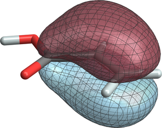

# Properties

## Overview

Properties can be calculated for both the Hartree-Fock and DFT wave
functions. The properties that are available are:

  - Natural bond analysis
  - Dipole, quadrupole, and octupole moment
  - Mulliken population analysis and bond order analysis
  - Electrostatic potential (diamagnetic shielding) at nuclei
  - Electric field and field gradient at nuclei
  - Electric field gradients with relativistic effects
  - Electron and spin density at nuclei
  - NMR shielding (GIAO method)
  - NMR hyperfine coupling (Fermi-Contact and Spin-Dipole expectation
    values)
  - NMR indirect spin-spin coupling
  - Gshift
  - Response to electric and magnetic fields (static and dynamic)
  - Raman
  - Localization of molecular orbitals

The properties module is started when the task directive TASK <theory>
property is defined in the user input file. The input format has the
form:
```
 PROPERTY 
   [property keyword]  
   [CENTER ((com || coc || origin || arb <real x y z>) default coc)] 
 END
```
Most of the properties can be computed for Hartree-Fock (closed-shell
RHF, open-shell ROHF, and open-shell UHF), and DFT (closed-shell and
open-shell spin unrestricted) wavefunctions. The NMR hyperfine and
indirect spin-spin coupling require a UHF or ODFT wave function.

## Vectors keyword
```
 VECTORS [ (<string input_movecs >)]
```
The VECTORS directive allows the user to specify the input molecular
orbital vectors for the property calculation

## Property keywords

Each property can be requested by defining one of the following
keywords:
```
 NBOFILE  
 DIPOLE  
 QUADRUPOLE  
 OCTUPOLE  
 MULLIKEN  
 ESP  
 EFIELD  
 EFIELDGRAD  
 EFIELDGRADZ4  
 GSHIFT  
 ELECTRONDENSITY  
 HYPERFINE [<integer> number_of_atoms <integer> atom_list]  
 SHIELDING [<integer> number_of_atoms <integer> atom_list]  
 SPINSPIN [<integer> number_of_pairs <integer> pair_list]  
 RESPONSE [<integer> response_order <real> frequency]  
 AIMFILE  
 MOLDENFILE
 LOCALIZATION  
 ALL
```
The `ALL` keyword generates all currently available properties.

### NMR and EPR

Both the NMR shielding and spin-spin coupling have additional optional
parameters that can be defined in the input. For the shielding the user
can define the number of atoms for which the shielding tensor should be
calculated, followed by the list of specific atom centers. In the case
of spin-spin coupling the number of atom pairs, followed by the atom
pairs, can be defined (i.e., `spinspin 1 1 2` will calculate the coupling
for one pair, and the coupling will be between atoms 1 and 2).

For both the NMR spin-spin and hyperfine coupling the isotope that has
the highest abundance and has spin, will be chosen for each atom under
consideration.

#### Calculating EPR and paramagnetic NMR parameters
The following
[tutorial](EPR-pNMR.md) illustrates how to combine the
hyperfine, gshift and shielding to calculate the EPR and paramagnetic
NMR parameters of an open-shell system. All calculations are compatible 
with the ZORA model potential approach.

For theoretical and computational details, please refer to 
references[@autschbach2011][@aquino2012][@aquino2011].

#### NMR: Input Example
```
geometry  nocenter
  C    0.00000000    0.00000000    0.00000000
  O    1.18337200    0.00000000    0.00000000
  H    -.63151821    0.94387462    0.00000000
end

basis
 "*" library 6-311G**
end
property
 efieldgradz4 1 3
 shielding 2 1 2
 hyperfine 2 1 3
 gshift
end

relativistic
  zora on
  zora:cutoff_NMR 1d-8
  zora:cutoff 1d-30
end

dft
mult 2
xc becke88 perdew86
end

task dft property
```
### CENTER: Center of expansion for multipole calculations
  
The user also has the option to choose the center of expansion for the
dipole, quadrupole, and octupole calculations.
```
   [CENTER ((com || coc || origin || arb <real x y z>) default coc)]
```
com is the center of mass, coc is the center of charge, origin is (0.0,
0.0, 0.0) and arb is any arbitrary point which must be accompanied by
the coordinated to be used. Currently the x, y, and z coordinates must
be given in the same units as UNITS in [GEOMETRY](Geometry).
  


### Response Calculations

Response calculations can be calculated as
follows:
```
property
 response  1 7.73178E-2   # response order and frequency in Hartree energy units  
 velocity                 # use modified velocity gauge for electric dipole  
 orbeta                   # calculate optical rotation 'beta' directly [@autschbach2007]  
 giao                     # GIAO optical rotation [@autschbach2011_2][@krykunov2005][@moore2012], forces orbeta  
 bdtensor                 # calculates B-tilde of Refs. [@autschbach2011_2][@moore2012] 
 analysis                 # analyze response in terms of MOs [@moore2012]  
 damping 0.007            # complex response functions with damping, Ref [@krykunov2006] 
 convergence 1e-4         # set CPKS convergence criterion (default 1e-4)  
end
```
Response calculations are currently supported only for   
  
  - order 1 (linear response),   
  - single frequency,   
  - electric field,
  - mixed electric-magnetic field perturbations.    

The output consists of the electric polarizability
and optical rotation tensors (alpha, beta for optical rotation) in
atomic units.  
The `response` keyword requires two arguments: response order and frequency in Hartree energy units
(the `aoresponse` keyword can be used with same effect as the `response` keyword).  
If the `velocity` or `giao` keywords are absent, the
dipole-length form will be used for the dipole integrals. This is a bit
faster.   
The isotropic optical rotation is origin independent when using
the velocity gauge (by means of `velocity` keyword) or with GIAOs [@autschbach2011_2] (by means of the `giao` keyword).   
With the keyword `bdtensor`, a
fully origin-invariant optical rotation tensor is calculated [@autschbach2011_2,@moore2012].  
Note that `velocity` and `orbeta` are incompatible.   
The input line
```
set prop:newaoresp 0
```
outside of the `properties` block forces the use of an
older version of the response code, which has fewer features (in
particular, no working GIAO optical rotation) but which has been tested
more thoroughly. In the default newer version you may encounter
undocumented features (bugs).  
The keyword `analysis` triggers an analysis of the
response tensors in terms of molecular orbitals.  
If the property input block also contains the keyword `pmlocalization`, then the analysis is
performed in terms of Pipek-Mezey localized MOs, otherwise the canonical
set is used (this feature may currently not work, please check the sum
of the analysis carefully). See Ref. [6] for an example. Works with HF
and density functionals for which linear response kernels are
implemented in NWChem.

Please refer to papers[@autschbach2011_2][@autschbach2007][@krykunov2005][@hammond2009][@krykunov2006][@moore2012] for further details:


### Raman

Raman calculations can be performed by specifying the Raman block. These
calculations are performed in conjunction with polarizability
calculations. Detailed description of input parameters at
[https://pubs.acs.org/doi/10.1021/jp411039m#notes-1](https://pubs.acs.org/doi/10.1021/jp411039m#notes-1)
```
RAMAN 
 [ (NORMAL | | RESONANCE) default NORMAL ]  
 [ (LORENTZIAN | | GAUSSIAN) default LORENTZIAN ]  
 [ LOW <double low default 0.0> ]  
 [ HIGH <double high default highest normal mode> ]  
 [ FIRST <integer first default 7> ]  
 [ LAST < integer last default number of normal modes > ]  
 [ WIDTH <double width default 20.0> ]  
 [ DQ <double dq default 0.01> ]  
END  
task dft raman
```
or
```
task dft raman numerical
```
Sample input block:
```
property
 response 1 8.8559E-2  
 damping 0.007  
end  
raman  
 normal  
 lorentzian  
end
```
#### Raman Keywords

  - `NORMAL` and `RESONANCE`: Type of Raman plot to make.
  - `LORENTZIAN` and `GAUSSIAN`: Generation of smoothed spectra (rather than
    sticks) using either a Lorentzian function or a Gaussian function.
    The default is `LORENTZIAN`.
  - `LOW` and `HIGH`: The default range in which to generate the Raman
    spectrum plot is (0.0, highest wavenumber normal mode) cm-1. The `LOW`
    and `HIGH` keywords modify the frequency range.
  - `FIRST` and `LAST`: The default range of indices of normal modes used in
    the plot is (7, number of normal modes). The `FIRST` and `LAST` keywords
    modify the range of indices.
  - `WIDTH`: Controls the width in the smoothed peaks, using Lorentzians or
    Gaussians, in the plot. The default value for `WIDTH` is 20.0.
  - `DQ`: Size of the steps along the normal modes. The default value for
    `DQ` is 0.01. It is related to the step size dR used in numerical
    evaluation of polarizability derivative

#### Raman Output

Raman spectrum in stick format and smoothed using Lorentzians or
Gaussians stored in a filename with format `[fname].normal`.  
The number of points is 1000 by default. This value can be changed by adding the following [SET](SET) directive to the input file
```
set raman:numpts <integer>
```

#### Raman References

Please refer to papers[@mullin2012][@aquino2014] for further details:


### Polarizability computed with the Sum over Orbitals method
  
As an alternative to the [linear response
method](#response-calculations), the Sum over Orbitals (SOO) method is
available to compute polarizabilities. Results of these method are
much less accurate than linear response calculations, with values off
by a factor of 2-4x. However, the qualitative nature of this results
can be used to compute Raman frequencies when coupled with
[QMD](Gaussian-Basis-AIMD.md#property-calculation-in-a-molecular-dynamics-simulation),
as described in references [@fischer2015][@apra2020].
  
Sample input computing polarizability both with the SOO method and the linear response method:
```
property
 polfromsos
end

task dft property

property
 response 1 0
end
task dft property
```
  
  
### Nbofile

The keyword `NBOFILE` does not execute the Natural Bond Analysis code, but
simply creates an input file to be used as input to the stand-alone NBO
code. All other properties are calculated upon request.

Following the successful completion of an electronic structure
calculation, a Natural Bond Orbital (NBO) analysis may be carried out by
providing the keyword `NBOFILE` in the `PROPERTY` directive. NWChem will
query the rtdb and construct an ASCII file, *file_prefix*`.gen`, that may
be used as input to the stand alone version of the NBO program, GenNBO.
*file_prefix* is equal to string following the `START` directive. The
input deck may be edited to provide additional options to the NBO
calculation, (see the NBO user's manual for details.)

Users that have their own NBO version can compile and link the code into
the NWChem software. See the INSTALL file in the source for details.

## Gaussian Cube Files

Electrostatic potential (keyword `esp`) and the magnitude of the
electric field (keyword `efield`) on the grid can be generated in the
form of the Gaussian Cube File. This behavior is triggered by the
inclusion of grid keyword as shown
below
```
 grid [pad dx [dy dz]] [rmax x y z] [rmin x y z] [ngrid nx [ny nz]] [output filename]
```
where

  - `pad dx [dy dz]` - specifies amount of padding (in angstroms) in
    x,y, and z dimensions that will be applied in the automatic
    construction of the rectangular grid volume based on the geometry of
    the system. If only one number is provided then the same amount of
    padding will be applied in all dimensions. The default setting is 4
    angstrom padding in all dimensions.


  - `rmin x y z` - specifies the coordinates (in angstroms) of the minimum
    corner of the rectangular grid volume. This will override any
    padding in this direction.

  - `rmax x y z` - specifies the coordinates (in angstroms) of the maximum
    corner of the rectangular grid volume. This will override any
    padding in this direction.


  - `ngrid nx [ny nz]` - specifies number of grid points along each
    dimension. If only one number is provided then the same number of
    grid points are assumed all dimensions. In the absence of this
    directive the number of grid points would be computed such that grid
    spacing will be close to 0.2 angstrom, but not exceeding 50 grid
    points in either dimension.


  - `output filename` - specifies name of the output cube file. The
    default behavior is to use *prefix*`-elp.cube` or *prefix*`-elf.cube`
    file names for electrostatic potential or electric field
    respectively. Here *prefix* denotes the system name as specified in
    start directive. Note that Gaussian cube files will be written in
    the run directory (where the input file resides).

Example input file
```
  echo  
  start nacl  
    
   
  geometry nocenter noautoz noautosym  
   Na                   -0.00000000     0.00000000    -0.70428494  
   Cl                    0.00000000    -0.00000000     1.70428494  
  end  
    
    
  basis  
    * library 6-31g*  
  end  
    
  #electric field would be written out to nacl.elf.cube file  
  #with  
  #ngrid     : 20 20 20  
  #rmax      : 4.000     4.000     5.704  
  #rmin      :-4.000    -4.000    -4.704  
    
  property  
  efield  
  grid pad 4.0 ngrid 20  
  end  
    
  task dft property  
    
  #electrostatic potential would be written to esp-pad.cube file  
  # with the same parameters as above  
    
  property  
  esp  
  grid pad 4.0 ngrid 20 output esp-pad.cube  
  end  
    
  task dft property  
     
  #illustrating explicit specification of minumum box coordinates  
    
  property  
  esp  
  grid pad 4.0 rmax 4.000 4.000 5.704 ngrid 20  
  end  
    
  task dft property
```
## Aimfile

This keyword generates AIM Wavefunction files. The resulting AIM
wavefunction file (.wfn/.wfx) can be post-processed with a variety of
codes, e.g.

  - [XAIM](http://www.quimica.urv.es/XAIM/)
  - [NCIPLOT](https://github.com/aoterodelaroza/nciplot)
  - [Multiwfn](http://sobereva.com/multiwfn/)
  - [Postg](https://github.com/aoterodelaroza/postg)

**WARNING:** Since we have discovered issues in generating .WFN files with this module (e.g. systems with ECPs), the recommended method for generating .WFN file is to first generate a Molden file with the [Moldenfile](Properties.md#moldenfile) option, then convert the Molden file into a WFN file by using the [Molden2AIM](https://github.com/zorkzou/Molden2AIM) program.

## Moldenfile
```
MOLDENFILE
MOLDEN_NORM (JANPA | | NWCHEM || NONE)
```
This keyword generates files using the [Molden
format](https://www.theochem.ru.nl/molden/molden_format.html). The resulting
Molden file (.molden) should compatible with a variety of codes that can
input Molden files, e.g.

  - [Molden](https://www.theochem.ru.nl/molden/)
  - [JANPA](https://janpa.sf.net) (the nwchem2molden step is no longer
    required when using .molden files and the `MOLDEN_NORM JANPA`
    keyword)
  - [orbkit](http://orbkit.github.io/)
  - [Molden2qmc](http://github.com/Konjkov/molden2qmc)
  - [Molden2AIM](https://github.com/zorkzou/Molden2AIM)
  - [Multiwfn](http://sobereva.com/multiwfn/)

the `MOLDEN_NORM` option allows the renormalization of the basis set
coefficients. By default, the coefficient values from input are not
modified. Using the `JANPA` value coefficients are normalized following
[JANPA](https://janpa.sourceforge.net/)'s
convention (where basis coefficients are normalized to unity), while the `NWCHEM` will produce coefficients normalized
according to NWChem's convention. Using `MOLDEN_NORM` equal `NONE` will
leave the input coefficients unmodified.  
It is strongly recommended to use **spherical** [basis set](Basis) when using the NWChem Molden output for JANPA analysis

Example input file for a scf calculation. The resulting Molden file will
be named `h2o.molden`
```
 start heat
    
 geometry; he 0. 0. 0.; end  
 
 basis spherical; * library 6-31g ; end  
  
 task scf  
  
 property 
  vectors heat.movecs  
  moldenfile   
  molden_norm janpa 
 end
 
 task scf property
```
Then, the resulting `h2o.molden` file can be post processed by [Janpa](https://janpa.sourceforge.net/) with the following command
```
java -jar janpa.jar h2o.molden > h2o.janpa.txt
```

## Localization


Localized molecular orbitals (LMOs) can be computed with the `localization` keyword.  

```
 property  
  localization (( pm || boys || ibo) default pm) ((0 || 1 || 2) default 0)
 end  
```

The following methods are available:

* Pipek-Mezey[@pipek1989], `pm` keyword (default) 
* Foster-Boys[@foster1960], `boys` keyword 
* IAO/IBO[@knizia2013][@knizia2015], `ibo` keyword 

An optional integer switch may be supplied after the localization method specification. The default `0` means only occupied orbitals are localized.  Use `1` to localize virtual orbitals instead, or `2` to separately localize occupied and virtual orbitals in the same run. Localization of virtual orbitals is not implemented for the Boys localization. If only the keyword `localization` is given, this defaults to a Pipek-Mezey localization of the occupied molecular orbitals.

In spin-unrestricted calculations, alpha and beta spin orbitals are localized separately. Fractional-occupation DFT and restricted open-shell Hartree-Fock or Kohn-Sham are not yet supported; attempting to use localization with fractional orbital occupations may run but will likely produce unwanted and wrong results.

A localization run prints a characterizations of the LMOs. Specifically, the PM and IBO localizations print an energy-sorted list of LMOs indicating the density weight of each LMO on the various atoms for weights exceeding a 1% threshold; the atoms are listed in terms of their input number. A Boys localization prints the LMO centroid and the expectation value of *r*^2 per LMO.

Typically, however, the user will want to visualize the LMOs. The localization run saves the LMO coefficients in a file `locorb.movecs`, which can be used as the MO vector file in an NWChem [DPLOT task](https://nwchemgit.github.io/DPLOT.html) to generate corresponding volume data maps, for example, in the `cube' format commonly used in computational chemistry. The latter can be visualized with a considerable number of open source, free, or proprietary software packages.

NWChem test jobs that use the orbital localization functionality (under `$NWCHEM_TOP/QA/tests/`) are `localize-ibo-allyl`, `localize-pm-allyl`, and `localize-ibo-aa`. The latter is based on the acrylic acid example from the original IBO publication.[@knizia2013] IBO number 19 represents the delocalized C-C pi bond LMO of the system. After running the test job, the corresponding cube file for LMO 19 can be generated, for example, with

```
 dplot
 vectors locorb.movecs
 limitxyz
 -4.3334997 4.9318898 50
 -3.3065879000000002 3.718637 50
 -2.0 2.0 50
 gaussian
 spin alpha
 orbitals view;1;19
 output localize-ibo-aa-00019.cube
 end
 task dplot
```

The resulting plot with &#177;0.03 isosurfaces may look like the following



A [Python script](https://github.com/jautschbach/nwchem-dplot-utility) is available to facilitate the creation of volume data files for visualizing multiple MOs or LMOs of a given molecule. For the acrylic acid example, after running NWChem with the `localize-ibo-aa.nw` input, the following command will create an input file with `dplot` tasks to generate cubes for the 19 occupied and 10 virtual IBOs of the molecule on a 50x50x50 grid:

```
 dplot.py -i localize-ibo-aa.nw -m locorb.movecs -g 50 -l 1-29
```

The `dplot` task shown above is included in the resulting NWChem input file `dplot.nw`.


## References 
///Footnotes Go Here///
