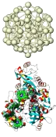
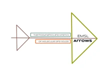

# NWChem: Open Source High-Performance Computational Chemistry

The NWChem  software contains 
computational chemistry tools that are scalable both in their
ability to efficiently treat large scientific  problems,
 and in their use of available computing resources
from high-performance parallel supercomputers to conventional
workstation clusters.

NWChem can handle:

<!--{ align=right}-->

  * Biomolecules, nanostructures, and solid-state
  * From quantum to classical, and all combinations
  * Ground and excited-states
  * Gaussian basis functions or plane-waves
  * Scaling from one to thousands of processors
  * Properties and relativistic effects

<!--{ align=right }-->

NWChem is actively developed by a consortium of developers and maintained by  
[The Environmental Molecular Sciences Laboratory (EMSL)](https://www.emsl.pnnl.gov) located at the Pacific  
Northwest National Laboratory ([PNNL](https://www.pnl.gov)) in Washington State. Researchers interested  
in contributing to NWChem should review
the [Developers page](Developer). The
code is distributed as open-source under the terms of the [Educational
Community License
version 2.0](https://opensource.org/licenses/ecl2.php) (ECL 2.0).

The NWChem development strategy is focused on providing new and
essential scientific capabilities to its users in the areas of kinetics
and dynamics of chemical transformations, chemistry at interfaces and in
the condensed phase, and enabling innovative and integrated research at
EMSL. At the same time continued development is needed to enable NWChem
to effectively utilize architectures of tens of petaflops and beyond.

## Latest NWChem release

NWChem version 7.2.0 is the latest release available for download from the link [https://github.com/nwchemgit/nwchem/releases](https://github.com/nwchemgit/nwchem/releases).

## EMSL Arrows

<!--{ align=right }-->
Are you just
learning how to use NWChem and would like to have an easy way to generate input
decks, check your output decks against a large database of calculations,
perform simple thermochemistry calculations, calculate the NMR and IR
spectra of a modest size molecule, or just try out nwchem before
installing it? EMSL Arrows scientific service can help. A web api to
EMSL Arrows is now available for alpha testing.

For more information see
[EMSL Arrows - an easier way to use nwchem](EMSL_Arrows)

[EMSL Arrows API](https://arrows.emsl.pnnl.gov/api/) 

## [NWChem Documentation](Home)

## NWChem Citation

Please cite the following reference when publishing results obtained
with NWChem:

E. Aprà, E. J. Bylaska, W. A. de Jong, N. Govind, K. Kowalski, T. P. Straatsma, M. Valiev, H. J. J. van Dam, Y. Alexeev, J. Anchell, V. Anisimov, F. W. Aquino, R. Atta-Fynn, J. Autschbach, N. P. Bauman, J. C. Becca, D. E. Bernholdt, K. Bhaskaran-Nair, S. Bogatko, P. Borowski, J. Boschen, J. Brabec, A. Bruner, E. Cauët, Y. Chen, G. N. Chuev, C. J. Cramer, J. Daily, M. J. O. Deegan, T. H. Dunning Jr., M. Dupuis, K. G. Dyall, G. I. Fann, S. A. Fischer, A. Fonari, H. Früchtl, L. Gagliardi, J. Garza, N. Gawande, S. Ghosh, K. Glaesemann, A. W. Götz, J. Hammond, V. Helms, E. D. Hermes, K. Hirao, S. Hirata, M. Jacquelin, L. Jensen, B. G. Johnson, H. Jónsson, R. A. Kendall, M. Klemm, R. Kobayashi, V. Konkov, S. Krishnamoorthy, M. Krishnan, Z. Lin, R. D. Lins, R. J. Littlefield, A. J. Logsdail, K. Lopata, W. Ma, A. V. Marenich, J. Martin del Campo, D. Mejia-Rodriguez, J. E. Moore, J. M. Mullin, T. Nakajima, D. R. Nascimento, J. A. Nichols, P. J. Nichols, J. Nieplocha, A. Otero-de-la-Roza, B. Palmer, A. Panyala, T. Pirojsirikul, B. Peng, R. Peverati, J. Pittner, L. Pollack, R. M. Richard, P. Sadayappan, G. C. Schatz, W. A. Shelton, D. W. Silverstein, D. M. A. Smith, T. A. Soares, D. Song, M. Swart, H. L. Taylor, G. S. Thomas, V. Tipparaju, D. G. Truhlar, K. Tsemekhman, T. Van Voorhis, Á. Vázquez-Mayagoitia, P. Verma, O. Villa, A. Vishnu, K. D. Vogiatzis, D. Wang, J. H. Weare, M. J. Williamson, T. L. Windus, K. Woliński, A. T. Wong, Q. Wu, C. Yang, Q. Yu, M. Zacharias, Z. Zhang, Y. Zhao, and R. J. Harrison,
"NWChem: Past, present, and future", *The Journal of Chemical Physics* **152**, 184102 (2020).
DOI: [10.1063/5.0004997](http://dx.doi.org/10.1063/5.0004997)  

